# خواننده تلگرام

<!-- TOP_NAV START -->

<a href="https://github.com/404kurd/aio-downloader/blob/main/telegram/content/archive_1.md" style="display:inline-block; padding:6px 12px; margin:0 4px; background-color:#2ea44f; color:white; text-decoration:none; border-radius:4px; font-weight:bold;">صفحه بعد</a>

<!-- TOP_NAV END -->

<!-- MSG START -->

---
📅 بروزرسانی: 1405/02/22 21:13
---

## VahidOOnLine — post 239753

  <a href="telegram/content/VahidOOnLine_239753_1778607806.mp4" target="_blank">🎬 Download video</a>

جان هیلی، وزیر دفاع بریتانیا، اعلام کرد لندن جنگنده، پهپاد و یک ناو جنگی را به مأموریت چندملیتی حفاظت از تردد کشتی‌ها در تنگه هرمز اعزام خواهد کرد.

هیلی این خبر را پس از نشست مشترک با وزرای دفاع ۴۰ کشور اعلام کرد؛ نشستی که با هدف جلب حمایت برای مأموریت تحت رهبری بریتانیا جهت تأمین امنیت کشتیرانی در تنگه هرمز برگزار شد.

بریتانیا می‌گوید این مأموریت در واکنش به محاصره تنگه هرمز از سوی جمهوری اسلامی انجام می‌شود.
‌🏁 🇬🇧 ManotoTV

🤖 @VahidOOnLine

## VahidOOnLine — post 239752

  

هاکان فیدان، وزیر خارجه ترکیه، در گفت‌وگو با الجزیره گفت اولویت اصلی آنکارا حفظ آتش‌بس میان واشینگتن و تهران است و تاکید کرد فوری‌ترین نگرانی ترکیه تداوم این آتش‌بس است، زیرا در حال حاضر این موضوع بیشترین اهمیت را دارد.

وزیر خارجه ترکیه افزود هیچ‌کس خواهان بازگشت به جنگ نیست، چرا که اقتصاد جهانی و امنیت انرژی جهان همین حالا نیز به اندازه کافی آسیب دیده است.

هاکان فیدان همچنین گفت ترکیه و دیگر کشورهای منطقه از جمله قطر برای حمایت از پاکستان به‌عنوان میانجی اصلی همکاری می‌کنند و در روند میانجی‌گری، زمانی که کار به بن‌بست می‌رسد، دشوارترین بخش یافتن ایده‌های خلاقانه است؛ گاهی طرفین و حتی خود میانجی نیز قادر به ارائه چنین ایده‌هایی نیستند.
‌🏁 🇬🇧 IranintlTV

🤖 @VahidOOnLine

## VahidOOnLine — post 239751

♦️ژنرال دن کین، رئیس ستاد مشترک نیروهای مسلح آمریکا، روز سه‌شنبه ۲۲ اردیبهشت‌ماه در جلسه استماع بودجه در کنگره گفت ایران قطعا فشار ناشی از محاصره و تحریم‌ها را احساس می‌کند.

او افزود این فشار تنها به محاصره محدود نمی‌شود و ادامه تحریم‌هایی که وزارت خزانه‌داری و دیگر نهادهای آمریکایی اعمال کرده‌اند نیز بخشی از آن است. دن کین همچنین تاکید کرد آمریکا همچنان «مجموعه‌ای از گزینه‌های نظامی» را در اختیار دارد.
‌🇸🇦 Indypersian

🤖 @VahidOOnLine

## VahidOOnLine — post 239750

  

دادگاه کیفری عالی بحرین سه نفر از جمله یک زن را به اتهام «همکاری» با جمهوری اسلامی به حبس ابد محکوم کرد.
دادستان‌ها اعلام کردند این زن در «ارتباط» با سپاه پاسداران بوده و قصد داشته «اقدامات تروریستی خصمانه» در بحرین انجام دهد.
در پرونده‌های جداگانه، ۱۰ نفر دیگر به اتهام «حمایت و تایید حملات تروریستی جمهوری اسلامی علیه بحرین»، انتشار اطلاعات ممنوع و عکسبرداری از اماکن ممنوعه، به احکام حبس تا ۱۰ سال محکوم شدند.

پیش‌تر نیز وزارت کشور بحرین اعلام کرد دستگاه‌های امنیتی این کشور یک تشکیلات مرتبط با سپاه پاسداران و تفکر «ولایت فقیه» را شناسایی کرده‌اند و ۴۱ نفر از اعضای آن را بازداشت کرده‌اند.
‌🏁 🇬🇧 IranintlTV

🤖 @VahidOOnLine

## VahidOOnLine — post 239749

  

♦️ دیک دوربین، سناتور دموکرات ایالت ایلینوی، روز سه‌شنبه ۲۲ اردیبهشت، در جلسه کمیته تخصیص بودجه سنا از ژنرال دن کین، رئیس ستاد مشترک ارتش آمریکا، پرسید که ایران چگونه همچنان توانایی متوقف کردن تردد کشتی‌ها در تنگه هرمز را دارد؟

ژنرال کین در پاسخ به اعضای این کمیته گفت: «اوضاع در آنجا پیچیده است؛ قایق‌های کوچک متعدد و توانمندی‌های دیگری در منطقه حضور دارند. بخشی از این مشکل به ترددکنندگان تجاری برمی‌گردد، اما ریشه اصلی مسئله به همان مشکل همیشگی، یعنی گروگان گرفته شدن اقتصاد جهانی توسط ایران از طریق این تنگه مربوط می‌شود.»

او در ادامه افزود: «من آن‌ها را تشویق می‌کنم که درباره اقدامات بعدی خود خردمندانه فکر کنند و از این فرصت برای بازگشایی تنگه استفاده نمایند؛ این انتخابی است که آن‌ها باید انجام دهند.»
‌🇸🇦 Indypersian

🤖 @VahidOOnLine

## VahidOOnLine — post 239748

  <a href="telegram/content/VahidOOnLine_239748_1778607809.mp4" target="_blank">🎬 Download video</a>

سازمان جهانی بهداشت هشدار داد شمار موارد ابتلا به هانتاویروس، پس از شیوع این ویروس در یک کشتی گردشگری در اقیانوس اطلس، احتمالاً افزایش پیدا خواهد کرد.
تدروس آدهانوم، مدیرکل سازمان جهانی بهداشت، اعلام کرد تاکنون ۹ مورد ابتلای قطعی و دو مورد مشکوک ثبت شده و انتظار می‌رود افراد بیشتری نیز به ویروس مبتلا شده باشند. با این حال او تأکید کرد خطر شیوع گسترده جهانی همچنان «پایین» ارزیابی می‌شود.
شیوع بیماری در کشتی «ام‌وی هوندیوس» آغاز شد؛ جایی که سه مسافر، شامل یک زوج هلندی و یک زن آلمانی، جان خود را از دست دادند. این کشتی در حال سفر ۳۵ روزه در اقیانوس اطلس بود.
هانتاویروس معمولاً از طریق ادرار، بزاق یا فضولات جوندگان منتقل می‌شود. گونه «آندِس» تنها نوع شناخته‌شده‌ای است که می‌تواند از انسان به انسان منتقل شود.
در پی این بحران، صدها مسافر و خدمه در کشورهای مختلف تحت قرنطینه یا مراقبت پزشکی قرار گرفته‌اند. مقام‌های بهداشتی در اروپا و آمریکا نیز در حال ردیابی تماس‌های مرتبط با مبتلایان هستند.
‌🏁 🇬🇧 ManotoTV

🤖 @VahidOOnLine

## VahidOOnLine — post 239747

  

♦️ پیت هگست، وزیر دفاع ایالات متحده، روز سه‌شنبه ۲۲ اردیبهشت، به قانون‌گذاران اعلام کرد که در سفر قریب‌الوقوع دونالد ترامپ به چین، او را همراهی خواهد کرد؛ سفری که در میانه ابهامات شدید پیرامون پایداری آتش‌بس با ایران صورت می‌گیرد.

هگست در پاسخ به پرسشی درباره وضعیت فروش تسلیحات به تایوان گفت: «رئیس‌جمهور در آستانه سفر است و من همراه ایشان خواهم بود؛ تمامی تصمیمات مربوط به این موضوع توسط خود ایشان اتخاذ خواهد شد.» انتظار می‌رود ترامپ بعدازظهر امروز واشنگتن را به مقصد پکن ترک کند.

سفیر ایران در چین روز سه‌شنبه اظهار داشت که پکن می‌تواند «نیروی مهمی برای کاهش تنش‌ها» میان واشنگتن و تهران باشد. با این حال، دونالد ترامپ روز دوشنبه با انتقاد شدید از وضعیت فعلی، آتش‌بس با ایران را «بسیار ضعیف» توصیف کرد و گفت که این توافق «تنها با کمک دستگاه زنده است». هگست نیز تاکید کرد که ارتش آمریکا آماده است تا در صورت صدور فرمان، عملیات نظامی علیه جمهوری اسلامی را بلافاصله از سر بگیرد.
‌🇸🇦 Indypersian

🤖 @VahidOOnLine

## VahidOOnLine — post 239746

  

شاهزاده رضا پهلوی در نشست امنیتی سالانه پولیتیکو گفت: «ما فقط زمانی می‌توانیم مردم را به بازگشت به خیابان‌ها فرا بخوانیم که آن‌ها از سطحی از برابری در توان مقابله برخوردار باشند؛ نه زمانی که رژیم بتواند اوباش و نیروهای سرکوبگرش را برای کشتن مردم در خیابان‌ها اعزام کند.»

او ادامه داد: «اما برای رسیدن به آن نقطه، باید پیام روشنی وجود داشته باشد. باید راهبردی شفاف برای پایان دادن به این رژیم وجود داشته باشد؛ فراخوانی روشن برای قیام مردم، و همچنین پیامی برای نیروهای نظامی و امنیتی از حکومت جدا شوند و به مردم بپیوندند. همه این‌ها باید در قالب یک راهبرد منسجم هماهنگ شود.»
‌🏁 🇬🇧 IranintlTV

🤖 @VahidOOnLine

## VahidOOnLine — post 239745

  <a href="telegram/content/VahidOOnLine_239745_1778607810.mp4" target="_blank">🎬 Download video</a>

♦️پیت هگست، وزیر جنگ آمریکا، روز سه‌شنبه ۲۲ اردیبهشت‌ماه در جلسه استماع کنگره آمریکا گفت ایالات متحده در هر شرایطی برای پیروزی می‌جنگد؛ از جمله برای اطمینان از اینکه ایران هرگز به سلاح هسته‌ای دست پیدا نکند.

او این اظهارات را در ادامه مواضع دولت دونالد ترامپ درباره برنامه هسته‌ای جمهوری اسلامی مطرح کرد.
‌🇸🇦 Indypersian

🤖 @VahidOOnLine

## VahidOOnLine — post 239744

  

♦️ لیندزی گراهام، سناتور جمهوری‌خواه و از حامیان سرسخت سیاست‌های جنگی دولت ترامپ، روز سه‌شنبه ۲۲ اردیبهشت، از رئیس‌جمهوری آمریکا خواست تا در سفر به چین، موضعی قاطع در برابر پکن اتخاذ کند. گراهام طی یک جلسه استماع در سنا تاکید کرد که شی جین‌پینگ در حال حمایت هم‌زمان از روسیه و جمهوری اسلامی است.

این سناتور کارولینای جنوبی با انتقاد از نقش چین در خرید مقادیر کلان نفت از ایران و روسیه، نسبت به عملکرد پاکستان نیز ابراز نارضایتی کرد. او با استناد به گزارش «سی‌بی‌اس نیوز» یادآوری کرد که اسلام‌آباد به هواپیماهای نظامی ایران اجازه داده است در فرودگاه‌های این کشور مستقر شوند.

وزارت امور خارجه پاکستان با رد قاطعانه این ادعا، اعلام کرد که حضور هواپیماهای ایرانی و آمریکایی در خاک این کشور صرفا جهت تسهیل تردد تیم‌های دیپلماتیک و اداری مربوط به «مذاکرات اسلام‌آباد» پس از برقراری آتش‌بس بوده است. مقامات پاکستانی تاکید کردند که این پروازها هیچ ارتباطی با ترتیبات نظامی یا پشتیبانی جنگی ندارند. با این حال، گراهام هشدار داد که واشنگتن باید فشار بر متحدان و شرکای تجاری جمهوری اسلامی را به شدت افزایش دهد.
‌🇸🇦 Indypersian

🤖 @VahidOOnLine

## VahidOOnLine — post 239743

  <a href="telegram/content/VahidOOnLine_239743_1778607811.mp4" target="_blank">🎬 Download video</a>

مقام‌های آمریکایی اعلام کردند نیروهای این کشور مانع عبور یک نفتکش با پرچم جمهوری مالت از تنگه هرمز شده‌اند.
سخنگوی ستاد فرماندهی مرکزی آمریکا سنتکام؛ به الجزیره گفت نفتکش «آگیوس فانوریوس» به‌دلیل نقض محاصره دریایی، اجازه عبور پیدا نکرده است. به گفته او، این کشتی حامل نفت ایران نبوده است.
مقام‌های آمریکایی همچنین اعلام کردند چند نفتکش دیگر نیز به‌دلیل نقض تحریم‌ها و محاصره اعمال‌شده علیه بنادر ایران، متوقف شده‌اند.
‌🏁 🇬🇧 ManotoTV

🤖 @VahidOOnLine

## VahidOOnLine — post 239742

  <a href="telegram/content/VahidOOnLine_239742_1778607812.mp4" target="_blank">🎬 Download video</a>

«اینترنت را قطع کردند تا صدای مردم خاموش شود.»
‌🏁 🇬🇧 ManotoTV

🤖 @VahidOOnLine

## VahidOOnLine — post 239741

  

شاهزاده رضا پهلوی در نشست امنیتی سالانه پولیتیکو گفت سیاست مماشات با رژیم جمهوری اسلامی که راهبرد بسیاری از دولت‌ها بود، شکست خورده است.
او افزود اکنون که با یک «جانور زخمی» روبه‌رو هستیم، این فرصتی است که نباید از دست برود، بلکه باید کار را یک‌بار برای همیشه تمام کرد؛ موضوعی که نه‌تنها میلیون‌ها ایرانی، بلکه بسیاری از کشورهای منطقه نیز انتظار آن را دارند.

شاهزاده رضا پهلوی درباره جنگ علیه جمهوری اسلامی نیز گفت مردم به‌اندازه کافی هوشمند هستند که تفاوت میان حمله به یک ملت و حمله به یک رژیم را تشخیص دهند و آن کارزار، حمله‌ای علیه ملت ایران نبود، بلکه علیه رژیم بود.
‌🏁 🇬🇧 IranintlTV

🤖 @VahidOOnLine

## VahidOOnLine — post 239740

♦️مایک هاکبی، سفیر آمریکا در اسرائیل، روز سه‌شنبه ۲۲ اردیبهشت در یک کنفرانس در دانشگاه تل‌آویو گفت اسرائیل سامانه گنبد آهنین و نیروهایی برای راه‌اندازی آن به امارات متحده عربی فرستاده است. او افزود این اقدام در چارچوب روابط «فوق‌العاده» میان اسرائیل و امارات متحده عربی و بر پایه توافق‌های ابراهیم انجام شده است.

هاکبی با اشاره به پیامدهای توافق‌های ابراهیم برای امارات گفت: «فقط نگاهی به مزایای آن بیندازید. اسرائیل همین حالا سامانه‌های گنبد آهنین و نیروهایی را برای کمک به بهره‌برداری از آن‌ها برایشان فرستاده است.»

امارات متحده عربی در چارچوب توافق‌های ابراهیم که در سال ۲۰۲۰ با میانجی‌گری آمریکا انجام شد، اسرائیل را به رسمیت شناخت. پیش‌تر فایننشال تایمز گزارش داده بود اسرائیل برای کمک به دفاع از امارات، سامانه شناسایی سبک «اسپکترو» و سامانه پدافند موشکی را همراه با ده‌ها نیروی نظامی به این کشور فرستاده است؛ اقدامی که یکی از نخستین نمونه‌های بزرگ همکاری دفاعی میان دو طرف به‌شمار می‌رود.
‌🇸🇦 Indypersian

🤖 @VahidOOnLine

## VahidOOnLine — post 239739

  

♦️اصغر فرهادی با فیلم تازه‌اش «داستان‌های موازی» امسال به جشنواره فیلم کن ۲۰۲۶ بازمی‌گردد؛ جشنواره‌ای که برخلاف سال‌های گذشته، این بار بیش از آنکه در اختیار ستاره‌ها و فیلم های پرخرج هالیوودی باشد، به سینمای مؤلف و فیلمسازان بین‌المللی تعلق دارد.
کن که از دهه‌ها پیش به‌عنوان مهم‌ترین جشنواره سینمایی جهان و ویترین اروپایی هالیوود شناخته می‌شد، امسال بدون فیلم‌های بزرگ استودیویی آمریکا برگزار می‌شود. در سال‌های اخیر، فیلم‌هایی مانند «تاپ گان: ماوریک»، «ماموریت غیرممکن»، «الویس» و «ایندیانا جونز» در کن رونمایی شده بودند، اما در دوره ۲۰۲۶ هیچ نام بزرگ هالیوودی در بخش مسابقه یا افتتاحیه حضور ندارد.
تنها دو فیلم آمریکایی برای نخل طلا رقابت می‌کنند: «مردی که دوستش دارم» ساخته ایرا ساکس با بازی رامی مالک و ربکا هال و «ببر کاغذی» ساخته جیمز گری با حضور آدام درایور و اسکارلت جوهانسون.
در مقابل، بخش مسابقه امسال مملو از نام‌های مهم سینمای مؤلف جهان است. پدرو آلمودوار با فیلم «کریسمس تلخ» بازگشته، لازلو نمش فیلم «مولن» را ارائه کرده و آندری زویاگینتسف، فیلمساز تبعیدی روس، «مینوتور» را به کن آورده است.
ریاست هیئت داوران دوره هفتادونهم جشنواره بر عهده پارک چان ووک، کارگردان سرشناس کره‌ای، است. اعضای هیئت داوران نیز دمی مور، روث نگا، لورا واندل، کلوئی ژائو، دیگو سسپدس، ایزاک دو بانکوله، پل لاورتی و استلان اسکارشگورد هستند. برندگان نهایی جشنواره و نخل طلای کن در مراسم اختتامیه ۲۳ مه اعلام خواهند شد.
‌🇸🇦 Indypersian

🤖 @VahidOOnLine

## VahidOOnLine — post 239738

  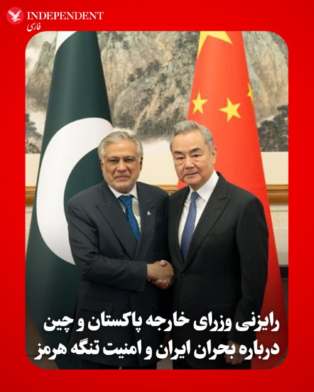

♦️ اسحاق دار، وزیر امور خارجه پاکستان و وانگ یی، همتای چینی او، روز سه‌شنبه ۲۲ اردیبهشت، در تماسی تلفنی درباره تحولات منطقه و تلاش‌های میانجی‌گرانه اسلام‌آباد برای پایان دادن به درگیری‌های ایران گفتگو کردند.

وزارت امور خارجه پاکستان در بیانیه‌ای اعلام کرد که هر دو طرف بر اهمیت تداوم آتش‌بس پایدار و تضمین تردد عادی از تنگه هرمز تاکید کردند. این گفتگو در آستانه دیدار سرنوشت‌ساز دونالد ترامپ و شی جین‌پینگ، رئیس‌جمهوری چین، انجام شد که قرار است اواخر هفته جاری در پکن برگزار شود. چین و پاکستان در این رایزنی، هماهنگی برای کاهش تنش‌های منطقه‌ای را مورد توجه قرار دادند.
‌🇸🇦 Indypersian

🤖 @VahidOOnLine

## VahidOOnLine — post 239737

  

دبیرکل شورای همکاری خلیج فارس اعلام کرد که نفوذ عناصر وابسته به سپاه پاسداران و برنامه‌ریزی آن‌ها برای اقدامات «خصمانه» را به‌شدت محکوم می‌کند.

دبیرکل شورای همکاری خلیج‌ فارس افزود از هر اقدامی که کویت برای حفظ امنیت و ثبات خود اتخاذ کند، حمایت می‌کند.

‌پیش‌تر نیز وزارت خارجه کویت اعلام کرد که سفیر جمهوری اسلامی را در پی نفوذ یک گروه وابسته به سپاه پاسداران به جزیره بوییان احضار کرده است.
‌🏁 🇬🇧 IranintlTV

🤖 @VahidOOnLine

## VahidOOnLine — post 239736

  

شهروندان در پیام‌هایی به ایران اینترنشنال می‌گویند که بدون رضایت و اطلاع و حتی هیچگونه اقدامی از سوی آن‌ها، نهادهای جمهوری اسلامی نام و مشخصات و تلفن همراه آن‌ها را برای ثبت‌نام در کارزار حکومتی «جان‌فدا» استفاده کرده‌اند.

طبق این پیام‌ها، حکومت پیامک‌هایی به شهروندان فرستاده و بدون اینکه بدانند، به آن‌ها گفته شده که در کارزار «جان‌فدا» ثبت‌نام شده‌اند.

طی روزهای گذشته، رسانه‌های حکومتی نوشتند که بیش از ۳۱ میلیون نفر در این کارزار ثبت‌نام کرده‌اند. این عدد و آمار از سوی شهروندان و ناظران با سوال مواجه شد. شهروندان در حالی که همچنان ده‌ها روز است که از دسترسی به اینترنت محروم‌اند، در پیام‌های خود به ایران اینترنشنال نوشته‌اند اگر حکومت ۳۱ میلیون جان‌فدا و حامی دارد، چرا اینترنت و دسترسی به آن را در کشور باز نمی‌کند.
‌🏁 🇬🇧 IranintlTV

🤖 @VahidOOnLine

## VahidOOnLine — post 239735

  <a href="telegram/content/VahidOOnLine_239735_1778607816.mp4" target="_blank">🎬 Download video</a>

شورای همکاری خلیج فارس ورود نیروهایی از سپاه پاسداران به جزیره بوبیان کویت را محکوم کرد.

جاسم البدیوی، دبیرکل شورای همکاری خلیج فارس، گفت: «نفوذ عناصر سپاه پاسداران به جزیره بوبیان کویت و برنامه‌ریزی آن‌ها برای اقدامات خصمانه را محکوم می‌کنیم.»

او همچنین تأکید کرد شورای همکاری خلیج فارس از کویت در همه اقداماتی که برای حفظ امنیت و ثبات خود انجام دهد، حمایت می‌کند.
‌🏁 🇬🇧 ManotoTV

🤖 @VahidOOnLine

## VahidOOnLine — post 239734

  <a href="telegram/content/VahidOOnLine_239734_1778607816.mp4" target="_blank">🎬 Download video</a>

وزارت خارجه کویت اعلام کرد در پی آنچه «نفوذ» اعضای مسلح وابسته به سپاه پاسداران خوانده شده، سفیر جمهوری‌اسلامی در این کشور را احضار و یادداشت اعتراضی رسمی به او تحویل داده است.
به گفته مقام‌های کویتی، چهار عضو منتسب به سپاه قصد داشتند از راه دریا وارد کویت شوند و «اقدامات خصمانه» انجام دهند. وزارت کشور کویت اعلام کرد در درگیری با نیروهای امنیتی، یک نیروی کویتی زخمی شده و دو نفر از متهمان نیز فرار کرده‌اند.
معاون وزیر خارجه کویت این اقدام را «نقض آشکار حاکمیت کویت» و مغایر با قوانین بین‌المللی و منشور سازمان ملل توصیف کرد و از تهران خواست فوراً چنین اقداماتی را متوقف کند.
‌🏁 🇬🇧 ManotoTV

🤖 @VahidOOnLine

## WithYashar — post 11084

چهار نیرو سپاه تروریستی توسط کویت دستگیر شدند.

سرهنگ امیرحسین عبدمحمد زارعی (سرهنگ نیروی دریایی)
سرهنگ عبدالصمد یدالله کنواتی (سرهنگ نیروی دریایی)
سرگرد احمد جمشید غلامرضا ذوالفقاری (کاپیتان نیروی دریایی)
ستوان محمدحسین سهراب فروغی راد (ستوان یکم نیروی دریایی)
@withyashar

## WithYashar — post 11083

شاهزاده رضا پهلوی در نشست امنیتی سالانه پولیتیکو:
سیاست مماشات با رژیم جمهوری اسلامی که راهبرد بسیاری از دولت‌ها بود، شکست خورده.
با یک جانور زخمی روبه‌رو هستیم، این فرصتیه که نباید از دست بره
بلکه باید کار رو یک‌بار برای همیشه تموم کرد؛ موضوعی که نه‌تنها میلیون‌ها ایرانی، بلکه خیلی از کشورهای منطقه هم انتظارشو دارن
مردم به‌اندازه کافی هوشمند هستن که تفاوت بین حمله به یک ملت و حمله به یک رژیم رو تشخیص بدن و اون کارزار، حمله‌ای علیه ملت ایران نبود، بلکه علیه رژیم بود.
ما فقط زمانی می‌تونیم مردم رو به بازگشت به خیابان‌ها فرا بخونیم که اونا از سطحی از برابری در توان مقابله برخوردار باشن.
نه زمانی که رژیم بتونه اوباش و نیروهای سرکوبگرشو برای کشتن مردم در خیابان‌ها اعزام کنن.
اما برای رسیدن به اون نقطه، باید پیام روشنی وجود داشته باشه. باید راهبردی شفاف برای پایان دادن به این رژیم وجود داشته باشه.
فراخوانی روشن برای قیام مردم، و همچنین پیامی برای نیروهای نظامی و امنیتی از حکومت جدا بشن و به مردم بپیوندن
@withyashar

## WithYashar — post 11082

رئیس جلسه: آقای وزیر، اجازه بدهید به سؤال سناتور کونز پاسخ دهید. سؤال ساده‌ای است: چطور قرار است تنگه را باز کنیم؟ در جلسات محرمانه، افرادی از تیم شما به ما گفته‌اند که راه‌حل نظامی برای بازگشایی تنگه وجود ندارد و در نهایت این یک تصمیم سیاسی از سوی ایران خواهد بود. شما هم ظاهراً همین را می‌گویید؛ اینکه فشار اقتصادی، تهران را مجبور به باز کردن تنگه می‌کند.
پس آیا تأیید می‌کنید که راه‌حل نهایی دیپلماتیک و اقتصادی است، نه نظامی؟»
وزیر جنگ : من می‌گویم قطعاً ابزارهای نظامی برای باز کردن تنگه وجود دارد؛ چه از طریق اهداف زمینی، چه توان دریایی ما و چه محاصرهٔ دریایی.»
رئیس جلسه:
اگر این درست است، چرا تا حالا انجامش نداده‌اید؟»

وزیر جنگ:چون راه‌حل بلندمدت و ترجیحی این است که توافقی حاصل شود که ایران تنگه را باز کند و دست از دزدی دریایی بردارد. این فقط کشتی‌های آمریکا نیستند که متوقف شده‌اند؛ کشتی‌های سراسر جهان درگیرند و این فشار بیشتری بر دیگر کشورها وارد می‌کند
@withyashar

## WithYashar — post 11081

سناتور : من هیچ‌وقت از رئیس‌جمهور نشنیدم که بگوید هدفش تغییر رژیم در ایران است یا می‌خواهد همهٔ مواد شکافت‌پذیر آن‌ها را تصاحب کند. چیزی که من شنیدم این بود که هدف ما فلج کردن توان آن‌ها برای باج‌گیری از جهان است.حالا شاید دوستان دموکرات من بخواهند بگویند ما شکست خورده‌ایم. ولی من نمی‌فهمم چطور شکست خورده‌ایم. آیا تنگه بسته شده؟ بله. اما اگر این محاصره ادامه پیدا کند و هیچ‌چیز وارد یا خارج نشود، در نهایت مجبور می‌شوند چاه‌های نفتشان را تعطیل کنند. نیمی از میادین نفتی‌شان وابسته به فشار طبیعی است؛ اگر خاموش شوند، دوباره راه‌اندازی‌شان بسیار سخت خواهد بود. چیزی را اشتباه متوجه شده‌ام؟»

وزیر جنگ:
نه، به همین دلیل است که رئیس‌جمهور می‌گوید همهٔ کارت‌ها دست ماست. و ما بهترین معامله‌گر دنیا را داریم که می‌تواند بهترین توافق را برای آمریکا رقم بزند. و اگر لازم باشد دوباره وارد عمل نظامی شویم، وزارت جنگ هم آماده است
@withyashar

## WithYashar — post 11080

سناتور کونز:
حالا دربارهٔ ایران امروز صحبت کنیم. آیا موافقید که ایران چه در بخش دولتی و چه خصوصی الان عملاً با تف و چسب نواری سرِ پا نگه داشته شده؟

وزیر جنگ پیت هگست:
اصطلاح “تف و چسب نواری” اصطلاح دکترین نظامی نیست، سناتور، ولی در کل با این توصیف موافقم
@withyashar

## WithYashar — post 11079

سناتور کونز : دستگاه اطلاعاتی ما مدتی پیش کشف کرد که رژیم ایران یک طرح جدید برای برنامهٔ تسلیحات هسته‌ای‌اش یک نقشهٔ بازی تازه طراحی کرده بود.
طرحشان این بود که تولید موشک‌های بالستیک، موشک‌های کروز و پهپادها را به‌شدت افزایش دهند و یک انبار عظیم از موشک و پهپاد بسازند. بعد از آن به آمریکا، اسرائیل و بقیهٔ دنیا بگویند: اگر دوباره مثل ژوئن(جنگ ۱۲ روزه) ما را بمباران کنید، برنامهٔ تسلیحات هسته‌ای را از سر می‌گیریم و خاورمیانه را نابود خواهیم کرد؛ و ضمناً موشک‌های ما حالا می‌توانند به برلین، لندن و پاریس برسند.
آیا برداشت من درست است که یکی از دلایل اصلی حملهٔ ما به ایران همین بود؟»

وزیر جنگ پیت هگست :
«فکر می‌کنم این موضوع را خیلی خوب بیان کردید، سناتور. آن‌ها تلاش می‌کردند با تکیه بر زرادخانهٔ متعارف خود، جهان را برای رسیدن به سلاح هسته‌ای باج‌گیری کنند.
@withyashar

## WithYashar — post 11078

سازمان اطلاعات سپاه اعلام کرد که پنج شبکه قاچاق سلاح مرتبط با اسرائیل را خنثی کرده است.

۲۰ فرد مرتبط با آنچه آن را شبکه‌های سازمان‌یافته «بی‌امنی» مرتبط با «گروه‌های تروریستی و قاچاقچیان سلاح» توصیف کرد، شناسایی و دستگیر شدند؛ این اقدام پس از اقدامات اطلاعاتی و عملیاتی نظارت بر محموله‌های غیرمجاز سلاح انجام شد.
بیش از ۵۰ سلاح گرم، ۷۰ کیلوگرم مواد منفجره، حدود ۲۰۰۰ فشنگ و مهمات اضافی در جریان این عملیات توقیف شدند
@withyashar

## WithYashar — post 11077

هدف جنگ از زبان روبیو: بازگشت به زمان قبل از جنگ

مارکو روبیو گفت: «ترجیح ما این است که تنگه هرمز باز باشد، به همان شکلی که قرار است باز باشد و به همان شکلی برگردد که قبلاً بود.»
@withyashar

## WithYashar — post 11076

بازگرداندن اولین نفتکش غیرایرانی از محاصره آمریکا نفتکش حامل نفت عراق به دلیل اینکه با اجازه ایران از تنگه هرمز عبور کرده بود، توسط نیروی دریایی آمریکا بازگردانده شد. @withyashar

## WithYashar — post 11075

وعده سر خرمن پزشکیان درباره اینترنت :
ارتباطات و اینترنت به بخش جدانشدنی زندگی مردم تبدیل شده
به آقای عارف ماموریت دادم با لحاظ حساسیت‌های حکمرانی، نظر رهبری و وعده‌ای که به مردم داده بودم، در قالب ساختاری چابک موجبات خدمت‌رسانی بهتر دولت و تحقق انتظارات عمومی رو فراهم کنه.
@withyashar

## WithYashar — post 11074

️عراقچی: هر کسی که فکر می‌کند ایران به دونالد ترامپ توافقی می‌دهد که می‌تواند به آن ببالد، در خیال‌پردازی زندگی می‌کند
@withyashar

## WithYashar — post 11073

نتانیاهو : پاکستان از ربات‌هایی استفاده می‌کند که خود را آمریکایی جا می‌زنند تا شبکه‌های اجتماعی را علیه اسرائیل دستکاری کنند
@withyashar

## WithYashar — post 11072

به گزارش ایرنا، ایران و عمان اوایل امروز یک نشست فنی و حقوقی با محوریت تنگه هرمز و عبور ایمن کشتی‌ها در مسقط برگزار کردند.
از سوی طرف ایرانی توسط عباس باقرپور، مدیرکل امور حقوق بین‌الملل وزارت امور خارجه، به همراه نمایندگانی از چندین سازمان دولتی هدایت شد.
@withyashar

## WithYashar — post 11071

بازگرداندن اولین نفتکش غیرایرانی از محاصره آمریکا
نفتکش حامل نفت عراق به دلیل اینکه با اجازه ایران از تنگه هرمز عبور کرده بود، توسط نیروی دریایی آمریکا بازگردانده شد.
@withyashar

## WithYashar — post 11070

اتاق جنگ با شما : به کارمندان دادگستری گفتن فردا نیایین تعطیله ،احتمال شروع جنگ رو دادن

یاشار : تایید میکنید ؟ اگه خبری دارید بفرستید
@withyashar

## WithYashar — post 11069

عبور نفتکش قطری از تنگه هرمز

در حالی که روز گذشته اعلام شده بود نفتکش قطری MIHZEM  توسط ایران از تنگه هرمز برگردانده شده است. این نفتکش دقایقی پیش موقعیت خود را در دریای عمان ثبت کرده و از مسیر تعیین شده ایران از تنگه هرمز عبور کرده است.

دقایقی پیش بلومبرگ هم خبر عبور دومین نفتکش قطری که حامل گاز طبیعی قطر است از مسیر  تعیین شده ایران را تأیید کرد.
@withyashar

## WithYashar — post 11068

ترامپ: من رابطه خیلی خوبی با بی‌بی نتانیاهو دارم. ما واقعاً مثل دو شریک واقعی کنار هم بودیم؛ اگه ما دوتا نبودیم، اسرائیلی هم وجود نداشت؛ مخصوصاً بدون من قطعاً چنین چیزی ممکن نبود.
@withyashar

## WithYashar — post 11067

رئیس‌جمهور ترامپ:
چین قوی است، اما ما از چین قوی‌تر هستیم. ما از هر کشور دیگری از نظر نظامی قوی‌تر هستیم.
شما این را در ونزوئلا دیدید. این کار برای اکثر کشورهای دیگر سخت بود. ما آن را در یک روز انجام دادیم، و حالا به آن نگاه کنید.
به ایران نگاه کنید... آنها همه چیز بزرگی داشتند، و حالا همه چیزشان رفته است.
@withyashar

## WithYashar — post 11066

  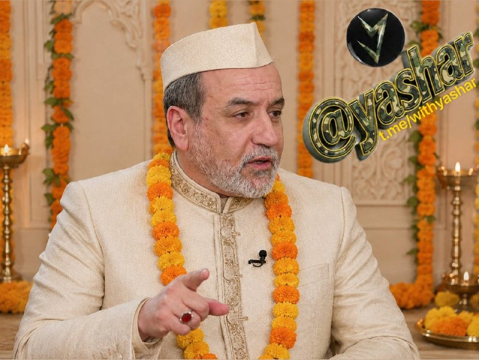

سیدعباس عراقچی وزیر امور خارجه برای شرکت در نشست وزرای امور خارجه کشورهای عضو بریکس به دهلی‌نو سفر می‌کند.😅
@withyashar

## WithYashar — post 11065

ترامپ: آمریکا در تماس مستقیم با مقامات ایرانی است و عجله ای برای رسیدن به توافق نداریم
@withyashar

## mwarmonitor — post 8988

  

✈️🇺🇸«نیروی هوایی ایالات متحده آمریکا (USAF) ✈️۱ فروند هواپیمای بمب‌افکن استراتژیک Rockwell B-1B Lancer AE6C05 86-0134 - ZENER 01 🔹 بعدازظهر امروز بر فراز جنوب غرب انگلستان از پایگاه RAF Fairford در حال عملیات بوده است. دو هواپیمای سوخت‌رسان KC-135 با شناسه‌های…

## mwarmonitor — post 8987

🇮🇱مقام‌های امنیتی اسرائیل به همتایان آمریکایی خود گفته‌اند که «در آستانه ازسرگیری درگیری‌ها در غزه هستند»، در حالی که تنش‌ها بر سر امتناع حماس از خلع سلاح یا واگذاری کنترل افزایش یافته است — به گزارش کان نیوز.

این گزارش می‌گوید گروه حماس با تهدید مسلحانه پیمانکاران محلی در غزه، آن‌ها را از مشارکت در کارهای ساختمانی یک شهر فلسطینی برنامه‌ریزی‌شده در رفح که با تأمین مالی امارات متحده عربی انجام می‌شود، منع کرده است. این پروژه با هماهنگی اسرائیل و یک ساختار فرماندهی تحت رهبری آمریکا در حال پیگیری بوده است.

@mwarmonitor

## mwarmonitor — post 8986

🇬🇧بریتانیا روز سه‌شنبه متعهد شد در صورت برقراری یک آتش‌بس پایدار در خاورمیانه، برای حفاظت از تنگه هرمز شناورهای خودران در اختیار قرار دهد.

🇬🇧بریتانیا پیشنهاد داده است شناورهای سطحی بدون سرنشین (USV) را به یک مأموریت چندملیتی به رهبری بریتانیا و فرانسه ارائه کند تا در صورت برقراری آتش‌بس پایدار، امنیت کشتیرانی بین‌المللی را تضمین کند.

🇬🇧این پیشنهاد علاوه بر سامانه‌های خودکار مین‌روبی نیروی دریایی سلطنتی بریتانیا و همچنین استقرار پیش‌دستانه ناوشکن پدافند هوایی کلاس Daring یعنی HMS Dragon است.

🇬🇧این مأموریت‌ها با هدف افزایش اطمینان برای کشتیرانی بین‌المللی در منطقه و به‌ویژه در Strait of Hormuz انجام می‌شود.

@mwarmonitor

## mwarmonitor — post 8985

🇮🇷ایران اعلام کرد تا زمانی که این شروط برآورده نشود، با ایالات متحده درباره مسئله هسته‌ای گفت‌وگو نخواهد کرد — الجزیره 📌پایان جنگ در «همه جبهه‌ها» 📌لغو کامل تمامی تحریم‌ها 📌آزادسازی دارایی‌های مسدودشده ایران 📌پرداخت غرامت‌های جنگی 📌به‌رسمیت شناختن حق…

## mwarmonitor — post 8983

🇮🇷ایران اعلام کرد تا زمانی که این شروط برآورده نشود، با ایالات متحده درباره مسئله هسته‌ای گفت‌وگو نخواهد کرد — الجزیره

📌پایان جنگ در «همه جبهه‌ها»

📌لغو کامل تمامی تحریم‌ها

📌آزادسازی دارایی‌های مسدودشده ایران

📌پرداخت غرامت‌های جنگی

📌به‌رسمیت شناختن حق حاکمیت ایران بر تنگه هرمز

@mwarmonitor

## mwarmonitor — post 8982

🇦🇹اتریش امروز دو فروند جنگنده Eurofighter Typhoon را برای شناسایی و رهگیری دو فروند هواپیمای PC-12 نیروی هوایی ایالات متحده که بدون مجوز وارد حریم هوایی این کشور شده بودند، به پرواز درآورد.
✈️گزارش‌ها حاکی است که هواپیماهای United States Air Force پس از رهگیری، تغییر مسیر داده و در مونیخ فرود آمدند.

@mwarmonitor

## mwarmonitor — post 8981

🔴«گروهی از مردان که به اتهام تلاش برای ورود به کشور از طریق دریا بازداشت شده بودند، در جریان بازجویی اعتراف کردند که عضو سپاه پاسداران انقلاب اسلامی ایران هستند، به گفته وزارت کشور کویت.» @mwarmonitor

## mwarmonitor — post 8979

  <a href="telegram/content/mwarmonitor_8979_1778607818.mp4" target="_blank">🎬 Download video</a>

✈️۱۵ فروند هواپیمای کوچک آمریکایی 🇺🇸 (احتمالاً F-16) که دیروز وارد شده‌اند در عربستان سعودی 🇸🇦، در اپرون (محوطه پارکینگ) آمریکایی پایگاه Prince Sultan Air Base (PSAB) در مختصات زیر مشاهده شدند:
24.0637, 47.5684

📌این موضوع تأیید می‌کند که محدودیت‌های عملیاتی عربستان علیه پروژه آمریکایی Project Freedom برداشته شده است.

✈️گفته می‌شود ۵۳ فروند جنگنده F-16 در پایگاه PSAB مستقر هستند.

@mwarmonitor

## mwarmonitor — post 8978

🔸سناتور گراهام: ژنرال کِین، آیا شما از گزارش‌هایی مبنی بر اینکه پاکستان اجازه می‌دهد از پایگاه‌هایش برای استقرار هواپیماهای ایرانی استفاده شود، اطلاعی دارید؟
🔹ژنرال کِین: قربان، من یک گزارش در این باره دیده‌ام.
🔸سناتور گراهام: خب، آیا این گزارش دقیق است؟
🔹ژنرال کِین: قربان، فکر می‌کنم با توجه به مسائل طبقه‌بندی شده مختلفی که دیده‌ام...
🔸سناتور گراهام (میان کلام او): اجازه دهید فقط این را بگویم؛ اگر این گزارش دقیق باشد، با نقش پاکستان به عنوان یک میانجی صلح در تضاد است، قبول دارید؟
🔹ژنرال کِین: قربان، من تمایلی ندارم بر اساس مذاکرات جاری و نقش پاکستان در این زمینه اظهار نظر کنم.
🔸سناتور گراهام: ممنون. آقای وزیر هِگسِت، اگر یک میانجی اجازه دهد هواپیماهای شناسایی ایران در پایگاه‌های هوایی پاکستان مستقر شوند، به نظر شما این با میانجی‌گری منصفانه همخوانی دارد؟
🔹وزیر هِگسِت: مجدداً عرض می‌کنم، من نمی‌خواهم در میانه این مذاکرات وارد شوم. من خواهان حداکثر اثربخشی برای...
🔸سناتور گراهام (با تندی): اما من می‌خواهم! من می‌خواهم وسط این مذاکرات باشم. من به اندازه یک پرتاب دست هم به پاکستان اعتماد ندارم. اگر آن‌ها واقعاً هواپیماهای ایرانی را برای محافظت از دارایی‌های نظامی ایران در پایگاه‌های خود مستقر کرده‌اند، به من می‌گوید که شاید باید به دنبال شخص دیگری برای میانجی‌گری باشیم. تعجبی ندارد که این مذاکرات لعنتی به هیچ‌جا نمی‌رسد.

@mwarmonitor

## mwarmonitor — post 8977

  <a href="telegram/content/mwarmonitor_8977_1778607819.mp4" target="_blank">🎬 Download video</a>

🔴سناتور لیندسی گراهام ؛ اگر این گزارش‌ها درست باشد، مستلزم بازنگری کامل در نقشی است که پاکستان به‌عنوان میانجی میان ایران، ایالات متحده و سایر طرف‌ها ایفا می‌کند. ‼️با توجه به برخی اظهارات پیشین مقام‌های دفاعی پاکستان علیه اسرائیل، اگر این موضوع صحت داشته…

## mwarmonitor — post 8976

  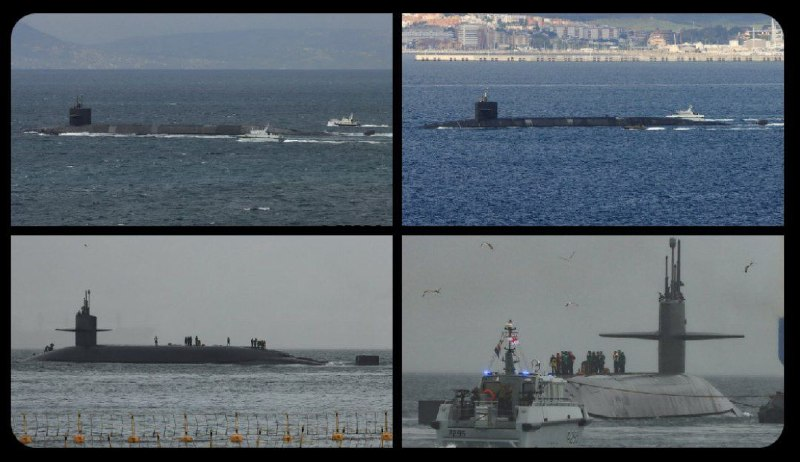

🔴پنتاگون اعلام کرد یک زیردریایی هسته‌ایِ نیروی دریایی آمریکا در جبل‌الطارق مستقر شده است؛ اقدامی که به‌ندرت درباره محل حضور یکی از محرمانه‌ترین تسلیحات آمریکا به‌صورت علنی اعلام می‌شود. این خبر یک روز پس از آن منتشر شد که رئیس‌جمهور ترامپ به‌طور قاطع آخرین…

## mwarmonitor — post 8975

  

✈️🇺🇸«نیروی هوایی ایالات متحده آمریکا (USAF)

✈️۱ فروند هواپیمای بمب‌افکن استراتژیک Rockwell B-1B Lancer
AE6C05 86-0134 - ZENER 01

🔹 بعدازظهر امروز بر فراز جنوب غرب انگلستان از پایگاه RAF Fairford در حال عملیات بوده است. دو هواپیمای سوخت‌رسان KC-135 با شناسه‌های GOLD 65/66 از پایگاه هوایی رامشتاین بدون سیگنال Mode-S برای دیدار با ZENER 01 پرواز کرده‌اند.

@mwarmonitor

## mwarmonitor — post 8973

🔴«ترامپ که از بن‌بست در مذاکرات ناراضی است، اکنون با جدیت بیشتری به ازسرگیری عملیات نظامی در ایران فکر می‌کند، هرچند به گفته منابع، تصمیم مهمی پیش از سفر او به چین بعید است گرفته شود.» CNN

@mwarmonitor

## mwarmonitor — post 8972

🇮🇷«ایران به‌طور قابل توجهی تعریف خود از تنگه هرمز را گسترش داده و اکنون منطقه‌ای بسیار بزرگ‌تر از قبل از جنگ را ادعا می‌کند. یک مقام نیروی دریایی سپاه پاسداران هشدار داده است که ایران «اجازه هیچ‌گونه تعرض به آب‌ها و منافع خود را نخواهد داد» - وال‌استریت ژورنال»

@mwarmonitor

## mwarmonitor — post 8971

🚢غول حمل‌ونقل دریایی مِرسک (Maersk)، دومین شرکت بزرگ کانتینری جهان، اعلام کرده است که همچنان از عبور از تنگه هرمز خودداری می‌کند.

@mwarmonitor

## mwarmonitor — post 8970

  

🇺🇸ناو هواپیمابر USS Abraham Lincoln (CVN 72) به عملیات خود در دریای عرب ادامه می‌دهد، از جمله اجرای محاصره آمریکا علیه ایران. به گفته سنتکام، نیروهای آمریکایی ۶۵ کشتی تجاری را تغییر مسیر داده و ۴ کشتی را از کار انداخته‌اند.

@mwarmonitor

## mwarmonitor — post 8969

✈️🇺🇸«یونایتد ایرلاینز اعلام کرد که پروازهای خود به ونزوئلا را از ۱۱ آگوست از سر خواهد گرفت.»

@mwarmonitor

## mwarmonitor — post 8968

🇺🇸نیروی دریایی آمریکا روز دوشنبه اعلام کرد که ناو جنگی جدیدی که به نام رئیس‌جمهور ترامپ نام‌گذاری شده، هسته‌ای خواهد بود؛ اقدامی که انتظار می‌رود هزینه و پیچیدگی این پروژه چند میلیارد دلاری را افزایش دهد، پروژه‌ای که پیش‌تر نیز درباره عملی شدن ساخت آن تردیدهایی وجود داشت. WSJ

@mwarmonitor

## mwarmonitor — post 8967

  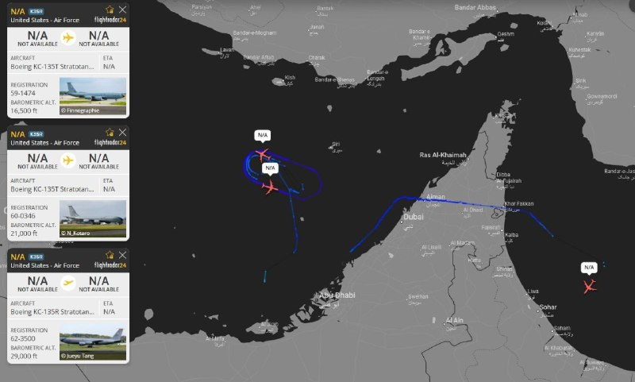

✈️۳ فروند هواپیمای سوخت‌رسان هوایی KC-135R/T نیروی هوایی آمریکا در حال حاضر در نزدیکی تنگه هرمز در حال عملیات هستند.

@mwarmonitor

## mwarmonitor — post 8966

  

‼️یکی دیگه

## FoxNewsTwitter — post 341601

  <a href="telegram/content/FoxNewsTwitter_341601_1778607823.mp4" target="_blank">🎬 Download video</a>

Fox News (Twitter/X)

NEW: Secretary of War Hegseth clashes with Sen. Chris Coons over claims of a looming "strategic loss" in the Middle East as America’s fragile ceasefire with Iran continues to hold.

COONS: "My concern, Mr. Secretary, is that you've achieved a series of tactical successes, but are on the verge of a strategic loss..."

HEGSETH: "I just think it's so foolish. Here we are in a committee in the United States Senate, 74 days in, and you're talking about ‘strategic loss’?"

"We have the ability to defeat a 47-year threat of a pursuit of a nuclear weapon. We have more leverage than we've ever had. We've had incredible battlefield successes. And you're talking about a ‘strategic loss’?”

## FoxNewsTwitter — post 341600

  

Fox News (Twitter/X)

NEW: Kevin Warsh clears the Senate to take a seat back on the Federal Reserve's Board of Governors — and now the spotlight shifts to the Fed’s top job.

Trump’s pick was confirmed 51–45, pushing past early doubts about whether he had the votes.

The Senate is expected to fully confirm Warsh on Wednesday, ending months of high-stakes drama over his Fed nomination to replace Chair Jerome Powell, whose term is set to end May 15.

## FoxNewsTwitter — post 341599

  <a href="telegram/content/FoxNewsTwitter_341599_1778607825.mp4" target="_blank">🎬 Download video</a>

Fox News (Twitter/X)

JUST IN: Officials reveal details of the harrowing timeline of a fatal security breach at Denver International Airport after a trespasser scaled a barbed-wire fence and was struck by a plane.

"The time between climbing over the fence and being struck by the plane, again, was approximately two minutes. The location of the incident is about two miles away from the terminal. Given the short time period, we were not able to intervene and prevent this person from reaching the runway."

## FoxNewsTwitter — post 341598

  <a href="telegram/content/FoxNewsTwitter_341598_1778607827.mp4" target="_blank">🎬 Download video</a>

Fox News (Twitter/X)

NEW: "If you want to go fast, go alone. But if you want to go far, go together."

Artemis II pilot Victor Glover reflects on the crew's historic mission from inside the U.S. Capitol, shifting the focus away from distance records and onto the team that made it possible.

Glover makes one thing clear: this wasn’t about four names on a crew list, it was a shared journey, powered by everyone watching, supporting, and pushing the mission forward.

## FoxNewsTwitter — post 341597

Fox News (Twitter/X)

JUST IN: WHO reports 2 new cases of hantavirus amid growing concern about the disease:

"As of 12 May, 12h00 CEST, a total of 11 cases, including 3 deaths, have been reported. Nine of the 11 cases are confirmed, and the other 2 are probable. All are among passengers or crew on the ship."

"We expect more cases given the dynamics of spread on a ship and the virus’ incubation period. At the moment, there is no sign that we are seeing the start of a larger outbreak."

## FoxNewsTwitter — post 341596

  <a href="telegram/content/FoxNewsTwitter_341596_1778607829.mp4" target="_blank">🎬 Download video</a>

Fox News (Twitter/X)

NEW: War Secretary Pete Hegseth unveils a massive $1.5 trillion budget aimed at restoring American commercial dominance and overhauling a "broken" military system.

“This budget also includes a historic troop pay increase 7% that builds on the pay increases that Congress has given in previous years, and the budget eliminates all poor or failing barracks.”

“Quality of life for our troops is front and center in this budget. By supercharging our industrial capacity and transforming how the department does business, we are restoring American commercial dominance at a pace unseen in generations, transforming the defense industrial base from the broken, slow-moving systems of the past.”

## FoxNewsTwitter — post 341595

  <a href="telegram/content/FoxNewsTwitter_341595_1778607830.mp4" target="_blank">🎬 Download video</a>

Fox News (Twitter/X)

BREAKING: Sen. Lindsey Graham unloads on Pakistan after reports claim the Middle East mediator allowed Iran to use their bases to park military aircraft.

"I don't trust Pakistan as far as I can throw them. If they actually do have Iranian aircraft parked in Pakistan bases to protect Iranian military assets, that tells me we should be looking maybe for somebody else to mediate. No wonder this damn thing is going nowhere."

## FoxNewsTwitter — post 341594

  <a href="telegram/content/FoxNewsTwitter_341594_1778607832.mp4" target="_blank">🎬 Download video</a>

Fox News (Twitter/X)

NEW: Senate Minority Leader Chuck Schumer lashes out at the White House, claiming the administration's policy decisions have left the nation vulnerable to the recent hantavirus outbreak.

"The Trump administration's gutting of America's public health preparedness has made the recent hantavirus outbreak even more alarming."

## FoxNewsTwitter — post 341593

  <a href="telegram/content/FoxNewsTwitter_341593_1778607833.mp4" target="_blank">🎬 Download video</a>

Fox News (Twitter/X)

RT @AmericaNewsroom: HANTAVIRUS OUTBREAK: @DrMarcSiegel breaks down the likelihood of human-to-human transmission in American communities as cruise passengers undergo medical observation.

“This ship was like a petri dish where everybody came together... it only occurred because of very, very close quarters and conditions.”

## FoxNewsTwitter — post 341592

‌Fox News (Twitter/X)

Read more:

## FoxNewsTwitter — post 341591

  <a href="telegram/content/FoxNewsTwitter_341591_1778607835.mp4" target="_blank">🎬 Download video</a>

Fox News (Twitter/X)

A suspected gunman with a lengthy criminal history, identified as Tyler Brown, allegedly opened fire on random drivers along a Massachusetts roadway, critically injuring two people as outrage builds over why he had previously been released from prison.

Authorities said the rampage ended when a Massachusetts State Police trooper and an armed Marine veteran rushed toward Brown as panicked drivers fled, with the Marine helping confront and stop the shooter before more people were hurt.

Investigators say Brown fired dozens of rounds before being subdued and now faces multiple charges, including armed assault with intent to murder.

## FoxNewsTwitter — post 341590

  <a href="telegram/content/FoxNewsTwitter_341590_1778607837.mp4" target="_blank">🎬 Download video</a>

Fox News (Twitter/X)

NEW: Two corporate entities and a foreign shipping employee have been charged in the Francis Scott Key Bridge collapse.

Federal prosecutors say the companies behind the container ship, along with a technical superintendent, altered critical fuel systems before the crash.

"The indictment alleges that if the Dali had been using the proper fuel supply pumps, then the vessel would have regained power in time to safely navigate under the Key Bridge," U.S. Attorney Kelly Hayes says.

Investigators say a second blackout sealed the outcome — turning a power loss into a deadly collapse that killed six workers.

## FoxNewsTwitter — post 341589

  <a href="telegram/content/FoxNewsTwitter_341589_1778607839.mp4" target="_blank">🎬 Download video</a>

Fox News (Twitter/X)

JUST IN: Two individuals were just ejected from the Senate Appropriations hearing as War Secretary Pete Hegseth and Joint Chiefs Chairman Gen. Dan Caine faces questions from lawmakers about military funding amid the war with Iran.

One of the protesters escorted out was a woman was yelling about Iranian-American opposition to the Middle East war.

## FoxNewsTwitter — post 341588

‌Fox News (Twitter/X)

https://www.foxnews.com/us/dali-ship-operator-foreign-employee-charged-francis-scott-key-bridge-collapse-unsealed-indictment-shows

## FoxNewsTwitter — post 341587

  

Fox News (Twitter/X)

Elon Musk is joining President Trump on a major trip to Beijing, signaling a notable shift after the pair’s well-documented falling out in 2025.

The Tesla CEO will be traveling alongside other corporate heavyweights like Apple's Tim Cook and BlackRock’s Larry Fink as part of the U.S. delegation, as more than a dozen business leaders from Wall Street to Silicon Valley join the trip.

Trump is preparing for a high-profile meeting with President Xi, with economic cooperation and corporate ties expected to take center stage in a rare show of business alignment alongside a presidential visit.

The trip could shape the tone of economic relations between the two countries going forward, as U.S. officials say the president wants to discuss the creation of a board of investment and a board of trade with China, as business leaders may prove to be just as much in the spotlight as the bilateral meeting itself.

## FoxNewsTwitter — post 341586

  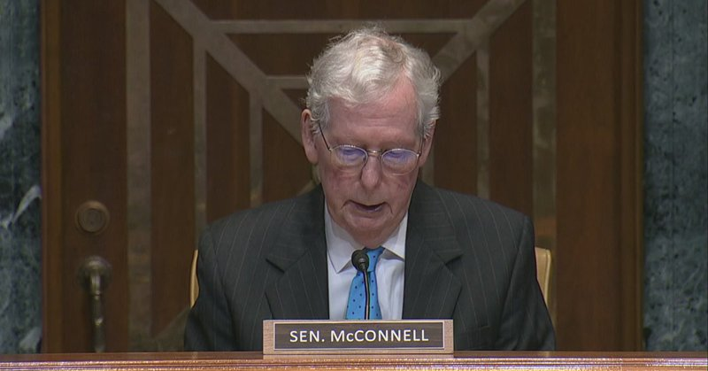

Fox News (Twitter/X)

WATCH LIVE: Secretary Hegseth testifies on Pentagon budget before Senate panel https://twitter.com/i/broadcasts/1PKqrEVLXpeGb

## FoxNewsTwitter — post 341585

  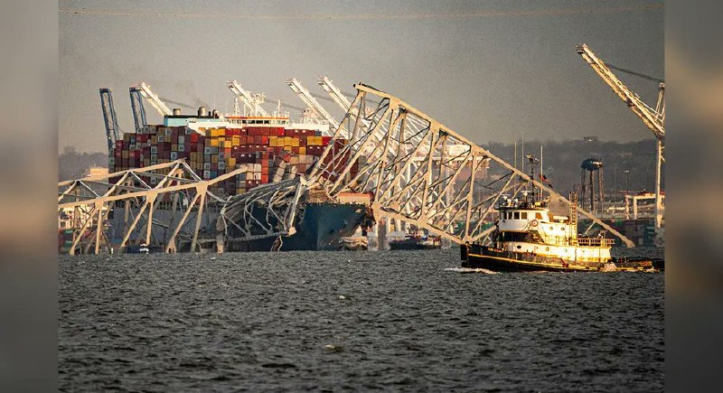

Fox News (Twitter/X)

BREAKING: Foreign crew of container ship Dali charged over deadly Francis Scott Key bridge collision, newly unsealed indictment shows

## FoxNewsTwitter — post 341584

  <a href="telegram/content/FoxNewsTwitter_341584_1778607842.mp4" target="_blank">🎬 Download video</a>

Fox News (Twitter/X)

WATCH: Three people arrested as another protest outside a New York synagogue turns violent.

Hundreds gathered in Brooklyn as anti-Israel demonstrators clashed with police near the site, escalating into chaos.

Police say those taken into custody were seen throwing items during the confrontation. It follows a similar protest at a historic Manhattan synagogue just weeks ago, raising concerns as tensions continue to spill into the streets.

## FoxNewsTwitter — post 341583

  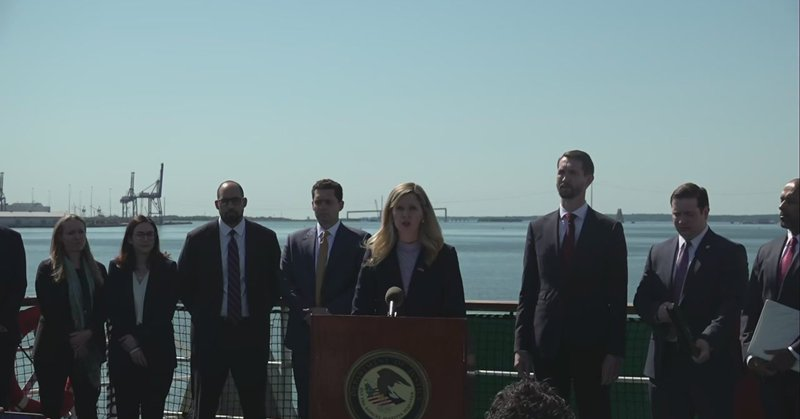

Fox News (Twitter/X)

WATCH LIVE: Federal officials deliver update on probe into Baltimore bridge vessel crash https://twitter.com/i/broadcasts/1nKOLEqNaNVGR

## FoxNewsTwitter — post 341582

  <a href="telegram/content/FoxNewsTwitter_341582_1778607844.mp4" target="_blank">🎬 Download video</a>

Fox News (Twitter/X)

NEW: "President Trump's War Department has begun to turn the lights back on in manufacturing towns across this country."

Secretary Pete Hegseth touting a push to steer federal agencies toward buying American and investing in domestic manufacturing:

"We are firing up the American economic engine at every level of the defense industrial base."

"This is admittedly a historic budget. It is a fiscally responsible budget, and it is a warfighting budget."

## pm_afshaa — post 90638

🔴سناتور لیندسی گراهام: من به هیچ وجه به پاکستان اعتماد ندارم؛ اونا هیچ صلاحیتی برای میانجیگری ندارن. اونا اصلاً منصف نیستن

💧 Rainbet.com the #1 Non-KYC Crypto Casino & Sportsbook @rainbetcom

😁 @Pm_Afshaa

## pm_afshaa — post 90637

  <a href="telegram/content/pm_afshaa_90637_1778607845.webm" target="_blank">🎬 Download video</a>

🔴کانال 12 اسرائیل:
انتظار میره که ترامپ بعد از بازگشتش از چین در پایان هفته، تصمیمات نهایی و جدیش رو درباره ایران بگیره.

💧 Rainbet.com the #1 Non-KYC Crypto Casino & Sportsbook @rainbetcom

😁 @Pm_Afshaa

## pm_afshaa — post 90636

  <a href="telegram/content/pm_afshaa_90636_1778607846.webm" target="_blank">🎬 Download video</a>

🔴لیست کامل مدیران شرکت‌های بزرگ آمریکایی که ترامپ رو در سفر به چین همراهی خواهند کرد :

💧 Rainbet.com the #1 Non-KYC Crypto Casino & Sportsbook @rainbetcom

😁 @Pm_Afshaa

## pm_afshaa — post 90635

  <a href="telegram/content/pm_afshaa_90635_1778607846.webm" target="_blank">🎬 Download video</a>

🔴تصاویر ماهواره‌ای از حضور بی‌سابقه بیش از 53 جنگنده آمریکایی در پایگاه هوایی سلطان عربستان خبر میده.

💧 Rainbet.com the #1 Non-KYC Crypto Casino & Sportsbook @rainbetcom

😁 @Pm_Afshaa

## pm_afshaa — post 90634

  <a href="telegram/content/pm_afshaa_90634_1778607846.webm" target="_blank">🎬 Download video</a>

🔴تسنیم: به دیوان داوری لاهه علیه آمریکا شکایت کردیم؛ تجاوز نظامی به تاسیسات هسته‌ای، اعمال تحریم‌های اقتصادی و تهدید به توسل به زور از موضوعات این شکایته.

💧 Rainbet.com the #1 Non-KYC Crypto Casino & Sportsbook @rainbetcom

😁 @Pm_Afshaa

## pm_afshaa — post 90633

  <a href="telegram/content/pm_afshaa_90633_1778607847.webm" target="_blank">🎬 Download video</a>

🔴یک مقام ارشد پنتاگون: جنگ ایران تاکنون 29 میلیارد دلار برای آمریکا هزینه داشته.

💧 Rainbet.com the #1 Non-KYC Crypto Casino & Sportsbook @rainbetcom

😁 @Pm_Afshaa

## pm_afshaa — post 90632

شهبازی مجری کونیه صداوسیما:
اگه خیلی به اینترنت علاقه دارید برید سوریه و افغانستان و عراق زندگی کنید

💧 Rainbet.com the #1 Non-KYC Crypto Casino & Sportsbook @rainbetcom

😁 @Pm_Afshaa

## pm_afshaa — post 90631

  <a href="telegram/content/pm_afshaa_90631_1778607847.webm" target="_blank">🎬 Download video</a>

🔴نفتکش حامل نفت عراق به دلیل اینکه چند روز پیش با اجازه ایران از تنگه هرمز عبور کرده بود، امروز توسط نیروی دریایی آمریکا بازگردانده شد.

💧 Rainbet.com the #1 Non-KYC Crypto Casino & Sportsbook @rainbetcom

😁 @Pm_Afshaa

## pm_afshaa — post 90630

سخنگوی دولت: تا سایه‌ جنگ دور نشه اینترنت وصل نمیشه، وقتی دور شد به تدریج وصل میشه

💧 Rainbet.com the #1 Non-KYC Crypto Casino & Sportsbook @rainbetcom

😁 @Pm_Afshaa

## pm_afshaa — post 90629

  <a href="telegram/content/pm_afshaa_90629_1778607848.webm" target="_blank">🎬 Download video</a>

🔴دونالد ترامپ: چین قوی است، اما ما قوی‌تر از چین هستیم. ما از نظر نظامی قوی تر از هر کشور دیگری هستیم.

این رو در مورد ونزوئلا دیدید. این برای اکثر کشورهای دیگر کار سختی بود. ما این کار رو در یک روز انجام دادیم.
نگاهی به ایران بندازید، آنها چیز های بزرگی داشتن و همه چیز از بین رفته.

💧Rainbet.com the #1 Non-KYC Crypto Casino & Sportsbook @rainbetcom

😁 @Pm_Afshaa

## pm_afshaa — post 90628

  <a href="telegram/content/pm_afshaa_90628_1778607848.webm" target="_blank">🎬 Download video</a>

🔴ترامپ: من رابطه خیلی خوبی با بی‌بی نتانیاهو دارم. ما واقعاً مثل دو شریک واقعی کنار هم بودیم؛ اگه ما دوتا نبودیم، اسرائیلی هم وجود نداشت؛ مخصوصاً بدون من قطعاً چنین چیزی ممکن نبود.

💧 Rainbet.com the #1 Non-KYC Crypto Casino & Sportsbook @rainbetcom

😁 @Pm_Afshaa

## pm_afshaa — post 90627

  <a href="telegram/content/pm_afshaa_90627_1778607849.webm" target="_blank">🎬 Download video</a>

🔴ترامپ: آمریکا در تماس مستقیم با مقامات ایرانی است و عجله‌ای برای رسیدن به توافق نداریم!

💧 Rainbet.com the #1 Non-KYC Crypto Casino & Sportsbook @rainbetcom

😁 @Pm_Afshaa

## pm_afshaa — post 90626

  <a href="telegram/content/pm_afshaa_90626_1778607849.mp4" target="_blank">🎬 Download video</a>

🔴دونالد ترامپ: ما لازم نیست عجله کنیم، ما یک محاصره داریم که بهشون اجازه نمیده پولی داشته باشن.

این یه چیز بسیار سادست؛ ما نمیتونیم بهشون اجازه بدیم سلاح هسته‌ای داشته باشن چون صدرصد ازش استفاده میکنن.

ایرانی‌ها به من گفتن غبار هسته‌ای مال تو میشه، اما بعد نظرشون عوض شد.

ما 100 درصد گرد و غبار هسته‌ای و همه چیز رو به دست خواهیم آورد.

💧 Rainbet.com the #1 Non-KYC Crypto Casino & Sportsbook @rainbetcom

😁 @Pm_Afshaa

## pm_afshaa — post 90625

  <a href="telegram/content/pm_afshaa_90625_1778607851.webm" target="_blank">🎬 Download video</a>

🔴هگست، وزیر جنگ آمریکا:
ما مهمات و قابلیت‌های کافی برای تضمین دستیابی به آنچه میخوایم در ایران به دست بیاریم، داریم. وزارت جنگ در آمادگی کامله و در صورت لزوم آماده اقدام علیه ایرانه.

💧 Rainbet.com the #1 Non-KYC Crypto Casino & Sportsbook @rainbetcom

😁 @Pm_Afshaa

## pm_afshaa — post 90624

  <a href="telegram/content/pm_afshaa_90624_1778607851.webm" target="_blank">🎬 Download video</a>

🔴هگست، وزیر جنگ آمریکا:
به دلیل حساسیت عملیاتی که رئیس‌جمهور ترامپ بر عهده داره و همچنین برای اطمینان از عدم دستیابی ایران به بمب هسته‌ای، گام بعدی خود علیه این کشور رو فاش نخواهیم کرد.

💧 Rainbet.com the #1 Non-KYC Crypto Casino & Sportsbook @rainbetcom

😁 @Pm_Afshaa

## pm_afshaa — post 90623

  <a href="telegram/content/pm_afshaa_90623_1778607852.webm" target="_blank">🎬 Download video</a>

🔴ترامپ با انتشار این پست از اوباما، بایدن و پلوسی نوشت: دموکرات‌ها عاشق فاضلاب هستن.

💧 Rainbet.com the #1 Non-KYC Crypto Casino & Sportsbook @rainbetcom

😁 @Pm_Afshaa

## pm_afshaa — post 90622

🔴پیت هگست : اگه لازم باشه، برای تشدید درگیری با ایران یه برنامه داریم

💧 Rainbet.com the #1 Non-KYC Crypto Casino & Sportsbook @rainbetcom

😁 @Pm_Afshaa

## pm_afshaa — post 90621

وزارت خارجه کویت: ما از ایران می‌خواهیم که فوراً و بدون قید و شرط اقدامات غیرقانونی و خصمانه خود را که امنیت منطقه را تهدید می‌کند، متوقف کند

💧 Rainbet.com the #1 Non-KYC Crypto Casino & Sportsbook @rainbetcom

😁 @Pm_Afshaa

## pm_afshaa — post 90620

🔴فیدان : به خاطر جهان، تنگه هرمز باید باز شود

💧 Rainbet.com the #1 Non-KYC Crypto Casino & Sportsbook @rainbetcom

😁 @Pm_Afshaa

## pm_afshaa — post 90617

🔴ترامپ در Truth Social:هیچ جمهوری‌خواهی تاکنون درباره کوبا با من صحبت نکرده است، کشوری شکست‌خورده که فقط در یک جهت حرکت می‌کند - به سمت پایین

💧 Rainbet.com the #1 Non-KYC Crypto Casino & Sportsbook @rainbetcom

😁 @Pm_Afshaa

## iaghapour — post 2602

🚀 آپدیت بزرگ و انقلابی پنل 3x-ui (نسخه‌های 3.0.0 و 3.0.1)

بالاخره یکی از مهم‌ترین آپدیت‌های پنل محبوب 3x-ui منتشر شد! در این نسخه‌ها شاهد بازنویسی کامل رابط کاربری، اضافه شدن قابلیت‌های مدیریتی کلان و بهبودهای چشمگیر امنیتی هستیم.

🌐 ۱. بازنویسی کامل و سریع‌تر شدن پنل (مهاجرت به Vue 3) رابط کاربری از پایه بازنویسی شده است! این یعنی سرعت لود بسیار بالاتر، طراحی مدرن‌تر، صفحه لاگین جدید و بهبود چشمگیر تم دارک.

⚡️ ۲. آمار زنده و در لحظه: با جایگزینی سیستم قدیمی با WebSocket، از این پس تمام آمارهای داشبورد، مصرف حجم کلاینت‌ها و وضعیت سرور به صورت «زنده» آپدیت می‌شوند و دیگر نیازی به رفرش کردن صفحه نیست!

🌍 ۳. مدیریت چند سروره (Multi-Node Deployment) - 🌟 ویژگی طلایی یکی از مورد انتظارترین قابلیت‌ها اضافه شد! حالا می‌توانید از طریق یک پنل مرکزی (Manager)، کانفیگ‌ها و اینباندها را روی چندین سرور دیگر (Remote Nodes) مستقر و مدیریت کنید.

📱 ۴. رابط کاربری کاملاً سازگار با موبایل: داشبورد، لیست کلاینت‌ها و بخش لاگ‌ها حالا به صورت "کارتی" و کاملاً بهینه برای نمایشگرهای موبایل طراحی شده‌اند تا مدیریت پنل با گوشی بسیار راحت‌تر شود.

⚙️ ۵. خداحافظی با کدهای JSON و تنظیمات آسان‌تر فرم‌های ساخت کانفیگ (Inbounds) کاملاً ساختاریافته و گرافیکی شده‌اند. دیگر برای تنظیمات پایه نیازی به دستکاری JSON خام نیست (البته تب Advanced برای حرفه‌ای‌ها همچنان وجود دارد). همچنین مدیریت DNSها بسیار پیشرفته‌تر شده است.

👥 ۶. مدیریت گروهی کلاینت‌ها (Bulk Actions) امکان انتخاب گروهی کلاینت‌ها برای حذف یا اعمال تغییرات اضافه شده که کار ادمین‌ها را بسیار راحت می‌کند.

🛠 ۷. امکانات جدید Xray و Outboundها اضافه شدن پروتکل Loopback، دکمه Test All برای تست همزمان همه Outboundها و ارائه گزارش دقیق از تایم‌اوت‌ها، و همچنین خاموش شدن امن هسته Xray.

🔒 ۸. ارتقاء امنیت و نصب راحت‌تر ➖ اضافه شدن سیستم امنیتی CSRF Protection برای جلوگیری از حملات. ➖ اضافه شدن گزینه skip-SSL در اسکریپت نصب (بسیار کاربردی برای کسانی که از ریورس‌پروکسی یا تانل استفاده می‌کنند و نیازی به سرتیفیکیت روی خود سرور ندارند). ➖ اضافه شدن صفحه مستندات API (API Docs) در داخل خود پنل برای برنامه‌نویسان.

و بسیاری از تغییرات دیگه که میتونید در این لینک مطالعه کنید.

💡 نکته: برای تجربه این تغییرات فوق‌العاده، پیشنهاد می‌شود هرچه سریع‌تر پنل خود را آپدیت کنید. (توصیه همیشگی: قبل از آپدیت بکاپ فراموش نشود!)

✍🏻 با تشکر از ثنایی عزیز.

🆔 @iaghapour

## DEJradio — post 4594

  <a href="telegram/content/DEJradio_4594_1778607852.webm" target="_blank">🎬 Download video</a>

ب
🔺📷 ررسی‌ها نشان می‌دهد نرگس افشردی شاغل در دانشگاه هاروارد، برادرزاده محمد باقری (محمدحسین افشردی)، رئیس پیشین ستاد کل نیروهای مسلح جمهوری اسلامی، است که در خرداد ۱۴۰۴ در پی حمله هوایی اسرائیل کشته شد.

کاربران در شبکه‌های اجتماعی که سوابق نرگس افشردی را بررسی کرده‌اند می‌گویند او در حالی خارج از ایران در رفاه زندگی می‌کند که اگر یکی از بستگان دور یک گروهبان در خارج از کشور مقیم باشد هیچگونه انتصابی به او نمی‌دهند اما بسیاری از اقوام و خویشاوندان درجه یک فرماندهان ارشد نظام و مقامات سیاسی و امنیتی خارج از ایران سکونت دارند.

نرگس افشردی فرزند حسن باقری (غلامحسین افشردی)، از فرماندهان سپاه پاسداران در دوران جنگ ایران و عراق، می‌باشد.
همسر او، محسن گودرزی استاد مطالعات اسلامی در دانشگاه «هاروارد» است و خود نرگس نیز به‌عنوان پژوهشگر حوزه روان‌شناسی در همین دانشگاه فعالیت می‌کند.

این موضوع بار دیگر بحث قدیمی درباره تفاوت سبک زندگی و محل اقامت فرزندان و نزدیکان برخی مسئولان جمهوری اسلامی با شرایط عمومی مردم ایران را در فضای مجازی پررنگ کرده است.

#IRGCterrorists #جمهوری_اسلامی
@DEJradio

## DEJradio — post 4593

  <a href="telegram/content/DEJradio_4593_1778607853.webm" target="_blank">🎬 Download video</a>

🤡
🔺 یک سرگرد نیروی انتظامی با ابعاد چاق و بدفرم در تجمعات شبانه طرفداران حکومت خطاب به سلطنت‌طلب‌ها می‌گوید، مجتبی را تنها نمی‌گذاریم!

این در حالی‌ست که مجتبی خامنه‌ای وضعیت نامشخص دارد و اصلا معلوم نیست توان حرکت یا تصمیم‌گیری دارد یاصرفا یک جسم بی‌تحرک در خدمت سرداران است.

#موشتبا #جمهوری_اسلامی
@DEJradio

## DEJradio — post 4592

  <a href="telegram/content/DEJradio_4592_1778607853.mp4" target="_blank">🎬 Download video</a>

🚨
🔸 شکستن تابوی سکوت

*غنچه استوارنیا

#تابوشکنی #جمهوری_اسلامی
@DEJradio

## DEJradio — post 4591

  <a href="telegram/content/DEJradio_4591_1778607855.mp4" target="_blank">🎬 Download video</a>

🚨
🔸 افزایش شمار اعدام‌ها در جمهوری اسلامی؛ انتقام نظام از شهروندان؟

گفت‌وگو با سامان گنجی، زندانی سابق کهریزک

شمار اعدام‌ها در جمهوری اسلامی همچنان رو به افزایش است. اغلب این زندانیان به «ارتباط و همکاری با اسرائیل» و «محاربه» متهم شده‌اند. سامان گنجی، زندانی سیاسی جان‌به‌دربرده از کهریزک در سال ۱۳۸۸، در گفت‌وگو با «دژ» درباره هدف جمهوری اسلامی از اجرای فزاینده احکام اعدام در ایران توضیح می‌دهد.

#اعدام #جمهوری_اسلامی
@DEJradio

## DEJradio — post 4590

  <a href="telegram/content/DEJradio_4590_1778607857.mp4" target="_blank">🎬 Download video</a>

🤡
🔺 ظهره‌وند نماینده مجلس:
میشه کارهایی کرد که بمب اتم جلوش بچه‌بازیه!

ابوالفضل ظهره‌وند عضو دیگر کمیسیون امنیت ملی مجلس شورای اسلامی، مدعی شده است، «تولید بمب کاری نداره، وقتی شما اراده داشته باشی می‌توانی پلاسما و سلاح‌هایی داشته باشی که بمب اتم جلوش ترقه باشه؛ تاثیر تنگه هرمز، باب المندب و جبهه مقاومت از صد تا بمب اتم بیشتره، البته این تضادی هم با دیگر مسائل ندارد.»

او همچنین گفته «من جاها و ظرفیت‌هایی رو دیدم که اتفاقی میوفته که بمب اتم جلوش ترقه است، شما میتونید زمان رو پشت سر بزارید، چیزی که در چند ثانیه از تهران تا واشنگتن برود، میشه یه کارهایی کرد که بمب اتم جلوش بچه بازیه!»

#بمب_اتم #تنگه_هرمز
@DEJradio

## mamlekate — post 103515

  

💥 دعوت به همکاری با خبرگزاری هرانا

خبرگزاری هرانا، با بیش از دو دهه سابقه در حوزه گزارشگری و مستندسازی حقوق بشر، در راستای توسعه فعالیت‌های خود از علاقه‌مندان واجد شرایط برای همکاری دعوت می‌کند.

هرانا در این مرحله بیش از آن‌که به دنبال افراد با سابقه حرفه‌ای باشد، به دنبال افرادی متعهد، دقیق و آموزش‌پذیر است؛ کسانی که دغدغه واقعی حقوق بشر دارند و مایل‌اند در یک چارچوب حرفه‌ای، مهارت‌های خود را توسعه دهند.

زمینه‌های همکاری شامل:
گزارشگری، ویراستاری، ترجمه، مدیریت شبکه‌های اجتماعی و سایر حوزه‌های مرتبط

ویژگی‌های مورد انتظار:

* تسلط کافی به زبان فارسی (خواندن و نوشتن)
* دقت، مسئولیت‌پذیری و توانایی یادگیری مستمر
* علاقه و حساسیت نسبت به موضوعات حقوق بشر
* آمادگی برای فعالیت در چارچوب‌های سازمان‌یافته و حرفه‌ای

❗️ توجه: این فرصت همکاری فقط شامل کسانی است که به زبان فارسی مسلط و ساکن یکی از کشورهای "ترکیه، قبرس شمالی، هندوستان، مصر، قرقیزستان، ازبکستان، کلمبیا، پاراگوئه، قزاقستان، سریلانکا، بلغارستان و رومانی" هستند.

همکاری با هرانا فرصتی است برای کسب تجربه عملی در حوزه مستندسازی و فعالیت‌های حقوق بشری در یک نهاد با سابقه و ساختار حرفه‌ای.

📎 برای ثبت درخواست همکاری، لطفا فرم زیر را تکمیل کنید:
https://hra.news/4cBjHqs

📩 در صورت بروز مشکل در تکمیل فرم، می‌توانید رزومه و اطلاعات تماس خود را به آدرس زیر ارسال نمایید:
info@hra-news.org

↘️
@hranews_bot تماس ✉️ -  @Hranews  کانال هرانا 🆑

## mamlekate — post 103514

  

📞 الو یه سری قایق های تیز رو مال مردم جنوب هست که سالهاست دارن از خصب عمان کالا میارن (قایق های شوتی) توی این هفته گذشته تا الان دارم که پیام مینویسم پهپادهای آمریکایی چندتا از این قایق‌ها رو زدند ۱۰ تا ۱۲ نفر تلفات دادند. هر قایق دونفر سرنشین دارند یک ناخدا یک ملوان. این آگهی مربوط به یکی از این قایق‌هاست.

آمریکایی ها فکر می‌کنند اینا مال نیروی دریایی هستش. جمهوری اسلامی هم مهم نیست براش خوشحالم میشه تلفات غیرنظامی بره بالا.

@mamlekate

## mamlekate — post 103513

  

📞 تهران بالاتر از چهارراه ولیعصر ۲۲ اردیبهشت ساعت ۱۲ نفربر نوپو گذاشتن. قبلا هم بوده البته چون بخاطر جنگ هنوز جایی برای پارکشون ندارن. دکوراسیون شهر تهران شدن.

@mamlekate

## VahidOnline — post 75432

  

دونالد ترامپ در گفت‌وگو با برنامه رادیویی «سید رازبرگ» گفت: انتظار داریم اقتصاد ایران زیر فشارهای ناشی از محاصره بنادرش فرو بپاشد.
او افزود این درگیری بدون نیاز به شتاب‌زدگی حل‌وفصل خواهد شد و جمهوری اسلامی با انزوایی روبه‌رو است که آن را از منابع درآمدی محروم می‌کند.
ترامپ گفت ایالات متحده در حال انجام ارتباطات مستقیم با مقام‌های تهران است و برای رسیدن به توافق عجله‌ای ندارد و او اطمینان دارد که تهران غنی‌سازی اورانیوم را به‌طور کامل متوقف خواهد کرد.
@VahidOOnLine
دونالد ترامپ گفت حکومت ایران با انزاویی روبه‌روست که آن را از منابع درآمدش محروم می‌کند و انتظار می‌رود اقتصاد ایران زیر فشارهای ناشی از محاصره بندرها دچار فروپاشی شود.
او افزود: «این درگیری بدون نیاز به شتاب‌زدگی حل‌وفصل خواهد شد و جمهوری اسلامی با انزوایی روبه‌رو است که آن را از منابع درآمدی محروم می‌کند.»
دونالد ترامپ درباره اورانیوم غنی‌شده در ایران گفت مقام‌های جمهوری اسلامی به او گفته‌اند قرار است آنچه او «گردوغبار هسته‌ای» می‌نامد در اختیار آمریکا قرار گیرد، اما بعدا نظرشان را تغییر داده‌اند. او تاکید کرد در نهایت این مواد را به دست خواهند آورد و موضوع را جمع‌وجور می‌کنند.
@VahidOOnLine

📡 @VahidOnline

## VahidOnline — post 75431

  

یک مقام ارشد پنتاگون روز سه‌شنبه ۲۲ اردیبهشت اعلام کرد که جنگ ایالات متحده با ایران تاکنون ۲۹ میلیارد دلار هزینه داشته است، رقمی که نسبت به برآورد ارائه‌شده در اواخر ماه گذشته، چهار میلیارد دلار افزایش نشان می‌دهد.

به گزارش خبرگزاری رویترز، در حالی که تنها شش ماه تا انتخابات میان‌دوره‌ای کنگره آمریکا باقی مانده است، دموکرات‌ها در نظرسنجی‌های عمومی موقعیت بهتری پیدا کرده‌اند و تلاش می‌کنند این جنگ را به مسائل مربوط به هزینه‌های زندگی پیوند بزنند.
@VahidHeadline

📡 @VahidOnline

## VahidOnline — post 75430

  

دونالد ترامپ، رییس‌جمهوری آمریکا، روز سه‌شنبه در تروث سوشال دو تصویر گرافیکی منتشر کرد که صحنه‌هایی از حمله به پهپادها و قایق‌های جمهوری اسلامی را نشان می‌دهد.

در یکی از این تصاویر، یک ناو آمریکایی با استفاده از سلاح لیزری یک پهپاد جمهوری اسلامی را هدف قرار داده و نابود می‌کند. در تصویر دیگر، یک پهپاد آمریکایی دو قایق جمهوری اسلامی را هدف قرار داده و منهدم می‌کند.
@VahidOOnLine

📡 @VahidOnline

## VahidOnline — post 75429

  <a href="telegram/content/VahidOnline_75429_1778607861.mp4" target="_blank">🎬 Download video</a>

نشست خبری سخنگوی دولت مسعود پزشکیان روز سه‌شنبه ۲۲ اردیبهشت به دلیل وضعیت اینترنت به بگومگوی خبرنگاران با فاطمه مهاجرانی منجر شد.
سخنگوی دولت تاکید کرد که «اینترنت پرو» با مصوبه شورای عالی امنیت ملی که ریاست آن را مسعود پزشکیان بر عهده دارد،‌ مورد استفاده قرار می‌گیرد.
او در عین حال تاکید کرد که این اینترنت ویژه کسب و کارها است. [در حالیکه خیلی از مردم بدون کسب و کار هم پیامک گرفتند بیاید پرو بخرید]
@VahidHeadline
فاطمه مهاجرانی گفت با توجه به وضعیت جنگی، فعلا اینترنت عمومی وصل نخواهد شد.
مهاجرانی در پاسخ به پرسش‌های متعدد خبرنگاران درباره وضعیت اینترنت و به‌ویژه «اینترنت پرو» گفت ما در وضعیت جنگی هستیم. رئیس جمهوری به‌عنوان رئیس شورای عالی امنیت ملی پیگیر حقوق مردم است اما وضعیت جنگی است و بعد از پایان شرایط ویژه، اینترنت به‌حالت قبل بازخواهد گشت.»
پس از این سخنان، چند خبرنگار تلاش کردند تا با یادآوری تعهدات دولت پیگیر وضعیت وصل اینترنت شوند. مهاجرانی خطاب به آن‌ها گفت: «وقتی رئیس جمهوری آمریکا می‌گوید آتش‌بس به تنفس مصنوعی وصل است، انتظار شما چیست؟»
@VahidOOnLine
فاطمه مهاجرانی، سخنگوی دولت جمهوری اسلامی، با اشاره به قطعی طولانی‌مدت اینترنت در ایران گفت اینترنت حق مردم است و عصبانیت مردم کاملا درست است. اما در ادامه تاکید کرد: «عامل این عصبانیت دشمنانی هستند که باعث می‌شوند فضای امنیتی ما مخدوش شود.»
او افزود: «رسانه‌ها کمک کنند که این ادبیات را جا بیندازند. دولت طرفدار دسترسی آزاد است.»
@VahidOOnLine

📡 @VahidOnline

## VahidOnline — post 75428

  

قوه قضائیه از اجرای حکم اعدام یک زندانی دیگر به نام عبدالجلیل شه‌بخش در بامداد سه‌شنبه ۲۲ اردیبهشت خبر داد.

ارگان رسمی نهاد قضایی ایران، شه‌بخش را «تروریست آموزش‌دیده» گروه «انصارالفرقان» معرفی کرده است.

از زمان حملات آمریکا و اسرائیل به ایران، جمهوری اسلامی اجرای احکام اعدام را افزایش داده است و در برخی روزها چند نفر را اعدام کرده است.
@VahidHeadline

📡 @VahidOnline

## kianmeli1 — post 87370

‏🔴یک مقام ارشد پنتاگون سه‌شنبه اعلام کرد که جنگ آمریکا در ایران تاکنون ۲۹ میلیارد دلار هزینه داشته است؛ رقمی که نسبت به برآورد ارائه‌شده در اواخر ماه گذشته، چهار میلیارد دلار افزایش یافته است
https://t.me/kianmeli1

## kianmeli1 — post 87369

‏🔴وزارت دفاع بریتانیا با انتشار بیانیه‌ای اعلام کرد این کشور تجهیزات خودکار مین‌یابی و سامانه‌های پیشرفته مقابله با پهپادها را به همراه جنگنده‌های تایفون و ناو «اچ‌ام‌اس دراگون» در قالب یک ماموریت دفاعی آینده برای تامین آزادی کشتیرانی در تنگه هرمز مستقر خواهد کرد
https://t.me/kianmeli1

## kianmeli1 — post 87368

‏🔴بلومبرگ گزارش داد امارات متحده عربی از زمان آغاز کارزار آمریکا و اسرائیل علیه تهران در ماه فوریه، بیش از یک‌بار به ایران حمله کرده است. به گفته این رسانه آمریکایی و به نقل از «افراد مطلع»، امارات متحده عربی این حملات را هم پیش از آتش‌بس و هم پس از آن انجام داده است
https://t.me/kianmeli1

## kianmeli1 — post 87367

  <a href="telegram/content/kianmeli1_87367_1778607862.mp4" target="_blank">🎬 Download video</a>

🔴زلنسکی: به تأسیسات گازی روسیه در فاصله ۱۵۰۰ کیلومتری حمله کردیم

ولودیمیر زلنسکی، رئیس‌جمهور اوکراین، حمله به یک تأسیسات صنعت گاز در منطقه اورنبورگ روسیه را تأیید کرد.

این هدف در فاصله بیش از ۱۵۰۰ کیلومتری مرز اوکراین قرار دارد.

به گفته زلنسکی، این عملیات پاسخی به حملات اخیر روسیه با پهپادهای شاهد و بمب‌های سرشی بوده است.

او تأکید کرد که کی‌اف به فشار بر روسیه ادامه می‌دهد تا آن را «به سمت دیپلماسی و صلح» سوق دهد. برخی رسانه‌ها از این اقدام با عنوان «تحریم‌های دوربرد» یاد کرده‌اند.
https://t.me/kianmeli1

## kianmeli1 — post 87366

  <a href="telegram/content/kianmeli1_87366_1778607864.mp4" target="_blank">🎬 Download video</a>

🔴سربازان روسی در حال استفاده از پهپاد رهگیر «یولکا» (Yolka) علیه پهپادهای اوکراینی هستند که براحتی با لانچر بسیار کوچک دستی به سرعت پرتاب میشود
https://t.me/kianmeli1

## kianmeli1 — post 87365

  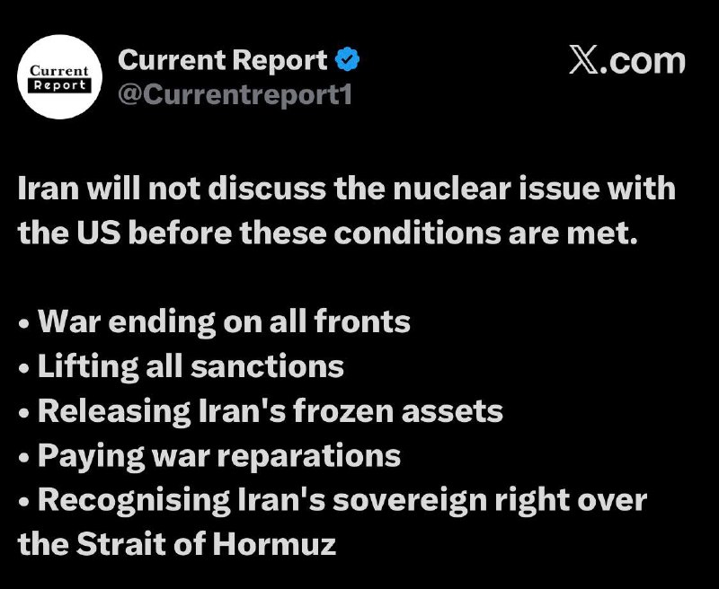

🔴ایران قبل از برآورده شدن این شرایط، در مورد مسئله هسته‌ای با آمریکا مذاکره نخواهد کرد.

• پایان جنگ در همه جبهه‌ها
• لغو همه تحریم‌ها
• آزادسازی دارایی‌های مسدود شده ایران
• پرداخت غرامت جنگ
• به رسمیت شناختن حق حاکمیت ایران بر تنگه هرمز
https://t.me/kianmeli1

## kianmeli1 — post 87364

  <a href="telegram/content/kianmeli1_87364_1778607865.mp4" target="_blank">🎬 Download video</a>

‏🔴سپاه پاسداران رزمایشی برای ورود قریب‌الوقوع به جنگ زمینی برگزار کرد
https://t.me/kianmeli1

## kianmeli1 — post 87363

  <a href="telegram/content/kianmeli1_87363_1778607867.mp4" target="_blank">🎬 Download video</a>

🔴تصاویر ماهواره‌ای جدید منتشر شده از پایگاه هوایی پرنس سلطان در عربستان سعودی نشان می‌دهد که تعداد زیادی هواپیما (به احتمال زیاد از نوع F-16) در این پایگاه مستقر شده‌اند. به نظر می‌رسد عربستان سعودی محدودیت‌های خود را علیه «پروژه آزادی» مرتبط با دونالد ترامپ برداشته است و حداقل ۵۳ فروند جنگنده F-16 در این پایگاه حضور دارند.
https://t.me/kianmeli1

## IranIntlTV — post 336855

  

هاکان فیدان، وزیر خارجه ترکیه، در گفت‌وگو با الجزیره گفت اولویت اصلی آنکارا حفظ آتش‌بس میان واشینگتن و تهران است و تاکید کرد فوری‌ترین نگرانی ترکیه تداوم این آتش‌بس است، زیرا در حال حاضر این موضوع بیشترین اهمیت را دارد.

وزیر خارجه ترکیه افزود هیچ‌کس خواهان بازگشت به جنگ نیست، چرا که اقتصاد جهانی و امنیت انرژی جهان همین حالا نیز به اندازه کافی آسیب دیده است.

هاکان فیدان همچنین گفت ترکیه و دیگر کشورهای منطقه از جمله قطر برای حمایت از پاکستان به‌عنوان میانجی اصلی همکاری می‌کنند و در روند میانجی‌گری، زمانی که کار به بن‌بست می‌رسد، دشوارترین بخش یافتن ایده‌های خلاقانه است؛ گاهی طرفین و حتی خود میانجی نیز قادر به ارائه چنین ایده‌هایی نیستند.
https://iranintl.com/202605122251

## IranIntlTV — post 336854

  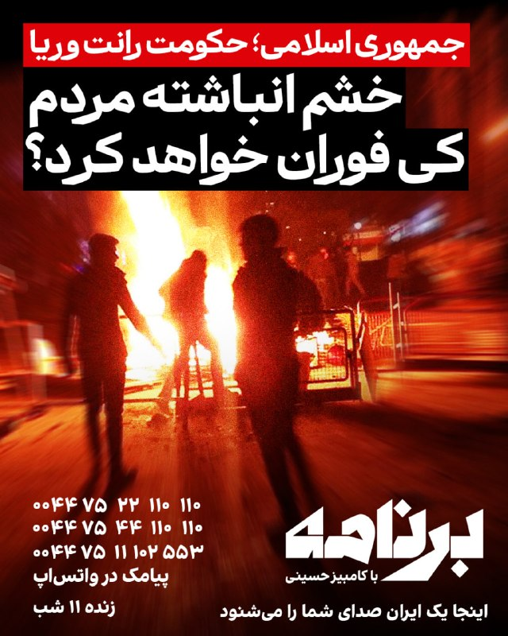

هزینه‌ای که جمهوری اسلامی به مردم ایران تحمیل کرده، فقط در اقتصاد خلاصه نمی‌شود؛ از سفره‌های کوچک‌تر تا اینترنت طبقاتی، از اعدام و زندان تا ترس، ناامیدی و خشم فروخورده‌ای که هر روز بزرگ‌تر می‌شود.
مردم تا کی تاب می‌آورند؟
آیا ایران به نقطهٔ انفجار رسیده است؟
خشم انباشتهٔ مردم چه زمانی فوران خواهد کرد؟

امشب در «برنامه با کامبیز حسینی» دربارهٔ هزینه‌های ۴۷ سال حاکمیت جمهوری اسلامی و آیندهٔ ایران حرف می‌زنیم.

«برنامه» صدای شماست.

اگر در ایران به اینترنت دسترسی دارید، بیایید و مشاهدات خود را از جنگ بگویید. ما شما را، بدون نوبت، مستقیم از ایران روی خط می‌آوریم.
بیایید و روایت خود را برای همیشه ثبت کنید.
تاریخ با صدای شما نوشته می‌شود.

برای شرکت در برنامه، همین حالا در واتس‌اپ پیام بدهید:
۰۰۴۴۷۵۲۲۱۱۰۱۱۰
۰۰۴۴۷۵۴۴۱۱۰۱۱۰
۰۰۴۴۷۵۱۱۱۰۲۵۵۳

«برنامه با کامبیز حسینی»
«یک ایران صدای شما را می‌شنود»

@iranintltv

## IranIntlTV — post 336853

  <a href="telegram/content/IranIntlTV_336853_1778607869.mp4" target="_blank">🎬 Download video</a>

در حالی‌ که گزارش‌ها از جدی‌تر شدن بررسی گزینه‌های نظامی جدید آمریکا علیه جمهوری اسلامی خبر می‌دهند، دونالد ترامپ گفت منتظر فروپاشی اقتصادی ایران در اثر محاصره دریایی است.

گفت‌وگو با فرشته پزشک، کارشناس روابط بین‌الملل
@iranintltv

## IranIntlTV — post 336852

  

دادگاه کیفری عالی بحرین سه نفر از جمله یک زن را به اتهام «همکاری» با جمهوری اسلامی به حبس ابد محکوم کرد.
دادستان‌ها اعلام کردند این زن در «ارتباط» با سپاه پاسداران بوده و قصد داشته «اقدامات تروریستی خصمانه» در بحرین انجام دهد.
در پرونده‌های جداگانه، ۱۰ نفر دیگر به اتهام «حمایت و تایید حملات تروریستی جمهوری اسلامی علیه بحرین»، انتشار اطلاعات ممنوع و عکسبرداری از اماکن ممنوعه، به احکام حبس تا ۱۰ سال محکوم شدند.

پیش‌تر نیز وزارت کشور بحرین اعلام کرد دستگاه‌های امنیتی این کشور یک تشکیلات مرتبط با سپاه پاسداران و تفکر «ولایت فقیه» را شناسایی کرده‌اند و ۴۱ نفر از اعضای آن را بازداشت کرده‌اند.
https://iranintl.com/202605122799

## IranIntlTV — post 336849

  

شاهزاده رضا پهلوی در نشست امنیتی سالانه پولیتیکو گفت: «ما فقط زمانی می‌توانیم مردم را به بازگشت به خیابان‌ها فرا بخوانیم که آن‌ها از سطحی از برابری در توان مقابله برخوردار باشند؛ نه زمانی که رژیم بتواند اوباش و نیروهای سرکوبگرش را برای کشتن مردم در خیابان‌ها اعزام کند.»

او ادامه داد: «اما برای رسیدن به آن نقطه، باید پیام روشنی وجود داشته باشد. باید راهبردی شفاف برای پایان دادن به این رژیم وجود داشته باشد؛ فراخوانی روشن برای قیام مردم، و همچنین پیامی برای نیروهای نظامی و امنیتی از حکومت جدا شوند و به مردم بپیوندند. همه این‌ها باید در قالب یک راهبرد منسجم هماهنگ شود.»
https://iranintl.com/202605123516

## IranIntlTV — post 336848

  <a href="https://t.me/IranintlTV/336848" target="_blank">📎 Download file</a>

🎧نسخه صوتی اخبار شبانگاهی | سه‌شنبه ۲۲ اردیبهشت
@iranintlTV

## IranIntlTV — post 336847

  <a href="telegram/content/IranIntlTV_336847_1778607872.mp4" target="_blank">🎬 Download video</a>

تیتراول با نیوشا صارمی، سه‌شنبه ۲۲ اردیبهشت
@iranintltv

## IranIntlTV — post 336846

  <a href="telegram/content/IranIntlTV_336846_1778607873.mp4" target="_blank">🎬 Download video</a>

تیتراول با نیوشا صارمی، سه‌شنبه ۲۲ اردیبهشت
@iranintltv

## IranIntlTV — post 336845

  

شاهزاده رضا پهلوی در نشست امنیتی سالانه پولیتیکو گفت سیاست مماشات با رژیم جمهوری اسلامی که راهبرد بسیاری از دولت‌ها بود، شکست خورده است.
او افزود اکنون که با یک «جانور زخمی» روبه‌رو هستیم، این فرصتی است که نباید از دست برود، بلکه باید کار را یک‌بار برای همیشه تمام کرد؛ موضوعی که نه‌تنها میلیون‌ها ایرانی، بلکه بسیاری از کشورهای منطقه نیز انتظار آن را دارند.

شاهزاده رضا پهلوی درباره جنگ علیه جمهوری اسلامی نیز گفت مردم به‌اندازه کافی هوشمند هستند که تفاوت میان حمله به یک ملت و حمله به یک رژیم را تشخیص دهند و آن کارزار، حمله‌ای علیه ملت ایران نبود، بلکه علیه رژیم بود.
https://iranintl.com/202605128673

## IranIntlTV — post 336844

  

دبیرکل شورای همکاری خلیج فارس اعلام کرد که نفوذ عناصر وابسته به سپاه پاسداران و برنامه‌ریزی آن‌ها برای اقدامات «خصمانه» را به‌شدت محکوم می‌کند.

دبیرکل شورای همکاری خلیج‌ فارس افزود از هر اقدامی که کویت برای حفظ امنیت و ثبات خود اتخاذ کند، حمایت می‌کند.

‌پیش‌تر نیز وزارت خارجه کویت اعلام کرد که سفیر جمهوری اسلامی را در پی نفوذ یک گروه وابسته به سپاه پاسداران به جزیره بوییان احضار کرده است.
https://iranintl.com/202605128445

## IranIntlTV — post 336843

  <a href="telegram/content/IranIntlTV_336843_1778607875.mp4" target="_blank">🎬 Download video</a>

با ادامه نارضایتی ترامپ از پاسخ تهران، ارم‌نیوز به نقل از منابع آمریکایی خبر داد واشینگتن به دنبال حمله به باقیمانده مراکز هسته‌ای ایران است تا قواعد جدیدی را به تهران تحمیل کند. سی‌ان‌ان هم خبر داد ترامپ در حال بررسی حمله به ایران پس از سفر به چین است.

گزارشی از مجتبا پورمحسن
@iranintltv

## IranIntlTV — post 336842

  

شهروندان در پیام‌هایی به ایران اینترنشنال می‌گویند که بدون رضایت و اطلاع و حتی هیچگونه اقدامی از سوی آن‌ها، نهادهای جمهوری اسلامی نام و مشخصات و تلفن همراه آن‌ها را برای ثبت‌نام در کارزار حکومتی «جان‌فدا» استفاده کرده‌اند.

طبق این پیام‌ها، حکومت پیامک‌هایی به شهروندان فرستاده و بدون اینکه بدانند، به آن‌ها گفته شده که در کارزار «جان‌فدا» ثبت‌نام شده‌اند.

طی روزهای گذشته، رسانه‌های حکومتی نوشتند که بیش از ۳۱ میلیون نفر در این کارزار ثبت‌نام کرده‌اند. این عدد و آمار از سوی شهروندان و ناظران با سوال مواجه شد. شهروندان در حالی که همچنان ده‌ها روز است که از دسترسی به اینترنت محروم‌اند، در پیام‌های خود به ایران اینترنشنال نوشته‌اند اگر حکومت ۳۱ میلیون جان‌فدا و حامی دارد، چرا اینترنت و دسترسی به آن را در کشور باز نمی‌کند.
https://iranintl.com/202605129601

## IranIntlTV — post 336841

  <a href="telegram/content/IranIntlTV_336841_1778607878.mp4" target="_blank">🎬 Download video</a>

ستاد فرماندهی مرکزی آمریکا، سنتکام، اعلام کرد ناو هواپیمابر آبراهام لینکلن به عملیات خود در دریای عرب، از جمله اجرای محاصره دریایی علیه جمهوری اسلامی، ادامه می‌دهد و تاکنون یک کشتی تجاری را وادار به تغییر مسیر کرده است.
جزییات بیشتر با مرضیه حسینی، خبرنگار ایران‌اینترنشنال
@iranintltv

## IranIntlTV — post 336840

  <a href="telegram/content/IranIntlTV_336840_1778607879.mp4" target="_blank">🎬 Download video</a>

روزنامه وال‌استریت ژورنال گزارش داد جمهوری اسلامی در آستانه سفر دونالد ترامپ به چین، از طریق سفیر خود در پکن در تلاش است پیامی را به واشینگتن منتقل کند.
سمیرا قرایی، خبرنگار ایران‌اینترنشنال، گزارش می‌دهد
@iranintltv

## IranIntlTV — post 336839

  <a href="telegram/content/IranIntlTV_336839_1778607880.mp4" target="_blank">🎬 Download video</a>

یک شهروند در پیامی به ایران اینترنشنال با اشاره به هشدار ترامپ درباره حمله و بردن ایران به «عصر حجر» گفت که جمهوری اسلامی با قطع اینترنت این کار را کرد و نه ترامپ. پیام این مخاطب و تصویر این پست با هوش مصنوعی خوانده و ساخته شده است.

## IranIntlTV — post 336838

  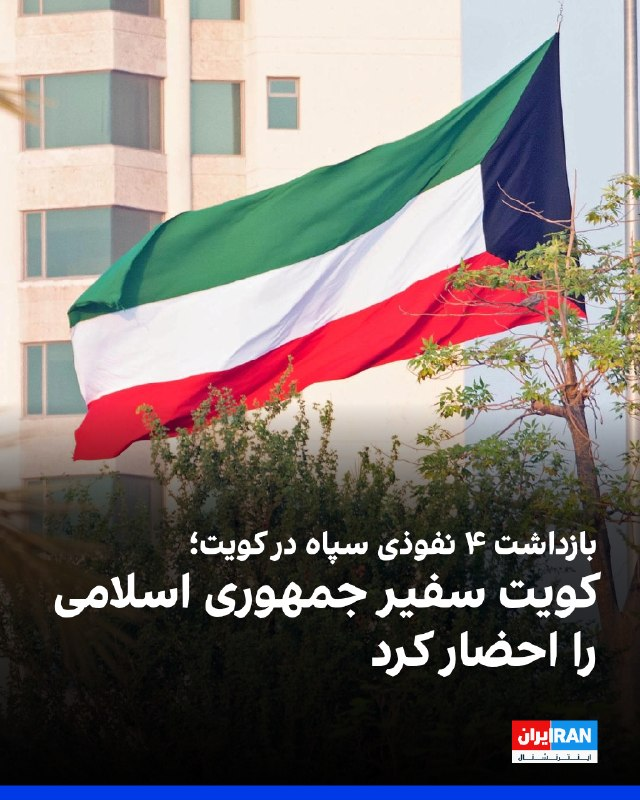

وزارت خارجه کویت اعلام کرد که سفیر جمهوری اسلامی را در پی نفوذ یک گروه وابسته به سپاه پاسداران به جزیره بوییان احضار کرده است.

وزارت کشور کویت اعلام کرد چهار نفری که به‌صورت غیرقانونی از راه دریا وارد این کشور شده بودند، در جریان بازجویی به عضویت در سپاه پاسداران انقلاب اسلامی اعتراف کردند.
در بیانیه این وزارتخانه آمده است این افراد اعتراف کردند مامور شده بودند با استفاده از یک قایق ماهیگیری که به‌طور ویژه برای اجرای اقدامات خصمانه علیه کویت اجاره شده بود، به جزیره بوبیان نفوذ کنند.
بر اساس این بیانیه، این افراد با نیروهای مسلح کویت درگیر شدند که در نتیجه آن یکی از نیروهای کویتی زخمی شد و دو نفر از عناصر نفوذی گریختند.
https://iranintl.com/202605121020

## IranIntlTV — post 336837

  <a href="telegram/content/IranIntlTV_336837_1778607883.mp4" target="_blank">🎬 Download video</a>

بررسی‌های ایران‌اینترنشنال نشان می‌دهد سپاه پاسداران انقلاب اسلامی برای دور زدن تحریم‌های آمریکا، از صرافی‌های ترکیه و هواپیماهای خصوصی استفاده می‌کند. این اقدامات پس از آن صورت گرفت که مسیرهای پیشین تامین ارز جمهوری اسلامی در امارات متحده عربی قطع شده است.
جزییات بیشتر با آرش آزرمی، دبیر بخش اقتصادی ایران‌اینترنشنال
@iranintltv

## IranIntlTV — post 336836

  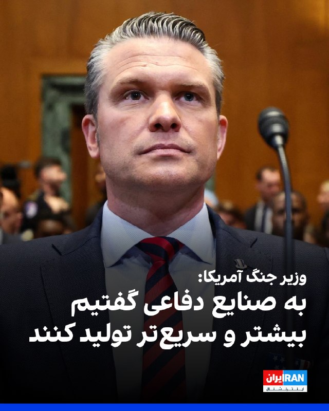

پیت هگست، وزیر جنگ آمریکا، سه‌شنبه در کنگره این کشور درباره جنگ علیه جمهوری اسلامی اعلام کرد که ارتش ایالات متحده برنامه‌ای برای خروج نیروها از منطقه خاورمیانه دارد، اما در عین حال برای تشدید درگیری یا جابه‌جایی تجهیزات در صورت لزوم نیز برنامه‌ریزی کرده است.
او افزود: «ما دقیقا می‌دانیم چه چیزی در اختیار داریم. هر آنچه نیاز داریم به اندازه کافی داریم.»
او گفت به صنایع دفاعی گفته شده است که «بیشتر و سریع‌تر تولید کنند»، و در عین حال ظرفیت ناکافی مجتمع‌های صنعتی-نظامی را ناشی از دولت‌های پیشین و کمک‌های آمریکا به اوکراین در جنگش با روسیه دانست.
https://iranintl.com/202605122781

## IranIntlTV — post 336835

  <a href="telegram/content/IranIntlTV_336835_1778607885.mp4" target="_blank">🎬 Download video</a>

دونالد ترامپ، رییس‌جمهوری آمریکا، اعلام کرد اطمینان دارد جمهوری اسلامی غنی‌سازی اورانیوم را به‌طور کامل متوقف خواهد کرد. او همچنین گفت آمریکا برای رسیدن به توافق عجله‌ای ندارد، زیرا جمهوری اسلامی از بخش مهمی از درآمدهایش محروم شده است.
گفت‌وگو با شایان سمیعی، کارشناس امنیت ملی
@iranintltv

## IranIntlTV — post 336834

🔻پالایشگاه‌های «مستقل» چینی چگونه به بقای اقتصادی جمهوری اسلامی کمک می‌کنند؟

سی‌ان‌ان گزارش داد یک شبکه پنهان نفتی در چین سال‌هاست میلیاردها دلار به اقتصاد ایران تزریق کرده و اکنون نیز هم‌زمان با تشدید فشارهای آمریکا، به بقای مالی جمهوری اسلامی کمک می‌کند.

در استان شاندونگ چین و مناطق پیرامونی آن، بنادر، خطوط انتقال و پالایشگاه‌های موسوم به «تی‌پات» نقش کلیدی در این چرخه ایفا می‌کنند.

این پالایشگاه‌های کوچک و مستقل که با مجوز دولت چین فعالیت دارند، به‌صورت غیرعلنی نفت خام تحریم‌شده ایران را به فرآورده‌هایی مانند بنزین، گازوئیل و محصولات پتروشیمی تبدیل می‌کنند تا نیاز دومین اقتصاد بزرگ جهان تامین شود.

سی‌ان‌ان با اشاره به سفر قریب‌الوقوع دونالد ترامپ به چین نوشت هم‌زمان با تشدید تنش‌ها بر سر تجارت نفت ایران، پکن در موقعیتی پیچیده قرار گرفته است؛ از یک سو به دنبال برقراری رابطه‌ای باثبات با واشینگتن است و از سوی دیگر، همکاری‌های اقتصادی و دیپلماتیک نزدیک خود با تهران را ادامه می‌دهد.

در آستانه این سفر، وزارت خزانه‌داری آمریکا ۱۲ فرد و نهاد را به اتهام نقش‌آفرینی در تسهیل فروش و انتقال نفت ایران به چین تحریم کرد.

اسکات بسنت، وزیر خزانه‌داری آمریکا، به‌تازگی چین را متهم کرده است که با خرید انرژی از ایران، به تامین مالی «شبکه‌های تروریستی» جمهوری اسلامی کمک می‌کند.

۲۱ اردیبهشت، روزنامه فایننشال‌تایمز گزارش داد ترامپ در سفر به پکن خواستار کاهش حمایت چین از حکومت ایران خواهد شد.
تشدید فشارهای آمریکا بر شرکت‌های چینی

ایالات متحده حدود یک سال پیش، شرکت «هِبِی شینهای» چین را به خرید محموله‌های نفتی مرتبط با نیروهای مسلح جمهوری اسلامی متهم کرد. واشینگتن همچنین اعلام کرد این شرکت صدها میلیون دلار نفت خام را از طریق نفتکش‌های موسوم به «ناوگان سایه» وارد کرده است.

«هِبِی شینهای» اکنون به فهرست رو‌ به‌ گسترش تحریم‌های آمریکا علیه شرکت‌های فعال در تجارت نفت ایران اضافه شده است.

از سال گذشته تاکنون، چهار پالایشگاه دیگر در چین نیز در فهرست تحریم‌های واشینگتن قرار گرفته‌اند؛ تاسیساتی که اغلب در یک منطقه ساحلی و قطب مهم انرژی چین، در فاصله‌ای نزدیک به یکدیگر قرار دارند.

صنعت پالایش نفت در استان شاندونگ که دهه‌ها پیش با تکیه بر میدان‌های نفتی شِنگلی در دلتای رود زرد شکل گرفت، اکنون به واردات گسترده نفت خام وابسته شده و حدود ۲۰ درصد از نفت مصرفی چین را فرآوری می‌کند.

به گفته تحلیلگران، بخش قابل‌توجهی از نفت خام وارداتی این صنعت را محموله‌های تحت تحریم تشکیل می‌دهد.
اریکا داونز، پژوهشگر ارشد مرکز سیاست جهانی انرژی در دانشگاه کلمبیا، گفت: «اینها پالایشگاه‌های کوچکی هستند که با حاشیه سود اندک فعالیت می‌کنند. تخفیف‌هایی که طی سال‌های گذشته برای خرید نفت خام ونزوئلا، روسیه و ایران دریافت کرده‌اند، به بقای آنها کمک کرده است.»

با این حال، تحریم‌های آمریکا تنها به شرکت‌های کوچک چینی محدود نمی‌شوند. واشینگتن پیش‌تر شرکت پتروشیمی «هنگلی» را تحریم کرد، پالایشگاهی بسیار بزرگ‌تر در شهر بندری دالیان. این اقدام نشان می‌دهد ایالات متحده آماده است بازیگران بزرگ‌تر این صنعت را نیز هدف قرار دهد.

چین در آمار رسمی گمرکی خود واردات نفت خام ایران را ثبت نمی‌کند و منشا این محموله‌ها نیز در مسیر تجارت پنهان می‌شود.

با این حال، پکن تحریم‌های آمریکا را به رسمیت نمی‌شناسد و به شرکت‌های داخلی دستور داده است از تبعیت از تحریم‌های واشینگتن علیه پالایشگاه‌ها خودداری کنند.
نقش پالایشگاه‌های تی‌پات در تامین انرژی چین

سی‌ان‌ان‌ در ادامه نوشت ساختار صنعت نفت چین به شرکت‌های مستقل و پالایشگاه‌های موسوم به «تی‌پات» اجازه می‌دهد ریسک خرید نفت تحریمی را بپذیرند و با وجود تحریم‌های آمریکا، به فعالیت‌های عمدتا داخلی خود ادامه دهند.

این در حالی است که به گفته داونز، شرکت‌های بزرگ دولتی انرژی چین به‌دلیل پیوند گسترده با نظام مالی بین‌المللی، عموما از تحریم‌ها تبعیت می‌کنند.

با تداوم بحران جهانی نفت ناشی از جنگ ایران، نقش پالایشگاه‌های مستقل چین در تامین امنیت انرژی این کشور پررنگ‌تر شده است. این روند در شرایطی شدت گرفته که آمریکا با اعمال محاصره دریایی، در تلاش است از خروج نفتکش‌های حامل نفت ایران جلوگیری کند.
🔗ادامه این گزارش را اینجا بخوانید
@iranintltv

## Shin_Persian — post 5968

  

Shin ✓ @hey_itsmyturn Tue, 12 May 2026 14:29:01 UTC #Kuwait 🇰🇼 #Iran Kuwait Thwarts IRGC Infiltration & Hostile Plot Kuwait’s Ministry of Interior has released chilling details regarding the 4 infiltrators captured earlier this month. Interrogations confirm…

## Shin_Persian — post 5967

Shin ✓ @hey_itsmyturn
Tue, 12 May 2026 14:29:01 UTC

#Kuwait 🇰🇼 #Iran
Kuwait Thwarts IRGC Infiltration & Hostile Plot

Kuwait’s Ministry of Interior has released chilling details regarding the 4 infiltrators captured earlier this month. Interrogations confirm they are members of IRGC sent to carry out "hostile acts" within the country.

The Arrested IRGC Members:
Naval Colonel: Amir Hussein Abd Muhammad Zarai
Naval Colonel: Abdul Samad Yadollah Qanawati
Naval Captain: Ahmed Jamshid Ghulam Reza Zulfiqari
First Lieutenant: Muhammad Hussein Sohrab Foroughi Rad

Two others, Captain Mansour Qambari and boat pilot Abdulali Siamari, fled the scene during the initial skirmish

The incident has happened Bubiyan Island. The group used a rented fishing boat to enter Kuwaiti territorial waters illegally.

Upon discovery, the group opened fire on Kuwaiti Armed Forces. One Kuwaiti soldier was injured in the line of duty before the 4 suspects were neutralized and detained.

Source: https://24.ae/article/957997/

فارسی

#کوییت 🇰🇼 #ایران
کوییت نفوذ سپاه پاسداران (سپاه پاسداران انقلاب اسلامی) و توطئه‌ای خصمانه را خنثی کرد

وزارت کشور کوییت جزئیات تکان‌دهنده‌ای را در مورد ۴ نفوذی که اوایل این ماه دستگیر شده بودند، منتشر کرده است. بازجویی‌ها تأیید می‌کند که آن‌ها اعضای سپاه پاسداران هستند که برای انجام «اعمال خصمانه» در داخل کشور اعزام شده بودند.

اعضای دستگیر شده سپاه پاسداران:
سرهنگ دریایی: امیرحسین عبدالمحمد زارعی
سرهنگ دریایی: عبدالصمد یدالله قنواتی
ناخدا: احمد جمشید غلامرضا ذوالفقاری
ستوان یکم: محمدحسین سهراب فروغی راد

دو نفر دیگر، ناخدا منصور قنبری و هدایت‌کننده قایق، عبدالعلی سیامری، در جریان درگیری اولیه از صحنه گریختند.

این حادثه در جزیره بوبیان رخ داده است. این گروه از یک قایق ماهیگیری اجاره‌ای برای ورود غیرقانونی به آب‌های سرزمینی کوییت استفاده کرده بودند.

پس از شناسایی، این گروه به سوی نیروهای مسلح کوییت آتش گشودند. یک سرباز کویتی در حین انجام وظیفه مجروح شد و پس از آن، ۴ مظنون مهار و بازداشت شدند.

منبع: https://24.ae/article/957997/

𝕏 · @shin_persian

## Shin_Persian — post 5966

📦 mhrv-rs v1.9.23 released

• Fix: stream range-parallel downloads larger than Apps Script's 50 MiB cap (#1042 + PR #1085).

Files (Android APKs, Windows, macOS, Linux, OpenWRT) on the files channel:

👉 v1.9.23 — all files with SHA-256

Channel:
https://t.me/mhrv_rs
or: https://t.me/+R1OyoHX2boA1ZDgx

#v1923

## Shin_Persian — post 5965

Shin ✓ @hey_itsmyturn
Tue, 12 May 2026 12:54:39 UTC

State-owned Mehr News:
Islamic Regime files complaint against US at The Hague over "military aggression on nuclear facilities", economic sanctions, and "threat of force" during 12-day conflict. Case A-34 registered under 1981 Algiers Accords.

[😂]

فارسی

خبرگزاری دولتی مهر:
رژیم اسلامی شکایتی را علیه ایالات متحده در لاهه به دلیل «تجاوز نظامی به تاسیسات هسته‌ای»، تحریم‌های اقتصادی و «تهدید به استفاده از زور» در طول درگیری ۱۲ روزه تنظیم کرد. پرونده A-34 تحت بیانیه‌های الجزایر ۱۹۸۱ ثبت شده است.

[😂]

𝕏 · @shin_persian

## Shin_Persian — post 5964

  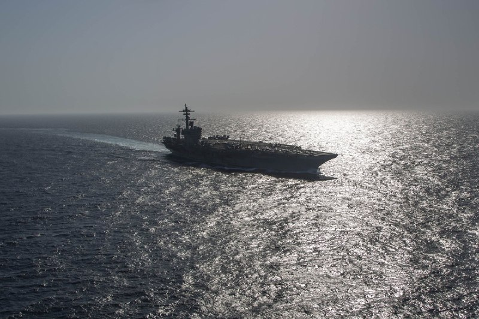

U.S. Central Command ✓ @CENTCOM
Tue, 12 May 2026 12:23:13 UTC

USS Abraham Lincoln (CVN 72) continues operations in the Arabian Sea, including enforcement of the U.S. blockade against Iran. CENTCOM forces have redirected 65 commercial vessels and disabled 4.

فارسی

ناو هواپیمابر یواس‌اس آبراهام لینکلن (سی‌وی‌ان ۷۲) به عملیات‌های خود در دریای عرب، از جمله اجرای محاصره ایالات متحده علیه ایران، ادامه می‌دهد. نیروهای سنتکام (فرماندهی مرکزی ایالات متحده) ۶۵ کشتی تجاری را تغییر مسیر داده و ۴ کشتی را از کار انداخته‌اند.

𝕏 · @shin_persian

## ManotoTV — post 105363

  <a href="telegram/content/ManotoTV_105363_1778607888.mp4" target="_blank">🎬 Download video</a>

جان هیلی، وزیر دفاع بریتانیا، اعلام کرد لندن جنگنده، پهپاد و یک ناو جنگی را به مأموریت چندملیتی حفاظت از تردد کشتی‌ها در تنگه هرمز اعزام خواهد کرد.

هیلی این خبر را پس از نشست مشترک با وزرای دفاع ۴۰ کشور اعلام کرد؛ نشستی که با هدف جلب حمایت برای مأموریت تحت رهبری بریتانیا جهت تأمین امنیت کشتیرانی در تنگه هرمز برگزار شد.

بریتانیا می‌گوید این مأموریت در واکنش به محاصره تنگه هرمز از سوی جمهوری اسلامی انجام می‌شود.

## ManotoTV — post 105362

  <a href="telegram/content/ManotoTV_105362_1778607889.mp4" target="_blank">🎬 Download video</a>

سازمان جهانی بهداشت هشدار داد شمار موارد ابتلا به هانتاویروس، پس از شیوع این ویروس در یک کشتی گردشگری در اقیانوس اطلس، احتمالاً افزایش پیدا خواهد کرد.
تدروس آدهانوم، مدیرکل سازمان جهانی بهداشت، اعلام کرد تاکنون ۹ مورد ابتلای قطعی و دو مورد مشکوک ثبت شده و انتظار می‌رود افراد بیشتری نیز به ویروس مبتلا شده باشند. با این حال او تأکید کرد خطر شیوع گسترده جهانی همچنان «پایین» ارزیابی می‌شود.
شیوع بیماری در کشتی «ام‌وی هوندیوس» آغاز شد؛ جایی که سه مسافر، شامل یک زوج هلندی و یک زن آلمانی، جان خود را از دست دادند. این کشتی در حال سفر ۳۵ روزه در اقیانوس اطلس بود.
هانتاویروس معمولاً از طریق ادرار، بزاق یا فضولات جوندگان منتقل می‌شود. گونه «آندِس» تنها نوع شناخته‌شده‌ای است که می‌تواند از انسان به انسان منتقل شود.
در پی این بحران، صدها مسافر و خدمه در کشورهای مختلف تحت قرنطینه یا مراقبت پزشکی قرار گرفته‌اند. مقام‌های بهداشتی در اروپا و آمریکا نیز در حال ردیابی تماس‌های مرتبط با مبتلایان هستند.

## ManotoTV — post 105361

  <a href="telegram/content/ManotoTV_105361_1778607889.mp4" target="_blank">🎬 Download video</a>

مقام‌های آمریکایی اعلام کردند نیروهای این کشور مانع عبور یک نفتکش با پرچم جمهوری مالت از تنگه هرمز شده‌اند.
سخنگوی ستاد فرماندهی مرکزی آمریکا سنتکام؛ به الجزیره گفت نفتکش «آگیوس فانوریوس» به‌دلیل نقض محاصره دریایی، اجازه عبور پیدا نکرده است. به گفته او، این کشتی حامل نفت ایران نبوده است.
مقام‌های آمریکایی همچنین اعلام کردند چند نفتکش دیگر نیز به‌دلیل نقض تحریم‌ها و محاصره اعمال‌شده علیه بنادر ایران، متوقف شده‌اند.

## ManotoTV — post 105360

  <a href="telegram/content/ManotoTV_105360_1778607890.mp4" target="_blank">🎬 Download video</a>

«اینترنت را قطع کردند تا صدای مردم خاموش شود.»

## ManotoTV — post 105359

  <a href="telegram/content/ManotoTV_105359_1778607891.mp4" target="_blank">🎬 Download video</a>

شورای همکاری خلیج فارس ورود نیروهایی از سپاه پاسداران به جزیره بوبیان کویت را محکوم کرد.

جاسم البدیوی، دبیرکل شورای همکاری خلیج فارس، گفت: «نفوذ عناصر سپاه پاسداران به جزیره بوبیان کویت و برنامه‌ریزی آن‌ها برای اقدامات خصمانه را محکوم می‌کنیم.»

او همچنین تأکید کرد شورای همکاری خلیج فارس از کویت در همه اقداماتی که برای حفظ امنیت و ثبات خود انجام دهد، حمایت می‌کند.

## ManotoTV — post 105358

  <a href="telegram/content/ManotoTV_105358_1778607892.mp4" target="_blank">🎬 Download video</a>

وزارت خارجه کویت اعلام کرد در پی آنچه «نفوذ» اعضای مسلح وابسته به سپاه پاسداران خوانده شده، سفیر جمهوری‌اسلامی در این کشور را احضار و یادداشت اعتراضی رسمی به او تحویل داده است.
به گفته مقام‌های کویتی، چهار عضو منتسب به سپاه قصد داشتند از راه دریا وارد کویت شوند و «اقدامات خصمانه» انجام دهند. وزارت کشور کویت اعلام کرد در درگیری با نیروهای امنیتی، یک نیروی کویتی زخمی شده و دو نفر از متهمان نیز فرار کرده‌اند.
معاون وزیر خارجه کویت این اقدام را «نقض آشکار حاکمیت کویت» و مغایر با قوانین بین‌المللی و منشور سازمان ملل توصیف کرد و از تهران خواست فوراً چنین اقداماتی را متوقف کند.

## ManotoTV — post 105357

  <a href="telegram/content/ManotoTV_105357_1778607892.mp4" target="_blank">🎬 Download video</a>

تورم در آمریکا افزایش یافته و طبق آمار رسمی اداره آمار کار آمریکا، این افزایش عمدتا به عوامل مرتبط با جنگ ایران مربوط می‌شود.
شاخص قیمت مصرف‌کننده در ماه آوریل به ۳.۸ درصد رسید؛ در حالی‌ که این رقم در ماه مارس ۳.۳ درصد بود. افزایش قیمت بنزین از مهم‌ترین دلایل این رشد اعلام شده است.
این آمار نشان می‌دهد بالا رفتن قیمت نفت، که ناشی از اختلال مؤثر در تردد از تنگه هرمز بوده، باعث افزایش بیشتر قیمت‌ها شده است.
بر اساس این گزارش، افزایش هزینه انرژی و سوخت اصلی‌ترین عامل رشد ۰.۵ واحد درصدی تورم بوده است.
تحلیلگران می‌گویند این وضعیت علاوه بر فشار بر مصرف‌کنندگان آمریکایی و اقتصاد آمریکا، ممکن است یک پیامد سیاسی هم داشته باشد؛ چرا که فشار اقتصادی بر رأی‌دهندگان می‌تواند دونالد ترامپ را به بازگشت به میز مذاکره سوق دهد.

## ManotoTV — post 105356

  <a href="telegram/content/ManotoTV_105356_1778607893.mp4" target="_blank">🎬 Download video</a>

تماسی از ایران؛ «می‌گفت تو این شرایط، به دور و برمون نگاه کنیم و دستِ همدیگه رو بگیریم…
تو هر خانواده و آشنایی یکی هست که بی‌صدا به کمک نیاز داره.»

## ManotoTV — post 105355

  <a href="telegram/content/ManotoTV_105355_1778607894.mp4" target="_blank">🎬 Download video</a>

دونالد ترامپ، رئیس‌جمهور آمریکا، با وجود توقف مذاکرات با جمهوری‌اسلامی، در یک گفتگو، اعلام کرده تهران صددرصد غنی‌سازی اورانیوم و هرگونه تلاش برای ساخت سلاح هسته‌ای را متوقف خواهد کرد.
ترامپ در گفت‌وگو با رادیوی WABC گفت شخصاً با مقام‌های جمهوری‌اسلامی در تماس بوده و افزود: «آن‌ها گفتند ما غبار هسته‌ای را تحویل خواهیم گرفت.»
او همچنین تأکید کرد آمریکا برای رسیدن به توافق عجله‌ای ندارد و گفت: «ما محاصره را در اختیار داریم.»

## ManotoTV — post 105354

  <a href="telegram/content/ManotoTV_105354_1778607895.mp4" target="_blank">🎬 Download video</a>

تماسی از تجربه‌اش با بهزیستی
می‌گفت برای بیمه و تأیید مشکلش هزار تا ایراد گرفتن
اما وقتی پای کمک رسید، گفتن هیچ مشکلی نداری

## ManotoTV — post 105353

  <a href="telegram/content/ManotoTV_105353_1778607896.mp4" target="_blank">🎬 Download video</a>

در جلسه استماع کنگره آمریکا، مقام‌های ارشد پنتاگون اعلام کردند هزینه تسلیحات و تجهیزات مصرف‌شده آمریکا در جنگ با ایران تاکنون به حدود ۲۴ میلیارد دلار رسیده است.
پیت هگست، وزیر دفاع آمریکا، به همراه رئیس ستاد مشترک ارتش و مقام مالی وزارت جنگ در این جلسه حضور داشتند. به گفته جولز هرست، این رقم شامل مهمات، موشک‌ها و سایر تجهیزات نظامی استفاده‌شده در جنگ است.
پنتاگون ماه گذشته نیز اعلام کرده بود مجموع هزینه‌های جنگ با ایران تاکنون به ۲۹ میلیارد دلار رسیده است.

## ManotoTV — post 105352

  <a href="telegram/content/ManotoTV_105352_1778607896.mp4" target="_blank">🎬 Download video</a>

ابراهیم رضایی، سخنگوی کمیسیون امنیت ملی و سیاست خارجی مجلس شورای اسلامی در شبکه اکس تهدید کرده، غنی سازی ۹۰ درصد به عنوان یکی از گزینه‌های جمهوری‌اسلامی در صورت حمله مجدد، بررسی می‌شود.

## ManotoTV — post 105351

  <a href="telegram/content/ManotoTV_105351_1778607897.mp4" target="_blank">🎬 Download video</a>

متاثر از پیچیده‌تر شدن سرنوشت مذاکرات جمهوری‌اسلامی و آمریکا، قیمت جهانی نفت، بیش از ۳ درصد افزایش یافت.
بهای نفت برنت به حدود ۱۰۸ دلار و نفت وست‌تگزاس آمریکا به بیش از ۱۰۱ دلار در هر بشکه رسید. تحلیلگران می‌گویند رد پیشنهادهای دو طرف، نگرانی‌ها درباره اختلال در عرضه نفت را دوباره افزایش داده است.
مدیرعامل آرامکوی عربستان هشدار داد هرگونه اختلال در صادرات نفت از تنگه هرمز می‌تواند بازگشت ثبات به بازار را تا سال ۲۰۲۷ به تعویق بیندازد.
کارشناسان همچنین گفته‌اند در صورت توافق واقعی میان تهران و واشنگتن، قیمت نفت ممکن است ۸ تا ۱۲ دلار کاهش پیدا کند، اما تشدید تنش‌ها می‌تواند قیمت نفت برنت را دوباره به بالای ۱۱۵ دلار برساند.

## ManotoTV — post 105350

  <a href="telegram/content/ManotoTV_105350_1778607897.mp4" target="_blank">🎬 Download video</a>

دونالد ترامپ در پیامی در شبکه اجتماعی تروث سوشال گفت کوبا از آمریکا درخواست کمک کرده و واشینگتن با هاوانا گفت‌وگو خواهد کرد.

ترامپ در این پیام نوشت هیچ جمهوری‌خواهی تاکنون درباره کوبا با او صحبت نکرده و این کشور را «شکست‌خورده» توصیف کرد که به گفته او تنها در مسیر «سقوط» حرکت می‌کند.

او افزود: «کوبا درخواست کمک کرده و ما گفت‌وگو خواهیم کرد.» ترامپ در پایان این پیام نوشت همزمان عازم چین است.

## ManotoTV — post 105349

  <a href="telegram/content/ManotoTV_105349_1778607898.mp4" target="_blank">🎬 Download video</a>

«حکومت بقای خود را در طناب دار می‌بیند»

## ManotoTV — post 105348

  <a href="telegram/content/ManotoTV_105348_1778607899.mp4" target="_blank">🎬 Download video</a>

مارک روته، دبیرکل ناتو، اعلام کرد موضوع جمهوری‌اسلامی و نحوه کمک کشورهای اروپایی برای مدیریت وضعیت تنگه هرمز، محور اصلی گفت‌وگوهای کنونی این ائتلاف است.
روته در نشست خبری در مونته‌نگرو گفت کشورهای عضو در حال بررسی راه‌هایی هستند تا متحدان اروپایی بتوانند در شرایط مرتبط با تنگه هرمز کمک کنند.
او با اشاره به افزایش بودجه دفاعی کشورهای اروپایی و کانادا، تأکید کرد نسبت به آینده ناتو «بسیار خوش‌بین» است.

## ManotoTV — post 105347

  <a href="telegram/content/ManotoTV_105347_1778607900.mp4" target="_blank">🎬 Download video</a>

دکتر حمید گیلوری فعال سیاسی و عضو حزب ایران نوین در گردهمایی ایرانیان روبروی دادگاه لاهه در هلند گفت: «اروپا نباید با جمهوری اسلامی مماشات کند».

## ManotoTV — post 105346

  <a href="telegram/content/ManotoTV_105346_1778607901.mp4" target="_blank">🎬 Download video</a>

وزارت خارجه امارات متحده عربی در بیانیه‌ای نفوذ اعضایی از سپاه از سوی نیروی دریایی جمهوری اسلامی به جزیره بوبیان کویت را محکوم کرد و آن را اقدامی در چارچوب «طرحی تروریستی» برای انجام عملیات خصمانه خواند.

در این بیانیه آمده است شیخ عبدالله بن زاید آل نهیان، وزیر خارجه امارات، در پیامی به عبدالله علی الیحیا، وزیر خارجه کویت، همبستگی کامل ابوظبی را با کویت اعلام کرده است.

بوبیان دومین جزیره بزرگ خلیج فارس بعد از جزیره قشم است.

## ManotoTV — post 105345

  <a href="telegram/content/ManotoTV_105345_1778607902.mp4" target="_blank">🎬 Download video</a>

دولت بریتانیا اعلام کرد از آوریل ۲۰۲۶، میزان کمک‌هزینه هفتگی برای «همسران اضافی» در ازدواج‌های چندهمسریِ ثبت‌شده در خارج از کشور، به ۱۲۵ پوند و ۲۵ پنس افزایش یافته است.
این مبلغ نسبت به سال گذشته ۴.۸ درصد افزایش داشته و شامل افرادی می‌شود که به سن بازنشستگی رسیده و از مزایایی مانند «پنشـن کردیت» یا کمک‌هزینه مسکن استفاده می‌کنند.
چندهمسری در بریتانیا غیرقانونی است، اما برخی ازدواج‌های چندهمسری که به‌طور قانونی در خارج از کشور ثبت شده‌اند، برای دریافت بعضی مزایای رفاهی به رسمیت شناخته می‌شوند.
دولت بریتانیا تأکید کرده «یونیورسال کردیت» شامل این نوع خانوارها نمی‌شود و قوانین مهاجرتی نیز اجازه حمایت برای ورود همسر دوم را نمی‌دهد، اگر ازدواج اول همچنان پابرجا باشد.

## ManotoTV — post 105344

  <a href="telegram/content/ManotoTV_105344_1778607902.mp4" target="_blank">🎬 Download video</a>

مونترال‌ | کانادا؛ گردهمایی ایرانیان

## FarsiVOA — post 217553

پیت هگست، وزیر جنگ آمریکا، و ژنرال دن کین، رئیس ستاد مشترک نیروهای مسلح آمریکا، روز سه‌شنبه ۲۲ اردیبهشت با حضور در جلسه کمیته فرعی تخصیص بودجه مجلس نمایندگان از عملکرد دولت ترامپ در عملیات نظامی علیه رژیم ایران دفاع کردند. بخش‌هایی از این نشست با ترجمه همزمان پژواک کیومرثی از صدای آمریکا پخش شد.

## FarsiVOA — post 217552

پیت هگست، وزیر جنگ آمریکا، و ژنرال دن کین، رئیس ستاد مشترک نیروهای مسلح آمریکا، روز سه‌شنبه ۲۲ اردیبهشت با حضور در جلسه کمیته فرعی تخصیص بودجه مجلس نمایندگان از عملکرد دولت ترامپ در عملیات نظامی علیه رژیم ایران دفاع کردند. بخش‌هایی از این نشست با ترجمه همزمان پژواک کیومرثی از صدای آمریکا پخش شد.

## FarsiVOA — post 217551

پیت هگست، وزیر جنگ آمریکا، و ژنرال دن کین، رئیس ستاد مشترک نیروهای مسلح ایالات متحده، روز سه‌شنبه ۲۲ اردیبهشت با حضور در جلسه کمیته فرعی تخصیص بودجه مجلس نمایندگان آمریکا از عملکرد دولت ترامپ در عملیات نظامی علیه رژیم ایران دفاع کردند.

## FarsiVOA — post 217550

🔺تعیین پاداش ۱۵ میلیون دلاری برای اطلاعات منجر به مختل شدن سازوکارهای مالی سپاه

▪️آمریکا با انتشار بیانیه‌ای از تعیین جایزه‌ای ۱۵ میلیون دلاری برای مقابله با فعالیت‌های مخرب سپاه خبر داد.

⬇️ بیشتر بخوانید:

https://ir.voanews.com/a/irgc-information-15-million-bonus/8149215.html/?nocach=1

## FarsiVOA — post 217549

پیت هگست: برای همه سناریوهای تداوم مقابله با جمهوری اسلامی آمادگی داریم

## FarsiVOA — post 217548

گفتگو با جمشید اسدی، اقتصاددان و کارشناس اقتصاد دیجیتالی، درباره چشم‌انداز بازار ارز در ایران و تداوم روند فزاینده قیمت دلار

## FarsiVOA — post 217547

گفت‌و‌گو با یاسین اهوازی، کارشناس مسائل خاورمیانه، درباره چرایی و عواقب انتقال هواپیماهای نظامی جمهوری اسلامی به فرودگاه‌های پاکستان

## FarsiVOA — post 217546

  <a href="telegram/content/FarsiVOA_217546_1778607904.mp4" target="_blank">🎬 Download video</a>

فرماندهی مرکزی ایالات متحده، سنتکام، اعلام کرد هزاران نیروی نظامی آمریکا مستقر در خاورمیانه در سال ۲۰۲۶ به دلیل عملکرد برجسته خود مورد تقدیر قرار گرفته‌اند.

به گفته سنتکام، این تقدیرها شامل اعطای مدال، ارتقای درجه، و واگذاری مسئولیت‌های جدید فرماندهی بوده است.

سنتکام تاکید کرد موفقیت عملیات این فرماندهی به تلاش سربازان، ملوانان، تفنگداران دریایی، نیروهای هوایی، گارد ملی و گارد ساحلی آمریکا وابسته است.

@FarsiVOA

## FarsiVOA — post 217545

فشارها برای کنار رفتن کی‌یر استارمر هر ساعت بیشتر می‌شود؛ ۸۴ نماینده حزب کارگر خواهان استعفا یا اعلام زمان خروج او شده‌اند، اما هنوز روند رسمی رقابت رهبری آغاز نشده است.

## FarsiVOA — post 217544

🔺وزیر جنگ: ما در حال پیروزی در جنگ با رژیم ایران هستیم؛ آنها در استفاده از استراتژی کره‌شمالی شکست خوردند

▪️پیت هگست، وزیر جنگ آمریکا، و ژنرال دن کین، رئیس ستاد مشترک نیروهای مسلح ایالات متحده، روز سه‌شنبه ۲۲ اردیبهشت با حضور در جلسه کمیته فرعی تخصیص بودجه مجلس نمایندگان آمریکا از عملکرد دولت ترامپ در عملیات نظامی علیه رژیم ایران دفاع کردند.

⬇️ بیشتر بخوانید:

https://ir.voanews.com/a/iran-us-war-hegseth-caine-testimony-pete-epic-fury/8149212.html/?nocach=1

## FarsiVOA — post 217543

سفرهای محرمانه قاآنی و هشدار آمریکا؛ عراق وارد مرحله‌ای سرنوشت‌ساز شد

## FarsiVOA — post 217542

دونالد ترامپ، رئیس جمهوری آمریکا، قرار است این هفته در پکن با شی جین‌پینگ، رئیس جمهوری چین، دیدار کند. پیش‌بینی می‌شود پرونده‌های امنیتی، اقتصادی، و فناوری، جنگ و برنامه هسته‌ای جمهوری اسلامی، و هوش مصنوعی موضوعاتی باشند که در این دیدار مورد بحث و تبادل نظر قرار بگیرد.

## FarsiVOA — post 217541

  <a href="telegram/content/FarsiVOA_217541_1778607904.mp4" target="_blank">🎬 Download video</a>

ارتش اسرائیل اعلام کرد در ۲۴ ساعت گذشته حدود ۴۵ زیرساخت گروه حزب‌الله را در جنوب لبنان هدف قرار داده است. از جمله این زیرساخت‌ها، «مراکز فرماندهی، ایستگاه‌های دیده‌بانی، نقاط تجمع و ساختمان‌های نظامی است که به گفته ارتش اسرائیل نیروهای حزب‌الله «از طریق آنها، اقدامات تروریستی علیه نیروهای ارتش و کشور اسرائیل را پیش می‌بردند.»

## FarsiVOA — post 217540

🔺بازداشت چهار عضو سپاه در کویت؛ بحرین یک زن را به جرم همکاری با رژیم ایران به حبس ابد محکوم کرد

▪️همزمان با ادامه فعالیت‌های مخرب جمهوری اسلامی علیه کشورهای منطقه، کویت از بازداشت چهار عضو سپاه پاسداران که قصد داشتند وارد این کشور شوند، خبر داد. در بحرین نیز یک زن به اتهام همکاری با سپاه پاسداران به حبس ابد محکوم کرد.

⬇️ بیشتر بخوانید:

https://ir.voanews.com/a/irgc-iran-kuwait-emirates-bahrain-proxy/8149179.html/?nocach=1

## FarsiVOA — post 217539

قطع گسترده اینترنت در ایران وارد هفتاد و چهارمین روز شده و مدت این اختلال از هزار و ۷۵۲ ساعت گذشته است؛ محدودیتی که همزمان با بالا گرفتن جنجال «اینترنت پرو» و «خط‌های سفید»، موضوع دسترسی تبعیض‌آمیز به اینترنت را به یکی از محورهای اختلاف درون ساختار رسمی جمهوری اسلامی تبدیل کرده است.

نت‌بلاکس، نهاد ناظر بر دسترسی به اینترنت، اعلام کرده است این خاموشی اینترنتی از ۲۸ فوریه ۲۰۲۶ آغاز شده و همچنان بخش بزرگی از کاربران داخل ایران را از دسترسی آزاد به اینترنت جهانی محروم کرده است. این نهاد می‌گوید دسترسی آزاد به اینترنت، حقی بنیادین است که بسیاری از آزادی‌های دیگر بر آن تکیه دارند و محروم کردن شهروندان از آن، توان جامعه برای ثبت، پیگیری و مقابله با نقض حقوق اساسی را محدود می‌کند.

گزارش کامل را در وب‌سایت صدای آمریکا بخوانید.

@FarsiVOA

## FarsiVOA — post 217538

  

ستاد فرماندهی ارتش ایالات متحده آمریکا، روز سه‌شنبه ۲۲ اردیبهشت در شبکه اجتماعی ایکس با انتشار عکسی از ناو هواپیمابر آبراهام لینکلن (سی‌وی‌ان ۷۲) نوشت: « نیروهای سنتکام ۶۵ کشتی تجاری را تغییر مسیر داده و ۴ کشتی را از کار انداخته‌اند.»

در ادامه سنتکام افزوده است که ناو هواپیمابر آبراهام لینکلن به عملیات خود در دریای عرب، از جمله اعمال محاصره دریایی ایالات متحده علیه ایران، ادامه می‌دهد.

## FarsiVOA — post 217537

انتقال پنهانی هواپیماهای جمهوری اسلامی به پاکستان و افغانستان؛ کویت چند عضو سپاه را بازداشت کرد

## FarsiVOA — post 217536

🔺پرزیدنت ترامپ: رژیم ایران بسیار ضعیف شده و «محاصره» دریایی منابع مالی آنها را محدود کرده است

▪️پرریدنت ترامپ با اشاره به موثر بودن محاصره دریایی بر محدود کردن دسترسی رژیم ایران به منابع مالی، بار دیگر تاکید کرد که آمریکا اجازه نخواهد داد رژیم ایران به سلاح هسته‌ای دست یابد.

⬇️ بیشتر بخوانید:

https://ir.voanews.com/a/president-trump-iran/8149184.html/?nocach=1

## FarsiVOA — post 217535

  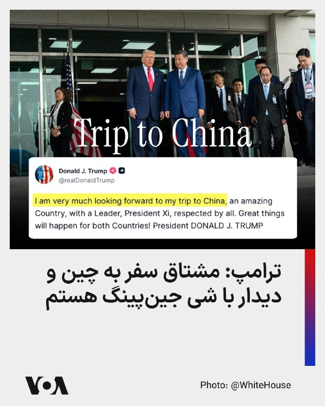

دونالد ترامپ، رئیس ‌جمهوری آمریکا، در پیامی در شبکه اجتماعی تروت سوشال اعلام کرد که مشتاق سفر به چین است.

ترامپ در این پیام، چین را «کشوری شگفت‌انگیز» توصیف کرد و از شی جین‌پینگ به عنوان رهبری یاد کرد که به گفته او مورد احترام همگان است.

او افزود که این سفر می‌تواند به دستاوردهای مهمی برای هر دو کشور منجر شود.

@FarsiVOA

## FarsiVOA — post 217534

  <a href="telegram/content/FarsiVOA_217534_1778607906.mp4" target="_blank">🎬 Download video</a>

ارتش اسرائیل اعلام کرد امروز ۲۲ اردیبهشت، بعد از اینکه در تلاشی ناموفق، یک موشک کوچک زمین به هوا به سمت یک هواپیمای ارتش شلیک شد، نیروی هوایی فرد مظنون را که بلافاصله پس از شلیک با موتورسیکلت فرار کرده بود، هدف قرار داد.

علاوه بر این، نیروی هوایی اهداف مشکوکی را که در منطقه عملیات نیروهای ارتش اسرائیل در جنوب لبنان شناسایی شده بودند، رهگیری کرد.

## DW_Farsi — post 124624

🔶 بیش از ۱۱۰ برنده جایزه نوبل خواستار آزادی نرگس محمدی شدند

بیش از ۱۱۰ برنده جایزه نوبل خواستار آزادی فوری و بی قید و شرط نرگس محمدی، فعال زندانی حقوق بشر و برنده جایزه نوبل صلح، و رفع اتهام از او شدند.

این درخواست در پی افزایش نگرانی از وخامت سریع وضعیت جسمانی نرگس محمدی و انتقال او از زندان زنجان به بیمارستانی در تهران مطرح شده است.

در بیانیه‌ای که امروز سه‌شنبه ۱۲ مه (۲۲ اردیبهشت) منتشر شد، ۱۱۲ برنده جایزه نوبل از مقام‌های جمهوری اسلامی و جامعه جهانی خواستند تا "بی‌درنگ" برای آزادی نرگس محمدی و تضمین دسترسی مداوم او به درمان پزشکی اقدام کنند.

نرگس محمدی که در سال ۲۰۲۳ به دلیل دهه‌ها فعالیت در دفاع از حقوق زنان در ایران برنده جایزه نوبل صلح شده بود، یکشنبه گذشته ۲۰ اردیبهشت، به دلیل وضعیت بحرانی جسمانی‌اش جهت درمان تخصصی با آمبولانس به بیمارستان پارس تهران منتقل شد.

@dw_farsi

## DW_Farsi — post 124623

  

🔶 معاون نیروی دریایی سپاه: محدوده تنگه هرمز برای ما بزرگ‌تر شده است

محمد اکبرزاده، معاون سیاسی نیروی دریایی سپاه پاسداران انقلاب اسلامی، در گفت‌وگویی در تلویزیون جمهوری اسلامی مدعی شد که در جریان تحولات جنگ و محاصره دریایی، تنگه هرمز برای حکومت ایران "بزرگ‌تر شده و به یک منطقه وسیع عملیاتی تبدیل شده است."

اکبرزاده با بیان این ادعا که در گذشته، "تنگه هرمز یک گستره محدود در اطراف جزایری مانند هرمز و هنگام تعریف می‌شد"، گفت: «اکنون در چارچوب طرح جدید، محدوده تنگه هرمز به‌طور قابل توجهی گسترش یافته و از سواحل جاسک و سیری تا فراتر از جزایر بزرگ، به‌عنوان یک پهنه راهبردی تعریف شده است.»

معاون سیاسی نیروی دریایی سپاه پاسداران با اشاره به تحولات دهه‌های اخیر این منطقه و نیز در جریان جنگ هشت ساله ایران و عراق، با اشاره به ابعاد ژئوپلیتیکی تنگه هرمز، مدعی شد: «اگر بخواهیم جغرافیای این منطقه را توضیح دهیم، باید به این نکته توجه کنیم که نگاه جمهوری اسلامی ایران به تنگه هرمز، صرفاً یک نگاه محدود جغرافیایی نبوده، بلکه نگاهی راهبردی و متفاوت است.»

اکبرزاده با بیان این ادعا که "این رویکرد ناشی از سیاست تنش‌زدایی و تامین امنیت بوده است"، گفت: «ما به‌دنبال آرامش و امنیت در منطقه بودیم، اما امروز شرایط متفاوت شده و سیاست‌های جدیدی در قبال تنگه هرمز در حال اعمال است که دنیا نتایج آن را خواهد دید.»

با تشدید حملات امریکا و اسرائیل به ایران، سپاه پاسداران اقدام به بستن تنگه هرمز کرد. این اقدام با اعتراضات شدید بین‌المللی روبرو شد چرا که این باریکه یک آبراه بین‌المللی است و بر اساس قوانین بین‌الملل ایران اجازه بستن آن را ندارد.

در حال حاضر این موضوع به یکی از موضوعات اصلی مورد مناقشه میان ایران و آمریکا تبدیل شده است.

@dw_farsi

## DW_Farsi — post 124622

  

🔶 کویت ۴ عضو سپاه را بازداشت کرد

خبرگزاری دولتی کویت (KUNA) گزارش داد که این کشور، چهار عضو سپاه پاسداران انقلاب اسلامی را که گفته می‌شود تلاش داشتند برای "انجام اقدامات خصمانه" وارد این کشور عربی حاشیه خلیج فارس شوند، بازداشت کرده است.

بر اساس این گزارش، این چهار نفر روز اول مه (۱۱ اردیبهشت) با یک قایق ماهیگیری تلاش کردند وارد کویت شوند و در جریان آن، با نیروهای نظامی کویت درگیر شدند که در نتیجه، یک سرباز کویتی زخمی شد.

این نخستین تلاش شناخته‌شده حکومت ایران برای نفوذ نظامی به یکی از کشورهای همسایه خود در ارتباط با جنگ اخیر به شمار می‌رود. خبرگزاری دولتی کویت، نام چهار فرد بازداشت‌شده، از جمله درجه‌های نظامی آن‌ها را نیز منتشر کرده است.

در همین راستا وزارت کشور کویت اعلام کرد این چهار نفر اعتراف کرده‌اند که از سوی سپاه پاسداران ماموریت داشتندبه جزیره بوبیان، یکی از مراکز مهم تجاری و لجستیکی، نفوذ کنند تا "ماموریتی شامل انجام اقدامات خصمانه علیه کویت" را اجرا کنند. بوبیان بزرگ‌ترین جزیره کشور کویت و دومین جزیره بزرگ در خلیج فارس پس از قشم است.

@dw_farsi

## DW_Farsi — post 124617

🔶 از کلاس درس تا چوبه دار؛ سرکوب نسل جوان در ایران

🔺 گزارشی از آتفه چهارمحالیان

در ماه‌های اخیر، پس از وقایع دی‌ماه ۱۴۰۴ و هم‌زمان با جنگ ایران با آمریکا و اسرائیل و تشدید فضای امنیتی در خیابان‌ها و دانشگاه‌ها، بار دیگر نوجوانان و جوانان ایران به یکی از هدف‌های اصلی سرکوب جمهوری اسلامی بدل شده‌اند.

موج تازه بازداشت‌ها، پرونده‌سازی‌های امنیتی و اعدام‌ها نشان می‌دهد حاکمیت در مواجهه با بحران‌های سیاسی و نظامی، بار دیگر به سراغ نسلی رفته که در سال‌های اخیر به یکی از فعال‌ترین نیروهای اعتراض تبدیل شده است؛ نسلی که حکومت، صدا، شیوه زیست و خواست‌های او را در تعارض با نظم سیاسی می‌بیند.

سازمان ملل اعلام کرده است که از آغاز جنگ اخیر تاکنون بیش از چهار هزار نفر در ایران با اتهام‌های امنیتی بازداشت شده‌اند و نهادهای حقوق بشری گزارش داده‌اند نوجوانان و جوانان نیز در میان بازداشت‌شدگان قرار داشته‌اند. گزارش‌های منتشرشده از شکنجه، ناپدیدسازی‌های قهری، اعترافات اجباری، مرگ در بازداشت و محاکمه‌های شتاب‌زده، تصویری از سرکوب نسلی ارائه می‌دهد که جمهوری اسلامی آن را بیش از هر زمان دیگری خارج از کنترل خود می‌بیند.

در ماه‌های گذشته چندین نوجوان و جوان معترض در معرض اجرای حکم اعدام قرار گرفتند؛ پرونده‌هایی که به گفته نهادهای حقوق بشری بر پایه اعترافات ناشی از شکنجه شکل گرفته‌اند.

📌 برای دسترسی کامل به گزارش به وبسایت دویچه‌وله فارسی مراجعه کنید.

@dw_farsi

## DW_Farsi — post 124616

  

🔶 ترامپ: ایران غنی‌سازی اورانیوم را "صددرصد" متوقف خواهد کرد

دونالد ترامپ، رئیس ‌جمهور ایالات متحده آمریکا در یک مصاحبه با شبکه WABC گفت اطمینان دارد که ایران غنی‌سازی اورانیوم را متوقف خواهد کرد و هرگونه تلاش برای ساخت سلاح هسته‌ای را کنار می‌گذارد.

اظهارات ترامپ در شرایطی بیان می‌شود که مذاکرات میان آمریکا و جمهوری اسلامی همچنان در بن‌بست قرار دارد.

ترامپ در این مصاحبه در پاسخ به این پرسش که آیا به باور او می‌توان مانع غنی‌سازی اورانیوم و ساخت بمب از سوی جمهوری اسلامی شد، گفت: «صد درصد آن‌ها متوقف خواهند شد.»

ترامپ همچنین گفت که مستقیما با مقام‌های حکومت ایران در جریان مذاکرات در ارتباط بوده است. رئیس جمهور آمریکا افزود: «من با آن‌ها سروکار دارم. و آن‌ها گفتند که ما غبار را [از آن‌ها] خواهیم گرفت. من به آن غبار هسته‌ای می‌گویم، چون اسم مناسبی است و ما آن را خواهیم گرفت.»

منظور ترامپ از "غبار هسته‌ای" ۴۰۰ کیلوگرم اورانیوم با غنای بیش از ۶۰ درصد است که یکی از موارد مناقشه اصلی میان ایران و آمریکاست.

ترامپ در عین حال با اشاره به این که "ایالات متحده نیازی ندارد برای دستیابی به توافق عجله کند" گفت: «ما قرار نیست برای هیچ‌چیز عجله کنیم، ما [اهرم] محاصره را در اختیار داریم.»رئیس‌ جمهور آمریکا همزمان روز سه‌شنبه با انتشار پستی در شبکه "تروث سوشال"، دو تصویر گرافیکی را به اشتراک گذاشت که در آن‌ها، حمله به پهپادها و قایق‌های موسوم به قایق تندروی سپاه نشان داده شده‌اند.

@dw_farsi

## DW_Farsi — post 124615

  

🔶 سفیر آمریکا در اسرائیل استفاده امارات از سامانه "گنبد آهنین" را تایید کرد

مایک هاکبی، سفیر ایالات متحده آمریکا در اسرائیل با بیان این که "امارات متحده عربی، از توافق‌نامه‌های ابراهیم و عادی‌سازی روابط با اسرائیل، سود برده است" از به‌کار‌گیری سامانه دفاع موشکی "گنبد آهنین" اسرائیل در امارات برای مقابله با موشک‌های پرتاب شده از ایران در جریان جنگ خبر داد.

هاکبی با اشاره به پیامدهای حاصل از پیمان ابراهیم برای امارات گفت: «فقط نگاهی به مزایای آن بیندازید. اسرائیل همین حالا سامانه‌های گنبد آهنین و نیروهایی را برای کمک به بهره‌برداری از آن‌ها برایشان فرستاده است.»

امارات متحده عربی در چارچوب توافق‌نامه‌های ابراهیم که در سال ۲۰۲۰ با میانجی‌گری ایالات متحده آمریکا انجام شد، اسرائیل را به رسمیت شناخت.

پیش از این فایننشال تایمز گزارش داده بود که اسرائیل برای کمک به دفاع از امارات، سامانه شناسایی سبک "اسپکترو" و سامانه پدافند موشکی را همراه با ده‌ها نیروی نظامی به این کشور فرستاده است. این گزارش، استقرار این تجهیزات را یکی از نخستین نمونه‌های بزرگ همکاری دفاعی میان اسرائیل و امارات می‌داند؛ همکاری‌ای که در جنگ اخیر برای نخستین بار در مقیاسی گسترده آزموده شد.

@dw_farsi

## DW_Farsi — post 124614

  

🔶 قوه قضاییه از توقیف اموال بیش از ۴۰۰ چهره خارج از کشور خبر داد

خبرگزاری مهر وابسته به سازمان تبلیغات اسلامی، به نقل از قوه قضاییه از توقیف اموال و دارایی‌های بیش از ۴۰۰ نفر از جمله خبرنگاران شبکه‌های "اینترنشنال" و "من‌وتو" خبر داد و مدعی شد که این افراد، "در همکاری با رژیم‌های متخاصم خسارت به زیرساخت‌ها و امنیت ملی وارد کردند".

بر اساس این گزارش، این اقدام در ادامه "دستور مقام قضایی و در راستای قانون تشدید مجازات جاسوسی" صورت گرفته و خبرنگاران یادشده، به همکاری با اسرائیل و "کشورهای متخاصم علیه امنیت و منافع ملی" متهم شده‌اند.

این گزارش، با اشاره به توقیف اموال ثبتی و دارایی‌های این افراد، آن‌ها را بیش از ۴۰۰ نفر از ایرانیان خارج از جمله "عده‌ای از بازیگران، ورزشکاران، مدیران و خبرنگاران" شبکه اینترنشنال و شبکه من‌وتو عنوان کرده است.

قوه قضاییه مدعی شده است که این افراد "در همکاری با دولت‌های متخاصم موجبات ایجاد خسارات گسترده‌ای به زیرساخت‌ها و مکان‌های عمومی نظیر مدارس، دانشگاه‌ها، مراکز تحقیقاتی، مراکز صنعتی و ... را فراهم کرده‌اند."

از زمان آغاز حملات نظامی آمریکا و اسرائیل به ایران در روز ۹ اسفندماه ۱۴۰۴، گزارش‌ها از افزایش بازداشت‌ها، اعدام‌ها و فشار بر فعالان رسانه‌ای و مدنی حکایت دارد. سازمان‌های حقوق بشری نیز نسبت به استفاده از مجازات‌هایی چون اعدام و مصادره اموال به عنوان ابزار سرکوب هشدار داده‌اند.

در این چارچوب، مصادره گسترده اموال را می‌توان بخشی از راهبردی دانست که در آن، جنگ خارجی بهانه‌ای برای بازتعریف و تشدید فشار داخلی شده است. در حالی که حکومت از "مذاکره" و "آتش‌بس" سخن می‌گوید، اقدامات عملی نشان می‌دهد که سطح تقابل با منتقدان و مخالفان نه تنها کاهش نیافته، بلکه در حال گسترش است.

@dw_farsi

## DW_Farsi — post 124613

🔶 هک با قدرت هوش مصنوعی؛ تهدیدی جدی در ابعاد جهانی

بر اساس یک گزارش گوگل، اقدامات هکرها با استفاده از قدرت هوش مصنوعی ، تنها در عرض سه ماه، از یک مشکل نوظهور به یک تهدید جدی در مقیاس وسیع تبدیل شده است.

گزارش‌های پیشین نشان داده بودند که جدیدترین مدل‌های هوش مصنوعی فراتر از حد تصور در کدنویسی توانمند هستند. این مدل‌ها در حال حاضر، به ابزارهایی بسیار قدرتمند برای سوءاستفاده از آسیب‌پذیری‌ سیستم‌ها تبدیل شده‌اند و طیف گسترده‌ای از سامانه‌های نرم‌افزاری را به خطر انداخته‌اند.

این گزارش همچنین دریافته است که گروه‌های تبهکار، همراه با عوامل بین‌المللی وابسته به دولت‌های چین، کره شمالی و روسیه، به طور گسترده از مدل‌های تجاری از جمله جمینای، کلود و ابزارهای شرکت اوپن‌ای‌آی برای بهبود و گسترش حملات استفاده می‌کنند.

به گزارش گاردین، یک کارشناس که در تدوین این گزارش نقش داشته می‌گوید این که چنین چیزی در آینده نزدیک رخ خواهد داد، تصوری اشتباه است. به گفته او "واقعیت این است که این روند همین حالا آغاز شده است".

@dw_farsi

## DW_Farsi — post 124612

🔶 تشکیل دادگاه نظامی در اسرائیل برای عاملان حمله هفت اکتبر

پارلمان اسرائیل شامگاه دوشنبه ۱۱ مه (۲۱ اردیبهشت) قانونی را تصویب کرد که بر اساس آن، یک دادگاه نظامی ویژه تشکیل خواهد شد تا صدها جنگجوی فلسطینی، به دلیل مشارکت در حمله تروریستی هفتم اکتبر ۲۰۲۳، در آن محاکمه شوند.

این قانون جدید با اکثریت ۹۳ رأی موافق، از مجموع ۱۲۰ نماینده کنست، تصویب شد. این طرح از سوی نمایندگانی از هر دو جناح ائتلاف حاکم و اپوزیسیون ارائه شده بود. نمایندگان پارلمان گفتند که این اقدام به التیام "ضربه روحی ملی" ناشی از آن حمله کمک خواهد کرد.

هدف این قانون آن است که تمامی مهاجمان ۷ اکتبر، بر اساس قوانین کیفری موجود اسرائیل، به اتهام‌هایی چون "جنایت علیه ملت یهود"، "جنایت علیه بشریت" و "جنایت جنگی" تحت پیگرد قرار گیرند.

به گفته اسرائیل، در حمله غافلگیرانه نیروهای موسوم به "نخبه" حماس در هفتم اکتبر ۲۰۲۳، دست‌کم ۱۲۰۰ نفر کشته شدند که بیشتر آنها غیرنظامی بودند. مهاجمان همچنین ۲۵۱ گروگان را به نوار غزه منتقل کردند. این روز، مرگبارترین روز تاریخ اسرائیل و شدیدترین حمله علیه یهودیان از زمان هولوکاست تاکنون توصیف شده است.

@dw_farsi

## DW_Farsi — post 124611

🔶 تبعیض دیجیتال در ایران زیر سایه جنگ؛ جدال بر سر اینترنت پرو

بیش از هفتاد روز پس از آغاز قطع گسترده اینترنت در ایران هم‌زمان با شروع جنگ آمریکا و اسرائیل علیه جمهوری اسلامی در نهم اسفند ۱۴۰۴، بحران دسترسی به شبکه جهانی از سطح محدودیتی امنیتی فراتر رفته و به مسئله‌ای سیاسی، اقتصادی و طبقاتی تبدیل شده است.

نت‌بلاکس پیش‌تر اعلام کرده بود که این قطعی در ششم اردیبهشت وارد پنجاه و هشتمین روز پیاپی شده و تا هشتم ماه مه از مرز هفتاد روز گذشته است؛ وضعیتی که به گفته این نهاد، گزارش‌دهی مستقل، ارتباطات عمومی و دسترسی مردم به اطلاعات جهانی را مختل کرده است.

هم‌زمان با این قطعی گسترده، موضوع "اینترنت پرو"، "خط سفید" و "سیم‌کارت سفید" نیز به نشانه‌ای آشکار از تبعیض دیجیتال بدل شده است. اکثریت شهروندان با اینترنت محدود، فیلترشکن‌های پرهزینه و اختلال دائمی روبرو هستند، اما گروه‌هایی خاص، از کسب‌وکارهای منتخب تا برخی چهره‌های رسانه‌ای و سیاسی، به مسیرهایی جداگانه برای دسترسی به اینترنت جهانی دست یافته‌اند.

@dw_farsi

## DW_Farsi — post 124601

📸 مروری بر مهم‌ترین حضورهای ایران در جشنواره سینمایی کن

هم‌زمان با آغاز جشنواره فیلم کن ۲۰۲۶ و نمایش دو فیلم ایرانی "داستان‌های موازی" ساخته اصغر فرهادی و "تمرین‌هایی برای یک انقلاب" به کارگردانی پگاه آهنگرانی، نگاهی داریم به مهم‌ترین فیلم‌های ایرانی که در سال‌های گذشته در این جشنواره حضور داشته‌اند.

از نخل طلای "طعم گیلاس" عباس کیارستمی تا موفقیت‌های اصغر فرهادی، جعفر پناهی و محمد رسول‌اف، سینمای ایران بارها در کن دیده شده و جوایز مهمی به دست آورده است.

این گالری مروری است بر فیلم‌ها، بازیگران و لحظه‌هایی که نام ایران را در یکی از مهم‌ترین جشنواره‌های سینمایی جهان ماندگار کردند.

@dw_farsi

## Persian_Trend_Official — post 13993

https://youtube.com/live/rrGzLhyQoaY?feature=share

## Persian_Trend_Official — post 13992

❤️ اگر از مخاطبان پرشین ترند هستید و تلگرام پرمیوم دارید،
با بوست کردن کانال کمک بزرگی به رشد و دیده‌شدن بیشتر پرشین ترند می‌کنید.
این بوست‌ها باعث می‌شود امکانات بیشتری برای انتشار محتوا، استوری و قابلیت‌های ویژه کانال فعال شود و در شرایط فعلی، به ادامه پوشش سریع و تحلیل‌های روزانه کمک زیادی می‌کند.
🙏 اگر مایل بودید، از طریق لینک زیر کانال را بوست کنید:
https://t.me/boost/persian_trend_official
📌 @persian_trend_official
پرشین ترند | متفاوت‌ترین کانال نظامی

## Persian_Trend_Official — post 13991

لایو امشب ساعت 21 به وقت تهران شروع میشه

## Persian_Trend_Official — post 13990

  <a href="telegram/content/Persian_Trend_Official_13990_1778607910.webm" target="_blank">🎬 Download video</a>

🔴 اختصاصی |تورم آمریکا بالاتر از انتظار ثبت شد

تورم آمریکا در ماه آوریل بار دیگر شتاب گرفت؛ موضوعی که تحت تأثیر افزایش قیمت بنزین، مواد غذایی و تبعات جنگ ایران رخ داده است.

بر اساس داده‌های منتشرشده:

▪️ نرخ تورم سالانه آمریکا به ۳.۸ درصد رسید
▪️ بازار انتظار عدد ۳.۷ درصدی را داشت
▪️ این سریع‌ترین رشد تورم از سال ۲۰۲۳ محسوب می‌شود

همچنین:

▪️ تورم ماهانه ۰.۶ درصد ثبت شد
▪️ تورم هسته ماهانه به ۰.۴ درصد رسید
▪️ تورم هسته سالانه نیز ۲.۸ درصد اعلام شد
▪️ هر دو شاخص هسته بالاتر از پیش‌بینی‌ها بودند

افزایش قیمت:

انرژی
بلیت هواپیما
و مواد غذایی

نشان می‌دهد فشارهای تورمی ممکن است در ماه‌های آینده نیز ادامه پیدا کند؛ حتی در صورت حفظ آتش‌بس یا کاهش تنش‌ها در تنگه هرمز

🫆:Tony

📌 @persian_trend_official
پرشین ترند | متفاوت‌ترین کانال نظامی

## Persian_Trend_Official — post 13989

🔴احضار سفیر جمهوری اسلامی به وزارت خارجه کویت

💢وزارت امور خارجه کویت عصر امروز در بیانیه‌ای اعلام کرد سفیر جمهوری اسلامی را احضار و یادداشت اعتراضی به او تحویل داده شد.

💢وزاتخانه یادشده در توجیه احضار سفیر جمهور اسلامی تأکید کرد این اقدام در پی آنچه «نفوذ گروهی از سپاه پاسداران به بوبیان و درگیری آنها با نیروهای کویتی» خوانده است، انجام گرفت.

🫆:Tony

📌 @persian_trend_official
پرشین ترند | متفاوت‌ترین کانال نظامی

## Persian_Trend_Official — post 13988

  

پیت هگست: آتش‌بس با ایران در حال اجراست
 

💢آتش‌بس با ایران در «وضعیت بسیار پویا» قرار دارد و در حال اجرا ست.
 
💢آتش‌بس به معنای توقف آتش‌پرانی است و می‌دانیم این اتفاق در حین مذاکرات رخ داده است و گفتگوهای مختلف بسیاری با تیم مذاکره ‌کننده ما در حال انجام است.

🫆:Tony

📌 @persian_trend_official
پرشین ترند | متفاوت‌ترین کانال نظامی

## Persian_Trend_Official — post 13987

🔴 دو وزیر دولت بریتانیا در اعتراض به استارمر استعفا دادند

💢گزارش‌ها حاکی است دو وزیر دولت بریتانیا در مخالفت با سیاست‌ها و عملکرد «کی یر استارمر» از سمت خود استعفا داده‌اند.

💢این استعفاها در حالی رخ می‌دهد که فشارهای سیاسی بر نخست‌وزیر بریتانیا افزایش یافته و پیش‌تر نیز گزارش‌هایی درباره نارضایتی گسترده در حزب کارگر منتشر شده بود.

🫆:Tony

📌 @persian_trend_official
پرشین ترند | متفاوت‌ترین کانال نظامی

## Persian_Trend_Official — post 13986

  <a href="telegram/content/Persian_Trend_Official_13986_1778607911.mp4" target="_blank">🎬 Download video</a>

🔴 وزارت دفاع روسیه تصاویر آزمایش موشک «سارمات» را منتشر کرد

وزارت دفاع روسیه ویدئویی از آزمایش موشک بالستیک قاره‌پیمای «سارمات» منتشر کرده است؛ موشکی که از آن به‌عنوان یکی از قدرتمندترین تسلیحات راهبردی هسته‌ای روسیه یاد می‌شود.

بر اساس گزارش‌ها:

▪️ «سارمات» یک موشک بالستیک قاره‌پیما با قابلیت حمل چندین کلاهک هسته‌ای است

▪️ ناتو این موشک را با نام «شیطان ۲» می‌شناسد

▪️ روسیه اعلام کرده این سامانه برای عبور از سپرهای موشکی طراحی شده است

️▪️ برد این موشک بین ۱۰ تا ۱۸ هزار
کیلومتر اعلام شده است

🫆:Tony

📌 @persian_trend_official
پرشین ترند | متفاوت‌ترین کانال نظامی

## Persian_Trend_Official — post 13984

🔴 عبور نفتکش‌های قطری از تنگه هرمز تأیید شد

در حالی که روز گذشته برخی گزارش‌ها مدعی شده بودند نفتکش قطری «مهزم» توسط ایران از تنگه هرمز بازگردانده شده، داده‌های جدید نشان می‌دهد این نفتکش دقایقی پیش موقعیت خود را در دریای عمان ثبت کرده و از مسیر تعیین‌شده عبور کرده است.

بر اساس گزارش‌ها:

▪️ نفتکش «مهزم» موفق به عبور از تنگه هرمز شده است
▪️ بلومبرگ نیز عبور دومین نفتکش حامل گاز طبیعی قطر از مسیر تعیین‌شده ایران را تأیید کرده است
▪️ عبور این کشتی‌ها در شرایط تنش شدید امنیتی در منطقه انجام شده است

🫆:Tony

📌 @persian_trend_official
پرشین ترند | متفاوت‌ترین کانال نظامی

## Persian_Trend_Official — post 13983

  <a href="telegram/content/Persian_Trend_Official_13983_1778607912.mp4" target="_blank">🎬 Download video</a>

🔴 رزمایش ضد هلی‌برن سپاه؛ بدون وجود پدافند هوایی

💢تصاویر منتشرشده از رزمایش «قائد شهید» سپاه تهران، استفاده از:
▪️ پهپادهای انتحاری
▪️ تک‌تیراندازها
▪️ مسلسل‌های سنگین سوار بر وانت تجاری

▪️ آرپی‌جی ۷

▪️ و توپ بدون لگد را نشان می‌دهد.

💢اما یک سؤال مهم مطرح است:
اگر هدف رزمایش مقابله با عملیات هلی‌برن دشمن بوده، چرا تمرینی برای هدف‌گیری بالگردها و اهداف پروازی با موشک‌های دوش‌پرتاب دیدهنمی‌شود؟

💢قاعدتاً جلوگیری از رسیدن و فرود دشمن، بسیار مؤثرتر از ورود به نبرد زمینی پس از پیاده‌سازی نیروهاست.

💢نکته مهم دیگر این است که ارتش آمریکا در صورت اجرای چنین عملیاتی، تنها از بالگرد ترابری استفاده نمی‌کند و عملیات معمولاً با:
▪️ پوشش هوایی
▪️ پهپادهای شناسایی
▪️ جنگ الکترونیک
▪️ و پشتیبانی آتش همراه خواهد بود.

💢به همین دلیل برخی تحلیلگران معتقدند این رزمایش بیشتر بر درگیری زمینی پس از فرود دشمن تمرکز داشته تا مقابله کامل با یک عملیات هوابرد مدرن.

🫆:Tony

📌 @persian_trend_official
پرشین ترند | متفاوت‌ترین کانال نظامی

## Persian_Trend_Official — post 13982

  

سخنگوی كميسيون امنيت ملی مجلس: غنی‌سازی ۹۰ درصدی اورانیوم در مجلس بررسی خواهد شد.

☆Phantom☆

📌 @persian_trend_official
پرشین ترند | متفاوت‌ترین کانال نظامی

## Persian_Trend_Official — post 13981

  

🚨🇺🇸🇮🇷 آخرین مقاومت سپاه پاسداران: این قایق‌ها تنها چیزی بود که برایشان باقی مانده بود.

☆Phantom☆

📌 @persian_trend_official
پرشین ترند | متفاوت‌ترین کانال نظامی

## Persian_Trend_Official — post 13979

  <a href="telegram/content/Persian_Trend_Official_13979_1778607915.webm" target="_blank">🎬 Download video</a>

اگر اینترنت غزه، اوکراین یا هرجایی که حمایت از آن برای حامی‌نماهای حقوق بشر "ویترین اخلاقی" داشته باشد فقط ۷ روز قطع میشد، دنیا را روی سرشان خراب می‌کردند؛ اما اینترنت ایران ۷۴ روز است عملاً قطع شده و آب از آب تکان نخورده است.

فکر می‌کنید اتفاق خاصی افتاده؟ خیر.
ضریب دسترسی واقعی به اینترنت آزاد در ایران به گواه نت‌بلاکس به حدود ۲ درصد رسیده؛ میلیون‌ها انسان نه ۷ روز، بلکه ۷۴ روز عملاً در یک زندان دیجیتال گروگان گرفته شده‌اند و همزمان که جمهوری اسلامی در پشت پرده به سرکوب، بازداشت و اعدام مشغول است، آشغالی به نام "اینترنت پرو" را به‌عنوان راه‌حل به مردم می‌فروشد، که عقیم‌سازی عمدی دسترسی آزاد به اطلاعات و نقض آشکار حقوق انسانی و حریم خصوصی شهروندان است.

ظاهراً برای جهان مدعی آزادی، فقط آن دسته از رنج‌هایی دیده می‌شوند که موضع‌گیری برایش هزینه‌ای نداشته باشد، یا چشم‌های مردمانش رنگی باشد.

📝 Nick

📌 @persian_trend_official
پرشین ترند | متفاوت‌ترین کانال نظامی

## Persian_Trend_Official — post 13978

💢خلاصه اخرین تحولات مهم

▪️دونالد ترامپ، رئیس‌جمهور آمریکا، اعلام کرد آتش‌بس با ایران «روی دستگاه حفظ حیات» قرار دارد و پیشنهاد اخیر تهران برای پایان جنگ را «کاملاً غیرقابل قبول» و «مزخرف» توصیف کرد.

▪️ قطر ایران را متهم کرد که از تنگه هرمز به‌عنوان ابزار فشار و «باج‌گیری» علیه کشورهای خلیج فارس استفاده می‌کند؛ در حالی که صادرات انرژی و کالاها همچنان با اختلال مواجه است

▪️ محمدباقر قالیباف، رئیس مجلس ایران، گفت تهران برای پاسخ به «هرگونه تجاوز» آماده است و واکنش ایران آمریکا را «غافلگیر» خواهد کرد

▪️ اتحادیه اروپا با اعمال تحریم‌های جدید علیه شهرک‌نشینان اسرائیلی به‌دلیل خشونت علیه فلسطینیان در کرانه باختری موافقت کرد؛ اقدامی که نتانیاهو گفته «موفق نخواهد شد»

▪️ شمار قربانیان جنگ غزه به ۷۲ هزار و ۷۴۰ نفر رسیده است

▪️ لبنان نیز اعلام کرد حملات اسرائیل از دوم مارس تاکنون ۲۸۶۹ کشته در این کشور برجای گذاشته است

🫆:Tony

📌 @persian_trend_official
پرشین ترند | متفاوت‌ترین کانال نظامی

## Persian_Trend_Official — post 13977

  

🔴 وزیر جنگ آمریکا درباره جنگ با ایران در کنگره بازخواست می‌شود

«پیت هگست» وزیر جنگ آمریکا قرار است در دور تازه‌ای از جلسات کنگره، درباره جنگ آمریکا و اسرائیل با ایران مورد پرسش نمایندگان قرار گیرد.

بر اساس گزارش‌ها:

▪️ برخی نمایندگان جمهوری‌خواه نیز نسبت به طولانی‌شدن جنگ و نبود مجوز رسمی کنگره ابراز نگرانی کرده‌اند
▪️ کمیته‌های بودجه دفاعی مجلس نمایندگان و سنا نشست‌هایی برای بررسی بودجه نظامی سال ۲۰۲۷ برگزار می‌کنند
▪️ دولت ترامپ بودجه‌ای تاریخی به ارزش ۱.۵ تریلیون دلار برای بخش دفاعی پیشنهاد داده است

گزارش‌ها حاکی است محور اصلی بحث‌ها علاوه بر بودجه، نحوه مدیریت جنگ با ایران خواهد بود؛ جنگی که به‌گفته رسانه‌های آمریکایی وارد وضعیت فرسایشی شده است.

همچنین انتظار می‌رود:

▪️ وزیر جنگ آمریکا و رئیس ستاد مشترک ارتش بر نیاز به افزایش پهپادها
ناوهای جنگی
سامانه‌های رهگیر موشکی
تأکید کنند؛ زیرا ذخایر این تجهیزات در جریان درگیری با ایران کاهش یافته است.

🫆:Tony

📌 @persian_trend_official
پرشین ترند | متفاوت‌ترین کانال نظامی

## Persian_Trend_Official — post 13976

  <a href="telegram/content/Persian_Trend_Official_13976_1778607916.webm" target="_blank">🎬 Download video</a>

کویت مدعی بازداشت ۴ افسر نیروی دریایی سپاه شد
وزارت کشور کویت اعلام کرد چهار نفر وابسته به سپاه پاسداران را هنگام تلاش برای ورود دریایی به جزیره بوبیان بازداشت کرده است.
طبق بیانیه رسمی، بازداشت‌شدگان شامل دو سرهنگ، یک کاپیتان و یک ستوان نیروی دریایی سپاه هستند که به گفته کویت، مأموریت «نفوذ» به جزیره بوبیان و انجام «اقدامات خصمانه» را داشته‌اند. در جریان درگیری، یک نیروی مسلح کویتی نیز زخمی شده است.

اسامی اعلام‌شده از سوی کویت:
1 امیرحسین عبدالمحمد زیرایی — سرهنگ نیروی دریایی
2▪️ عبدالصمد یدالله قنواتی — سرهنگ نیروی دریایی
3▪️ احمد جمشید غلامرضا ذوالفقاری — کاپیتان نیروی دریایی
4▪️ محمدحسین سهراب فاروقی‌راد — ستوان یکم
کویت می‌گوید این افراد اول ماه مه با یک قایق ماهیگیری وارد آب‌های این کشور شده بودند و دو نفر دیگر نیز موفق به فرار شده‌اند.
جزیره بوبیان بزرگ‌ترین جزیره کویت و در نزدیکی مرزهای دریایی ایران و عراق قرار دارد. ایران تاکنون واکنش رسمی به این ادعاها نشان نداده است.

## Persian_Trend_Official — post 13975

غرق شدن کشتی روسی حامل تجهیزات هسته‌ای به مقصد احتمالی کره شمالی

🔹 تحقیقات شبکه سی‌ان‌ان نشان می‌دهد یک کشتی باری روسی که احتمالاً دو راکتور هسته‌ای ویژه زیردریایی‌ها را حمل می‌کرد و ممکن بود مقصد آن کره شمالی باشد، پس از وقوع چند انفجار مشکوک در دریای مدیترانه غرق شده است.

☆Phantom☆

📌 @persian_trend_official
پرشین ترند | متفاوت‌ترین کانال نظامی

🔹این کشتی با نام Ursa Major در تاریخ 23 دسامبر 2024، حدود 60 مایلی سواحل اسپانیا، در شرایطی نامشخص غرق شد. به گفته منابع آگاه، سرنوشت این کشتی از زمان حادثه در هاله‌ای از ابهام قرار داشته و جزئیات مربوط به محموله و مأموریت آن محرمانه نگه داشته شده است.

## Persian_Trend_Official — post 13974

دقایقی قبل ارتش اسرائیل از رهگیری یک پهپاد که از سمت ایران یا حوثی ها به سمت جنوب اسرائیل شلیک شده بود خبر داد. ☆Phantom☆ 📌 @persian_trend_official پرشین ترند | متفاوت‌ترین کانال نظامی

## Persian_Trend_Official — post 13973

  <a href="telegram/content/Persian_Trend_Official_13973_1778607916.mp4" target="_blank">🎬 Download video</a>

دقایقی قبل ارتش اسرائیل از رهگیری یک پهپاد که از سمت ایران یا حوثی ها به سمت جنوب اسرائیل شلیک شده بود خبر داد.

☆Phantom☆

📌 @persian_trend_official
پرشین ترند | متفاوت‌ترین کانال نظامی

## RadioFarda — post 157103

🔸داده‌های کشتیرانی بورس لندن، ال‌اس‌ای‌جی، نشان می‌دهد که دومین نفتکش گاز طبیعی مایع (ال‌ان‌جی) متعلق به قطر روز سه‌شنبه با موفقیت از تنگه هرمز عبور کرده است. 🔸این اتفاق چند روز پس از آن رخ داده که نخستین محموله از این نوع، با مشارکت ایران و پاکستان، از این…

## RadioFarda — post 157102

  

🔸داده‌های کشتیرانی بورس لندن، ال‌اس‌ای‌جی، نشان می‌دهد که دومین نفتکش گاز طبیعی مایع (ال‌ان‌جی) متعلق به قطر روز سه‌شنبه با موفقیت از تنگه هرمز عبور کرده است.

🔸این اتفاق چند روز پس از آن رخ داده که نخستین محموله از این نوع، با مشارکت ایران و پاکستان، از این آبراه عبور کرده بود.

🔸بر اساس داده‌های ال‌اس‌ای‌جی، کشتی «میهزم» با ظرفیت ۱۷۴ هزار متر مکعب، روز دوشنبه بندر رأس لفان را ترک و روز سه‌شنبه از تنگه هرمز عبور کرد و به‌سوی بندر قاسم پاکستان رفت؛ جایی که انتظار می‌رود اواخر همان روز به آن برسد. این دومین عبور موفق یک نفتکش گاز طبیعی مایع قطری از هرمز از زمان آغاز جنگ ایران است.

🔸روز شنبه، نفتکش«الخریطیات» عبور از تنگه هرمز را از طریق مسیر شمالی مورد تأیید ایران آغاز کرد و روز یکشنبه موفق شد از این آبراه عبور کند. طبق داده‌های بورس لندن، این کشتی اکنون در نزدیکی بندر قاسم لنگر انداخته است.

@RadioFarda

## RadioFarda — post 157101

تشدید فشار بر نخست‌وزیر بریتانیا برای کناره‌گیری؛ استارمر می‌گوید قصد استعفا ندارد

🔸شکست سنگین حزب کارگر بریتانیا در انتخابات شوراهای محلی انگلستان و پارلمان‌های اسکاتلند و ولز، کابوسی را برای نخست‌وزیر بریتانیا رقم زده که گویی پایانی ندارد.

🔸صبح روز سه‌شنبه ۲۲ اردیبهشت‌ماه، کی‌یر استارمر در حالی در خانۀ شماره ۱۰ داونینگ‌‌استریت میزبان اعضای کابینه‌اش بود که می‌دانست دست‌کم ۸۰ تن از نمایندگان حزب کارگر، یعنی تقریباً یکی از هر پنچ نماینده این حزب در پارلمان، خواستار کناره‌گیری او از مقام صدارت شده‌اند؛ یا بلافاصله و یا بر اساس یک برنامۀ زمانبندی مشخص.

🔸در حالی‌که قرار است چارلز سوم پادشاه بریتانیا، روز چهارشنبه در مراسم سنتی افتتاح پارلمان، سخنرانی و برنامه‌های دولت کی‌یر استارمر برای یک‌سال آینده را اعلام کند، مشخص نیست چقدر از عمر این دولت باقی مانده باشد.

🔸پیش از ظهر سه‌شنبه کی‌یر استارمر در جلسۀ کابینه، تأکید کرد که کناره‌گیری نخواهد کرد و قصد دارد به رغم «۴۸ ساعت ناخوشایند گذشته»، رهبری کشور و تلاش برای اجرای برنامه‌های دولت کارگری را ادامه دهد.

🔸این وکیل حقوق بشر که کمتر از دو سال از نخست‌وزیری‌اش می‌گذرد، در جلسۀ کابینه تکرار کرد که گرچه مسئولیت شکست سنگین حزبش در انتخابات آخر هفتۀ قبل را می‌پذیرد، هنوز دلیل قاطعی برای کناره‌گیری نمی‌بیند.

🔸در این جلسه چندین تن از معاونان وزرا و اعضای ارشد کابینه بر ادامۀ حمایت از کی‌یر استارمر تأکید کردند.

🔸با وجود این دقایقی پس از پایان جلسه کابینه، جِس فیلیپس و الکس دیویس-جونز، دو معاون وزیر با انتشار مطالبی در شبکۀ ایکس از کناره‌گیری خود از مقام دولتی خبر دادند. پیش از این دو، میاتا فَنبوله، معاون وزیر در امور جوامع و اقلیت‌ها هم از تصمیمش برای کناره‌گیری از دولت خبر داده بود. اقدامی که با کناره‌گیری ربیر احمد معاون وزیر بهداشت دنبال شد.

🔸در همین حال همراهی شعبانه محمود وزیر کشور کابینۀ کی‌یر استارمر با نمایندگانی که خواهان کناره‌گیری نخست‌وزیر شده‌اند، می‌تواند برای رهبر حزب گران تمام شود.

🔸به گفتۀ منابع نزدیک به داونینگ استریت، انتظار می‌رود در ساعات آینده تعداد بیشتری از اعضای دولت از کناره‌گیری خود خبر داده و خواهان تغییر در رأس حزب کارگر شوند.

🔸گزارش کامل را در وب‌سایت رادیوفردا بخوانید.

@RadioFarda

## RadioFarda — post 157100

  

🔸الناز محمدی، روزنامه‌نگار ایرانی و دبیر گروه اجتماعی روزنامه «هم‌میهن»، در فهرست نامزدهای جایزه آزادی مطبوعات سازمان گزارشگران بدون مرز قرار گرفت.

🔸گزارشگران بدون مرز اعلام کرده است که الناز محمدی در بخش «شجاعت» نامزد این جایزه شده؛ بخشی که به روزنامه‌نگاران و رسانه‌هایی تعلق می‌گیرد که در شرایطی دشوار و با وجود خطر برای امنیت و آزادی‌شان به فعالیت ادامه داده‌اند.

🔸در توضیح این نامزدی آمده است که او پس از اعتراضات «زن، زندگی، آزادی» و پوشش پیامدهای اجتماعی آن، در سال ۲۰۲۳ بازداشت و به سه سال زندان محکوم شد. گزارشگران بدون مرز همچنین به فشارهای قضایی، زندان و محرومیت شغلی علیه او اشاره کرده است.

🔸مراسم اعلام برندگان جوایز آزادی مطبوعات سال ۲۰۲۶ روز ۱۱ خرداد در شهر مارسی فرانسه و همزمان با کنگره جهانی رسانه برگزار خواهد شد.

@RadioFarda

## RadioFarda — post 157099

  <a href="https://t.me/radiofarda/157099" target="_blank">📎 Download file</a>

📻بشنوید: ایستگاه ۱۹ با رادیوفردا، ۲۲ اردیبهشت ۱۴۰۵

@RadioFarda

## RadioFarda — post 157098

🔸دونالد ترامپ، رئیس‌جمهور آمریکا، روز سه‌شنبه گفت که «۱۰۰ درصد» اطمینان دارد که ایران غنی‌سازی اورانیوم را متوقف خواهد کرد و ذخیره اورانیوم خود را به آمریکا تحویل خواهد داد. 🔸او در گفت‌وگو با برنامه رادیویی سید رازنبرگ اعلام کرد که ایرانی‌ها متعهد شده‌اند…

## RadioFarda — post 157097

  

🔸دونالد ترامپ، رئیس‌جمهور آمریکا، روز سه‌شنبه گفت که «۱۰۰ درصد» اطمینان دارد که ایران غنی‌سازی اورانیوم را متوقف خواهد کرد و ذخیره اورانیوم خود را به آمریکا تحویل خواهد داد.

🔸او در گفت‌وگو با برنامه رادیویی سید رازنبرگ اعلام کرد که ایرانی‌ها متعهد شده‌اند غنی‌سازی اورانیوم را متوقف کنند: «آن‌ها قرار است متوقف شوند، و به من گفتند که «غبار» را به ما خواهند داد.»

🔸«غبار» اصطلاحی است که ترامپ به دفعات برای اشاره به اورانیوم غنی‌شده بعد از حملات آمریکا در اول تیر ماه سال گذشته به تأسیسات هسته‌ای ایران در جریان جنگ ۱۲ روزه به کار می‌برد.

🔸رئیس‌جمهور آمریکا در بخش دیگری از این گفت‌وگوی رادیویی گفت: «ما لازم نیست برای هیچ‌چیز عجله کنیم. ما یک محاصره داریم که هیچ پولی برای آن‌ها باقی نمی‌گذارد. مسئله خیلی ساده است: ما نمی‌توانیم اجازه دهیم آن‌ها سلاح هسته‌ای داشته باشند، چون از آن استفاده خواهند کرد.»

@RadioFarda

## RadioFarda — post 157096

🔸بحرین روز سه‌شنبه ۲۲ اردیبهشت سه نفر را به اتهام «همکاری با سپاه پاسداران» به حبس ابد محکوم کرد. 🔸دادگاهی در بحرین همچنین بیش از ۲۰ نفر دیگر را به حداکثر ۱۰ سال زندان محکوم کرد. 🔸این پادشاهی کوچک که تحت حاکمیت یک خاندان سنی است، جمعیت قابل‌توجهی از شیعیان…

## RadioFarda — post 157095

  

🔸بحرین روز سه‌شنبه ۲۲ اردیبهشت سه نفر را به اتهام «همکاری با سپاه پاسداران» به حبس ابد محکوم کرد.

🔸دادگاهی در بحرین همچنین بیش از ۲۰ نفر دیگر را به حداکثر ۱۰ سال زندان محکوم کرد.

🔸این پادشاهی کوچک که تحت حاکمیت یک خاندان سنی است، جمعیت قابل‌توجهی از شیعیان دارد که مدت‌هاست از حاشیه‌نشینی شکایت دارند.

🔸دادستانی بحرین در بیانیه‌ای اعلام کرد یک زن که «به همکاری با سازمان تروریستی سپاه پاسداران با هدف انجام اقدامات خصمانه و تروریستی» متهم شده بود، به حبس ابد محکوم شده است.

🔸دو نفر دیگر، که یکی از آن‌ها به ایران گریخته، نیز با اتهامات مشابه به حبس ابد و پرداخت جریمه ۱۰ هزار دیناری (۲۶ هزار و ۴۸۷ دلاری) محکوم شدند.

🔸در پرونده‌ای جداگانه، دادگاه ۱۰ متهم را به حبس‌هایی تا ۱۰ سال محکوم کرد که سه نفر از آن‌ها پس از گذراندن دوران محکومیت اخراج خواهند شد.

🔸آن‌ها به حمایت از ایران، فیلم‌برداری از مکان‌های ممنوعه و انتشار بیانیه‌های ممنوعه متهم شده‌اند.

@RadioFarda

## RadioFarda — post 157094

  

🔸یک مقام ارشد پنتاگون روز سه‌شنبه ۲۲ اردیبهشت اعلام کرد که جنگ ایالات متحده با ایران تاکنون ۲۹ میلیارد دلار هزینه داشته است، رقمی که نسبت به برآورد ارائه‌شده در اواخر ماه گذشته، چهار میلیارد دلار افزایش نشان می‌دهد.

🔸به گزارش خبرگزاری رویترز، در حالی که تنها شش ماه تا انتخابات میان‌دوره‌ای کنگره آمریکا باقی مانده است، دموکرات‌ها در نظرسنجی‌های عمومی موقعیت بهتری پیدا کرده‌اند و تلاش می‌کنند این جنگ را به مسائل مربوط به هزینه‌های زندگی پیوند بزنند.

🔸پنتاگون در ۲۹ آوریل اعلام کرده بود که هزینه جنگ تا آن زمان ۲۵ میلیارد دلار بوده است.

🔸جولز هرست، که به‌طور موقت وظایف حسابرس ارشد را بر عهده دارد، روز سه‌شنبه به قانون‌گذاران گفت که برآورد جدید شامل هزینه‌های به‌روزشده تعمیر و جایگزینی تجهیزات و همچنین هزینه‌های عملیاتی است.

🔸او گفت: «تیم ستاد مشترک و تیم حسابرسی به‌طور مداوم این برآورد را بررسی می‌کنند».

🔸هرست در کنار پیت هگست، وزیر دفاع، و ژنرال دن کین، رئیس ستاد مشترک نیروهای مسلح، سخن می‌گفت.

@RadioFarda

## RadioFarda — post 157093

رکوردشکنی شمار نویسندگان زندانی در جهان؛ ایران با ۵۳ نویسندهٔ زندانی در رده دوم

🔸انجمن قلم آمریکا در تازه‌ترین گزارش سالانهٔ خود دربارهٔ وضعیت آزادی بیان در جهان اعلام کرد شمار نویسندگان زندانی در سال ۲۰۲۵ برای نخستین بار از سال ۲۰۱۹ که این شاخص منتشر می‌شود، از مرز ۴۰۰ نفر عبور کرده است.

🔸این گزارش از افزایش چشمگیر بازداشت نویسندگان و فعالان فرهنگی در ایران نیز خبر می‌دهد.

🔸این گزارش که روز سه‌شنبه ۲۲ اردیبهشت منتشر شد، می‌گوید در سال ۲۰۲۵ میلادی در مجموع ۴۰۱ نویسنده در ۴۴ کشور زندانی بوده‌اند، در حالی‌که این رقم در سال پیش ۳۷۵ نفر در ۴۰ کشور بود.

🔸انجمن قلم آمریکا در شاخص «آزادی نوشتن» خود تأکید کرده است که طی هفت سال گذشته شمار نویسندگان زندانی در جهان ۶۸ درصد افزایش یافته و این روند نشان‌دهندهٔ تشدید مداوم سرکوب آزادی بیان و خاموش‌کردن صداهای منتقد در کشورهای مختلف است.

🔸بر اساس این گزارش، چین همچنان بزرگ‌ترین زندان نویسندگان در جهان است و با ۱۱۹ مورد در صدر فهرست قرار دارد. ایران با ۵۳ نویسندهٔ زندانی در رتبهٔ دوم ایستاده و به‌گفتۀ پن آمریکا، شدیدترین افزایش بازداشت‌ها در ایران طی سال گذشته رخ داده است.

🔸این سازمان می‌گوید مقام‌های جمهوری اسلامی در سال ۲۰۲۵ دست‌کم ۱۷ بازداشت تازه انجام دادند و شمار نویسندگان زندانی را بار دیگر به سطح دوران اعتراض‌های «زن، زندگی، آزادی» در سال ۱۴۰۱ نزدیک کرده‌اند.

🔸کارین دویچ کارلکار، مدیر برنامهٔ نویسندگان در معرض خطر در پن آمریکا، در این‌باره گفت مقام‌های جمهوری اسلامی در میان کشورهای جهان «کارزاری به‌ویژه خشن علیه صداهای مستقل» به راه انداخته‌اند.

🔸او افزود شاعران، مترجمان، پژوهشگران، ترانه‌سرایان، تحلیلگران آنلاین، مدافعان حقوق بشر و ستون‌نویسان همگی هدف بازداشت و سرکوب قرار گرفته‌اند، زیرا حکومت ایران در تلاش است «بحث و مخالفت» را خاموش کند.

🔸گزارش کامل را در وب‌سایت رادیوفردا بخوانید.

@RadioFarda

## RadioFarda — post 157092

🔸رسانه‌های ایران روز سه‌شنبه ۲۲ اردیبهشت مدعی شدند که هیئت‌های نمایندگی جمهوری اسلامی و عمان در مسقط دیدار کردند و «آخرین تحولات مربوط به تنگه هرمز و ترتیبات مربوط به عبور ایمن کشتی‌ها» را مورد بررسی قرار دادند. 🔸بر اساس این گزارش، عباس باقرپور مدیرکل حقوقی…

## RadioFarda — post 157091

  

🔸رسانه‌های ایران روز سه‌شنبه ۲۲ اردیبهشت مدعی شدند که هیئت‌های نمایندگی جمهوری اسلامی و عمان در مسقط دیدار کردند و «آخرین تحولات مربوط به تنگه هرمز و ترتیبات مربوط به عبور ایمن کشتی‌ها» را مورد بررسی قرار دادند.

🔸بر اساس این گزارش، عباس باقرپور مدیرکل حقوقی بین‌المللی وزارت خارجه، ریاست هیئت نمایندگی ایران را برعهده داشت و «نمایندگان دستگاه‌های ذیربط» جمهوری اسلامی نیز در آن حضور داشتند.

🔸به ادعای این رسانه‌ها، «دو طرف بر حقوق و صلاحیت‌های حاکمیتی خود بر این تنگه به عنوان بخشی از آب‌های سرزمینی ایران و عمان تأکید کردند».

🔸تنگه هرمز از ۹ اسفند پارسال که آمریکا و اسرائیل به ایران حمله کردند، از سوی سپاه پاسداران عملاً مسدود شده است؛ آبراهی حیاتی که حدود ۲۰ درصد از نفت و گاز جهان از این مسیر عبور می‌کند.

@RadioFarda

## RadioFarda — post 157090

  

🔸فرماندهی مرکزی ایالات متحده، سنتکام، روز سه‌شنبه خبر داد از ابتدای محاصره دریایی علیه بنادر ایران تاکنون، ۶۵ کشتی تجاری را وادار به «تغییر مسیر» کرده است.

🔸در اطلاعیه سنتکام که در حساب شبکه ایکس آن منتشر شده است، آمده که نیروهای نظامی آمریکا در خاورمیانه در این مدت چهار کشتی ایرانی را هم «از کار انداخته‌اند».

🔸ارتش آمریکا جمعه از شلیک به دو نفتکش ایرانی «ام‌تی سی استار» و «ام‌تی سودا» و از کار انداختن آنها خبر داد و روز چهارشنبه نیز نفتکش «ام‌تی حسنا» با پرچم ایران هدف قرار گرفته بود.

🔸ماه گذشته نیز نیروهای آمریکایی یک کشتی باری ایرانی را توقیف کرده بودند.

🔸آمریکا و ایران بعد از یک دور مذاکره حضوری در پاکستان که چند روز بعد از برقراری آتش‌بس در اسلام‌آباد برگزار شد، با ارسال طرح‌های پیشنهادی متقابل مشغول مذاکره بودند. آمریکا بعد از بی‌نتیجه ماندن مذاکره حضوری، محاصره دریایی بنادر ایران را آغاز کرد، در حالی که ایران از ابتدای جنگ تنگهٔ هرمز را مسدود کرده است.

@RadioFarda

## RadioFarda — post 157089

  

🔸در پی انتقال نرگس محمدی، برندهٔ جایزهٔ صلح نوبل و زندانی سیاسی، به بیمارستان، ۱۱۲ برندهٔ جایزهٔ نوبل از رشته‌های مختلف با انتشار بیانیه‌ای مشترک خواستار آزادی فوری و بی‌قیدوشرط او و لغو همهٔ اتهام‌ها علیه این فعال حقوق بشر شدند.

🔸این بیانیه روز سه‌شنبه ۲۲ اردیبهشت، با هماهنگی «ابتکار زنان نوبل» و همکاری «بنیاد نرگس» منتشر شد. امضاکنندگان شامل برندگان نوبل در رشته‌های شیمی، اقتصاد، ادبیات، پزشکی، صلح و فیزیک هستند.

🔸در این بیانیه آمده است که گزارش‌های منتشرشده از سوی بنیاد نرگس و دیگر منابع معتبر نشان می‌دهد وضعیت جسمانی خانم محمدی «بحرانی» شده و او با کاهش شدید وزن، ناپایداری فشار خون و علائم جدی قلبی روبه‌رو است.

🔸برندگان نوبل هشدار داده‌اند که جان نرگس محمدی ممکن است در معرض «خطر فوری» باشد و تأکید کرده‌اند که او ماه‌ها از دسترسی به خدمات تخصصی پزشکی محروم بوده است.

🔸نرگس محمدی روز ۲۰ اردیبهشت با آمبولانس به بیمارستان تهرانپارس منتقل شد و اکنون تحت درمان یک تیم تخصصی پزشکی قرار دارد.

@Radiofarda

## RadioFarda — post 157088

🔸تنها ساعاتی تا افتتاح هفتاد‌و‌نهمین جشنواره فیلم کن باقی است و رسانه‌های جهان تصاویری از آماده‌سازی‌ نهایی کاخ جشنواره‌ کن را منتشر کرده‌اند.

🔸فرش قرمز روز افتتاحیه هفتاد‌و‌نهمین دوره این جشنواره روز سه‌شنبه ۲۲ اردیبهشت پهن شد و بزرگترین رویداد سینمایی جهان در انتظار حضور چهره‌های سرشناس سینماست که قرار است تا دوم خرداد در این جشنواره حضور داشته باشند.

🔸از جمله چهره‌های سرشناسی که امسال فیلم‌هایشان برای اولین بار اکران می‌شود می‌توان به اسکارلت جوهانسون، رامی مالک، خاویر باردم، جان تراولتا و لیا سیدو اشاره کرد.

🔸۲۲ فیلم هم برای دریافت جایزه نخل طلا در مراسم اختتامیه رقابت می‌کنند که در میان آنها چهره‌هایی از جمله پدرو آلمودوار،‌ اصغر فرهادی و لاسلو نمش حضور دارند.

@Radiofarda

## RadioFarda — post 157087

  <a href="https://t.me/radiofarda/157087" target="_blank">📎 Download file</a>

📻بشنوید: ساعت ۱۴ با رادیوفردا، ۲۲ اردیبهشت ۱۴۰۵‌

@Radiofarda

## RadioFarda — post 157086

  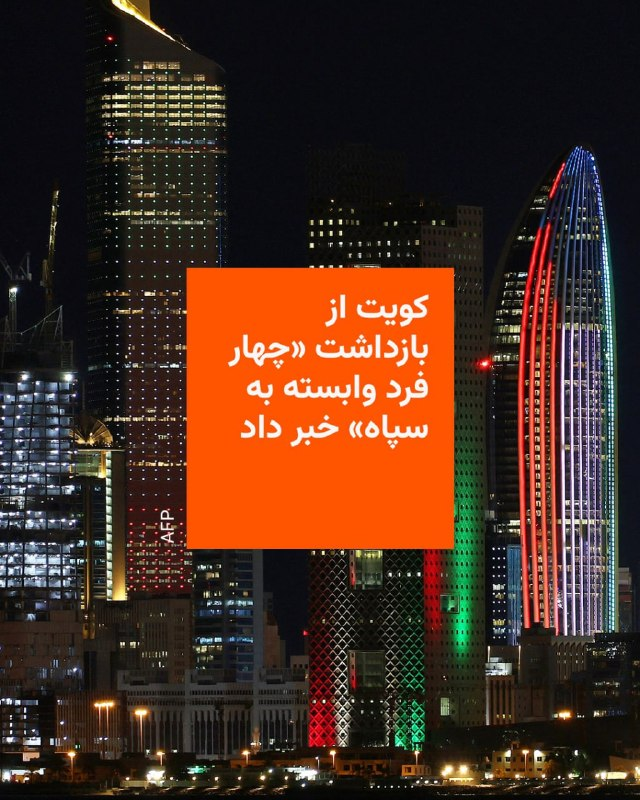

🔸وزارت کشور کویت اعلام کرد که «چهار نفوذی» وابسته به سپاه پاسداران انقلاب اسلامی ایران را پس از تلاش برای ورود دریایی به این کشور حوزه خلیج فارس بازداشت کرده است.

🔸خبرگزاری رسمی دولت کویت، کونا، این خبر را منتشر کرده است.

🔸این وزارتخانه افزود که در جریان درگیری با این این افراد، یکی از نیروهای مسلح کویت زخمی شد و «دو نفوذی‌» موفق به فرار شدند.

🔸کونا همچنین به نقل از وزارت کشور کویت نوشته که بازداشت‌شدگان در جریان بازجویی «اعتراف» کردند که وابسته به سپاه پاسداران هستند.

🔸بر اساس این گزارش، آنها «اعتراف کردند که مأموریت داشتند با یک قایق ماهیگیری که به‌طور ویژه برای انجام اقدامات خصمانه علیه کویت اجاره شده بود، به جزیره بوبیان نفوذ کنند».

🔸پیش از این وزارت دفاع کویت خبر اولیه‌ای از تلاش این چهار نفر برای ورود به این کشور از راه دریا منتشر کرده بود.

@RadioFarda

## RadioFarda — post 157085

  <a href="https://t.me/radiofarda/157085" target="_blank">📎 Download file</a>

🔸روز اقدام جهانی با هدف اعتراض به ادامه حبس زندانیان سیاسی، اعدام‌های گسترده و همچنین قطع اینترنت روز بیستم اردیبهشت در چندین شهر برگزار شد.

🔸 هواداران شاهزاده رضا پهلوی در شهرهای مختلف دنیا، از جمله در اروپا و آمریکا شمالی به خیابان آمدند و به این حرکت پیوستند؛ برخی شهرها مثل برلین و هامبورگ و استکهلم جمعیت قابل توجهی به این فراخوان پاسخ دادند و در برخی شهرهای دیگر تجمعات به نسبت موارد پیشین کوچکتر برگزار شد.

🔸پس از انتشار تصاویر برخی از تجمعات، بحثی پیرامون آن شکل گرفته است؛ مشخصا تجمع در شهر رگنسبورگ در آلمان، معترضان با لباس‌های متحدالشکل با نشان ساواک (سازمان اطلاعات و امنیت کشور) و پرچم‌هایی با همین نشان به خیابان آمدند.

🔸در نمونه‌ای دیگر شرکت‌کنندگان در تجمع با یونیفرم نظامی به خیابان آمده بودند. تصاویری که بسیار متفاوت از تصاویر تجمعاتِ معمول ایرانیان خارج از کشور بود.

🔸 درباره این روز اقدام جهانی و بحث‌های پیرامون آن ارزیابی عبدالرضا احمدی عضو حزب ایران نوین در آلمان را بشنوید.

@RadioFarda

## IranianMinds — post 20020

  <a href="telegram/content/IranianMinds_20020_1778607922.mp4" target="_blank">🎬 Download video</a>

عرفان شکورزاده 💔

@IranianMinds

## IranianMinds — post 20019

  

🔴 به گزارش بلومبرگ، امارات قبل و بعد از آتش‌بس ۸ آوریل، حملات تلافی‌جویانه‌ای علیه ایران انجام داد.

یکی از این حملات با اسرائیل هماهنگ شد، در پاسخ به حمله ایران به تأسیسات پتروشیمی بروجۀ امارات در ماه گذشته.

@IranianMinds

## IranianMinds — post 20018

  

🔴 سی‌ ان‌ ان به نقل از تصاویر ماهواره‌ای:

نشت عظیم نفت در نزدیکی جزیره خارک ایران ادامه دارد

@IranianMinds

## IranianMinds — post 20017

  

🔴 سناتور لیندزی گراهام به وزیر جنگ:

اگر میانجی (پاکستان) اجازه می‌دهد هواپیماهای شناسایی در پایگاه‌های هوایی پاکستان پارک شوند، آیا فکر می‌کنید این با نقش یک میانجی منصفانه سازگار است؟

وزیر جنگ پیت هگزت : من نمی‌خواهم وسط این مذاکرات قرار بگیرم.

سناتور گراهام: خب، من می‌خواهم وسط این مذاکرات باشم. من به پاکستان حتی به اندازه‌ای که بتوانم آن را پرتاب کنم هم اعتماد ندارم.

اگر واقعاً هواپیماهای ایرانی در پایگاه‌های پاکستان برای حفاظت از دارایی‌های نظامی ایران پارک شده باشند، این به من می‌گوید که شاید باید دنبال شخص دیگری برای میانجیگری باشیم. عجیب نیست که این قضیه هیچ‌جا نمی‌رسد

@IranianMinds

## IranianMinds — post 20016

  

شما فک کن گوشی که کلا قیمتش هزار دلاره رو‌ تو ایران به شما میدن سه هزار دلار !!

@IranianMinds

## IranianMinds — post 20015

💙 خان وی‌پی‌ان 
⚡️ سرعت بالا 
🛡 پینگ و پایداری عالی 
🔐 مناسب تلگرام، اینستا، یوتیوب، گیم و استریم 
💸 قیمت اقتصادی با پلن‌های متنوع 
🎁 تست ۵۰ مگ فقط ۷۵ تومن 
🛎 کانال: https://t.me/+qNjExGEJztE2OGI0 
🤖 ربات خرید: @Xan_vpn_bot

## IranianMinds — post 20014

🔴 ترامپ:

چین قدرتمنده، اما ما از نظر نظامی قوی تریم.

@IranianMinds

## IranianMinds — post 20013

  <a href="telegram/content/IranianMinds_20013_1778607926.mp4" target="_blank">🎬 Download video</a>

🔴 پیت هگزت درباره ایران:

ما برنامه‌ای برای تشدید اوضاع داریم، در صورت لزوم.

و همچنین ما برنامه‌ای برای عقب‌نشینی داریم، در صورت لزوم.

@IranianMinds

## IranianMinds — post 20012

  

🔴 علیرضا دبیر :

بمولا تو جنگ بالای ۱۰۰ تا موشک‌ زدن سمت من ولی من هیچیم‌ نشد ، آرزوم‌ بود شهید شم ولی خب سالم‌ موندم

@IranianMinds

## IranianMinds — post 20011

  <a href="telegram/content/IranianMinds_20011_1778607928.mp4" target="_blank">🎬 Download video</a>

🔴 شهبازی مجری صداوسیما در مورد نت 5G افغانستان و سیستم بانک جهانی‌ سوریه:

اگه اینارو میخوایید داشته باشید، برید همون سوریه و افغانستان زندگی کنید!

@IranianMinds

## IranianMinds — post 20010

  

💙 خان وی‌پی‌ان

⚡️ سرعت بالا

🛡 پینگ و پایداری عالی

🔐 مناسب تلگرام، اینستا، یوتیوب، گیم و استریم

💸 قیمت اقتصادی با پلن‌های متنوع

🎁 تست ۵۰ مگ فقط ۷۵ تومن

🛎 کانال:

https://t.me/+qNjExGEJztE2OGI0

🤖 ربات خرید:
@Xan_vpn_bot

## IranianMinds — post 20009

🔴وزیر آموزش و پرورش:

کلاس‌ها تا پایان سال تحصیلی مجازی شده است و امتحانات قرار است از ۹ خرداد برگزار بشود.

@IranianMinds

## IranianMinds — post 20008

🔴وزیر دوم بریتانیا از دولت کی‌ر استارمر استعفاء داد.

@IranianMinds

## IranianMinds — post 20007

🔴سنتکام:

ناو هواپیمابر امریکایی آبراهام لینکلن به عملیات دریایی خود در دریای عرب ادامه می‌دهد که این عملیات شامل محاصره دریایی ایران نیز می‌شود.

@IranianMinds

## IranianMinds — post 20006

  <a href="telegram/content/IranianMinds_20006_1778607930.mp4" target="_blank">🎬 Download video</a>

🔴چندتا از بستگان موشعلی خامنه‌ای در بیمارستان هند دیده شده‌اند.

@IranianMinds

## IranianMinds — post 20005

  

🔴پست ترامپ:
دموکرات‌ها عاشق فاضلاب هستند.

@IranianMinds

## IranianMinds — post 20004

  <a href="telegram/content/IranianMinds_20004_1778607932.mp4" target="_blank">🎬 Download video</a>

🔴دختر طهرانی مقدم: همسرم باور نمی‌کرد یک فرمانده ارشد نظامی اینقدر در خانه لطیف و عاطفی باشد.

ناباوری همسرش بی‌جا نبوده، دلیلش هم اینه که بیرون از خانه وحشی، خونخوار و قاتل هستن.

@IranianMinds

## IranianMinds — post 20003

🔴 اژه‌ای:
داستان اینترنت پرو و سیمکارت سفید باعث خشم مردم شده و باید با موارد خلاف قانون در این موضوع برخورد بشه.

@IranianMinds

## IranianMinds — post 20002

🔴 اسرائیل هیوم:

هزاران اسرائیلی پیام‌های تهدیدآمیز از هکرهای وابسته به ج‌آ دریافت کردن که از شهروندان خواسته شده با جمهوری اسلامی همکاری اطلاعاتی کنند.

@IranianMinds

## IranianMinds — post 20001

🔴سپاه اصفهان:

امروز از ساعت ۱۵ تا ۱۸ در محدوده زردنجان، احتمال شنیده شدن صدای انفجار هست که کنترل شده هست.

@IranianMinds

## BBCPersian — post 280864

  <a href="telegram/content/BBCPersian_280864_1778607933.mp4" target="_blank">🎬 Download video</a>

بیش از ۷۰ روز است که اینترنت جهانی در ایران قطع شده و هزینه‌های بسیاری بر اقتصاد اشخاص و کشور بر جا گذاشته است. در روزهای اخیر صداهای بیشتر از کاربران اینترنت در ایران شنیده می‌شود و به نظر می‌رسد تعداد بیشتری توانسته‌اند به اینترنت جهانی وصل شوند.

تعدادی از کاربران با پرداخت مبلغ «۴۰ هزار تومان به ازای هر گیگ» از اپراتور‌ها خدمات اینترنتی ایران موسوم به «اینترنت پرو» خریده‌اند و تعدادی با فیلترشکن‌های گران‌تر به اینترنت جهانی وصل شده‌اند.

حدود چهار ماه است که دسترسی کاربرانی که در ایران هستند به اینترنت جهانی بسیار دشوار شده است. پس از اعتراضات دی ۱۴۰۴ و سپس جنگ آمریکا و اسرائیل با ایران، دسترسی به اینترنت جهانی به طور کامل قطع شد. اما تعداد اندکی افراد دارای سیم‌کارت بااصطلاح «سفید» به اینترنت دسترسی داشته‌اند.

📷Getty Images
EPA/Shutterstock
https://bbc.in/49rKNBi
https://bbc.in/4uIjf2M

## BBCPersian — post 280863

🔻‌محمدرضا شهبازی، مجری برنامه پاورقی شبکه ۲ تلویزیون دولتی ایران که به عنوان یک چهره حامی حکومت شناخته می‌شود، در واکنش به مقایسه وضعیت اینترنت در ایران و آزمایش اینترنت ۵جی در افغانستان و شروع استفاده از کردیت کارت‌های بین‌المللی در سوریه گفت: «اگر این چیزها…

## BBCPersian — post 280862

🔻‌محمدرضا شهبازی، مجری برنامه پاورقی شبکه ۲ تلویزیون دولتی ایران که به عنوان یک چهره حامی حکومت شناخته می‌شود، در واکنش به مقایسه وضعیت اینترنت در ایران و آزمایش اینترنت ۵جی در افغانستان و شروع استفاده از کردیت کارت‌های بین‌المللی در سوریه گفت: «اگر این چیزها اینقدر مهم است بروید همانجا (سوریه و افغانستان) زندگی کنید.»

 مجری برنامه پاورقی با خواندن یک توییت از پوریا زراعتی، مجری تلویزیون اینترنشنال که شرایط اینترنت در ایران را با افغانستان و سوریه مقایسه کرده بود و همچنین اشاره به یک پست از یک کانال تلگرامی که اشاره مشابهی به اینترنت در ایران داشت، گفت: «بروید سوریه با کردیت کارت از آمازون چسب پهن بخرید و زمان بمباران شیشه‌هایتان را چسب بزنید.»

@BBCPersian

## BBCPersian — post 280861

🔻مخالفت دوباره حزب‌الله با هرگونه مذاکره مستقیم لبنان با اسرائیل

در آستانه دور جدید مذاکرات اسرائیل و دولت لبنان، حزب‌الله یک بار دیگر خواستار خودداری از هرگونه مذاکره مستقیم با اسرائیل شد.

نعیم قاسم، دبیرکل حزب‌الله، هشدار داد که هرگونه مذاکره مستقیم فقط به نفع اسرائیل خواهد بود.

او همچنین تاکید کرد که موضوع سلاح‌های حزب‌الله «یک امر داخلی است و در مذاکرات با دشمن جایی ندارد.»

نعیم قاسم در پیام صوتی خود خطاب به نیروهای حزب‌الله گفت که «مقاومت» هرگز تسلیم فشار آمریکا و اسرائیل نخواهد شد و قول داد که میدان نبرد برای اسرائیل به «جهنم» تبدیل شود.

دبیرکل حزب‌الله در بخشی دیگر از سخنانش از توجه ایران به لبنان و مردمش قدردانی کرد و گفت: «توافق ایران و آمریکا که شامل پایان تجاوز به لبنان می‌شود، تقریبا محکم‌ترین سند برای توقف این تجاوز است.»

با این حال او افزود که مسئولیت مذاکره برای تامین اهداف ملی لبنان همچنان بر عهده مقام‌های لبنان است و قول داد که همکاری کند.

دور سوم مذاکرات لبنان و اسرائیل قرار است روزهای پنجشنبه و جمعه این هفته برگزار شود.

باوجود ادامه آتش‌بس با ایران، تبادل آتش میان حزب‌الله لبنان و اسرائیل همچنان ادامه داشته است.

آمریکا و اسرائیل از دولت لبنان می‌خواهند که حزب‌الله را خلع سلاح کند اما حزب‌الله می‌گوید تسلیم نخواهد شد.

@BBCPersian

## BBCPersian — post 280860

🔻ثبت بالاترین نرخ تورم آمریکا در سه سال اخیر در پی افزایش قیمت سوخت

نرخ تورم در آمریکا به بالاترین حد خود در سه سال اخیر رسید و دلیل اصلی آن هم گرانی انرژی ناشی از جنگ با ایران عنوان شده است.

افزایش ۱۸ درصدی قیمت سوخت در ماه گذشته در کنار گرانتر شدن هزینه‌های خوراک، مسکن، پوشاک و مسافرت‌های هوایی، شاخص قیمت مصرف‌کننده را بالا برد و نرخ تورم در دوازده منتهی به آوریل را به ۳/۸ درصد رساند. این رقم در ماه قبل از آن ۳/۳ درصد بود.

اداره آمار کار آمریکا اعلام کرده است که تقریبا نیمی از افزایش قیمت‌ها در ماه آوریل متاثر از بالا رفتن هزینه‌های انرژی بوده است.

جنگ آمریکا و اسرائیل با ایران و بسته شدن تنگه هرمز، باعث جهش قیمت نفت و گرانی شدید بنزین در آمریکا شد.

بنابر اعلام انجمن خودروسازان آمریکا، قیمت متوسط یک گالن بنزین بدون سرب اکنون ۴ و نیم دلار است که بالاترین قیمت آن از ژوئیه ۲۰۲۲ میلادی است.

افزایش نرخ تورم در ماه آوریل، احتمال کاهش نرخ بهره بانکی در سال جاری را به طور فزاینده‌ای کاهش می‌دهد.
@BBCPersian

## BBCPersian — post 280859

  

🔻دادگاه عالی کیفری بحرین امروز دو نفر را برای «همکاری و ارتباط با سپاه پاسداران تروریستی ایران» به حبس ابد محکوم کرد.

به گزارش رسانه‌های بحرین، یکی از این دو فرد زن است.

آنها متهم به «اقدامات خصمانه و تروریستی» علیه پادشاهی بحرین بودند. دادگاه علاوه بر دستور ضبط اشیاء توقیف‌شده، آنها را ۱۰ هزار دینار بحرین (۲۶۵۲۵ دلار) جریمه کرد.

اداره کل تحقیقات کیفری و علوم جرم‌شناسی بحرین گفت که سرویس‌های اطلاعاتی ایران و سپاه پاسداران،به «رهبران برخی گروه‌های تروریستی مستقر در جمهوری اسلامی ایران» پول داده‌ و آنها را مامور کرده بودند تا چندین مرکز حیاتی را در بحرین زیر نظر بگیرند. هدف از این اقدام، «آماده‌سازی برای هدف قرار دادن این مراکز و اجرای عملیات‌های تروریستی» بود تا امنیت و ثبات پادشاهی بحرین را مختل کنند.

علاوه بر این، دادستانی جرایم تروریستی بحرین گفت که دادگاه عالی کیفری در جلسه امروز، در ۹ پرونده مربوط به افراد متهم به «حمایت و تایید حملات تروریستی ایران علیه پادشاهی بحرین، انتشار اطلاعات حیاتی ممنوعه و تصویربرداری از مکان‌های محدودشده» حکم صادر کرد.

مطلب کامل:

https://bbc.in/4d49cPM
📷Getty
@BBCPersian

## BBCPersian — post 280858

  

🔻بحران در دولت بریتانیا با استعفای سه عضو پایین‌رتبه کابینه امروز ادامه یافت.

بیش از ۸۴ نماینده حزب کارگر در پارلمان از کی‌یر استارمر خواسته‌اند که برای کناره‌گیری از نخست‌وزیری یک جدول زمانی اعلام کند.

پس از آنکه دیروز آقای استارمر گفت که اشتباهات را می‌پذیرد اما به کارش ادامه می‌دهد، بعضی از اعضای دولت از او حمایت کردند و گفتند اکنون زمان مناسبی برای به چالش کشیدن او به‌عنوان رهبر حزب نیست اما شمار فزاینده‌ای هم می‌گویند که کار دولت با ادامه نخست‌وزیری آقای استارمر ممکن نیست.

گمانه‌زنی‌ها درباره آینده سیاسی نخست‌وزیر بریتانیا از زمان انتخابات محلی پنجشنبه (۷ مه) شدت گرفته است؛ انتخاباتی که حزب کارگر، به رهبری کی‌یر استارمر، نزدیک به ۱۵۰۰ کرسی شوراهای محلی در انگلستان را از دست داد، در اسکاتلند هم عقب‌تر نشست، در ولز نیز پس از ۲۷ سال در صدر، به رتبه سوم سقوط کرد.

این شکست سنگین انتخاباتی باعث شد تعدادی از نمایندگان حزب کارگر خواستار کناره‌گیری یا تعیین زمانی برای آن شوند. برای به چالش کشیدن رهبر حزب، رای ۸۱ نماینده حزب کارگر لازم است.

مطلب کامل:
https://bbc.in/3Po91FI
📷Getty Images
@BBCPersian

## BBCPersian — post 280857

  <a href="https://t.me/bbcpersian/280857" target="_blank">📎 Download file</a>

کِلسی داونپورت: ایران تا سلاح اتمی، فقط یک تصمیم سیاسی فاصله دارد_ گفت‌وگوی ویژه
کِلسی داونپورت، از چهره‌های شناخته‌شده در حوزهٔ منع گسترش سلاح‌های هسته‌ای و مدیر سیاست‌گذاری عدم‌اشاعه در انجمن کنترل تسلیحات در آمریکا، یکی از دقیق‌ترین و صریح‌ترین تحلیلگران دربارهٔ برنامه هسته‌ای ایران است. او سال‌هاست تحولات مربوط به ایران، آمریکا و آژانس بین‌المللی انرژی اتمی را دنبال می‌کند و از منتقدان جدی سیاست‌های دولت ترامپ در این پرونده است.
در گفت‌وگویی با فرناز قاضی‌زاده، خانم داونپورت با جزئیات توضیح می‌دهد که چرا حملات اخیر به تأسیسات هسته‌ای ایران نه‌تنها این برنامه را نابود نکرده، بلکه ممکن است انگیزهٔ سیاسی ایران برای حرکت به سمت سلاح را افزایش داده باشد. او می‌گوید تا زمانی که ذخایر اورانیوم غنی‌شدهٔ ایران باقی است و آژانس دسترسی لازم برای بررسی این برنامه را ندارد، در صورت تصمیم سیاسی برای ساخت سلاح، ایران از دانش و امکانات لازم برخوردار است.
@BBCPersian

## BBCPersian — post 280853

  

🔻پنتاگون روز سه‌شنبه اعلام کرد که جدیدترین ارزیابی از هزینه جنگ با ایران حدود ۲۹ میلیارد دلار است.

این آمار جدید که در جلسه استماع بودجه در کنگره اعلام شد، حدود ۴ میلیارد دلار بیشتر از تخمینی است که پیت هگست، وزیر دفاع آمریکا، حدود دو هفته پیش ارائه کرده بود.

پیت هگست، وزیر دفاع و ژنرال دن کین، رئیس ستاد مشترک ارتش آمریکا، در حال شهادت دادن در مورد درخواست بودجه یک و نیم تریلیون دلاری برای سال ۲۰۲۷ میلادی بودند که از آنها خواسته شد تا در مورد هزینه جنگ با ایران هم توضیحاتی ارائه دهند.

جولز هرست، رئیس امور مالی پنتاگون هم که در این جلسه حضور داشت با اشاره به تخمین وزیر دفاع این کشور در ۲۹ آوریل در کنگره گفت: «در زمان شهادت... این مبلغ ۲۵ میلیارد دلار بود.»

او همچنین گفت: «اما تیم مشترک کارکنان و حسابرسی دائما تخمین‌ها را زیر نظر دارند و اکنون فکر می‌کنیم که این مبلغ به ۲۹ میلیارد دلار نزدیک‌تر است.»

📷Getty Images
@BBCPersian

## BBCPersian — post 280852

🔻رزمایش اعلام نشده سپاه در تهران

سپاه پاسداران یک همایش اعلام نشده به نام «قائد شهید» در تهران بزرگ برگزار کرد.

به گزارش رسانه‌های ایران، این رزمایش برای «تمرین سناریوهای مقابله با دشمن و ارزیابی تاکتیک‌های رزمی» در سطح سپاه محمد رسول الله تهران بزرگ برگزار شد.

سرتیپ حسن حسن‌زاده، فرمانده این سپاه گفت در این رزمایش برای «ارتقای توان رزمی برای مقابله با هرگونه تحرک دشمن» همه «تاکتیک‌ها و تکنیک‌های تیمی و فردی با موفقیت» تمرین شد.

سپاه محمد رسول‌الله تهران بزرگ که گفته می‌شود بزرگترین یگان نظامی امنیتی سپاه است مسئولیت امنیت شهر تهران را به عهده دارد. مسئولیت امنیت استان تهران جز تهران بزرگ با سپاه سیدالشهداست.

https://bbc.in/4drNww2
@BBCPersian

## BBCPersian — post 280851

  <a href="https://t.me/bbcpersian/280851" target="_blank">📎 Download file</a>

پادکست برنامه شصت دقیقه سه‌شنبه ۲۲ اردیبهشت ۱۴۰۵
این نسخه رادیویی برنامه شصت دقیقه تلویزیون فارسی بی‌بی‌سی است که هرشب بعد از پخش، با حجم کم از اپلیکیشن‌های پادگیر و صفحه تلگرام بی‌بی‌سی فارسی در دسترس است.
در تلگرام بی‌بی‌سی فارسی می‌توانید با هشتگ #BBCPersianRadio با ما در ارتباط باشید.

پیامگیر تلگرام بی‌بی‌سی فارسی:
@BBCShoma

## Dirty_Kids — post 389332

  <a href="telegram/content/Dirty_Kids_389332_1778607937.mp4" target="_blank">🎬 Download video</a>

طرف با AI, بازی تاج و تخت رو اونجوری که دلش خنک میشده درست کرده

@Dirty_Kids 👻

## Dirty_Kids — post 389331

  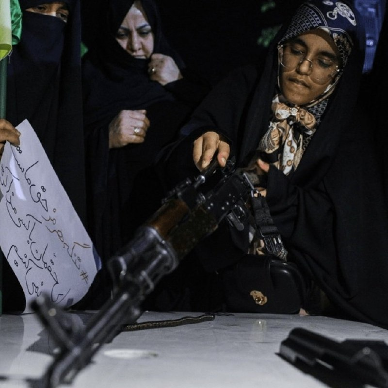

داداش تو اسلحه دست نگیر همینجوریش کلی استرس داریم.

@Dirty_Kids 👻

## Dirty_Kids — post 389330

  <a href="telegram/content/Dirty_Kids_389330_1778607938.mp4" target="_blank">🎬 Download video</a>

تراپی

اگر از تماشای آن لذت بردید، آن را برای دوستانتان ارسال کنید تا آنها نیز از آن لذت ببرند. 😃♥️

@Dirty_Kids 👻

## Dirty_Kids — post 389329

  <a href="telegram/content/Dirty_Kids_389329_1778607939.mp4" target="_blank">🎬 Download video</a>

هر جا هستی خواستم بگم دمت گرم ، اینجا‌ عرزشی میسوزونیم‌‌😂✌️

@Dirty_Kids 👻

## Dirty_Kids — post 389328

✖️ سایت بین المللی bet120x 
✖️  
👍دارای مجوز رسمی Gambling Judge سوئد
👍       
💳شارژ حساب از طریق ارز و یووچر و پرمیوم ووچر 
💳تسویه حساب دلاری سریع 💊بیمه شرط میکس 
⚠️فروش شرط 
🔔ویرایش شرط                    
3️⃣
2️⃣ 
🎁20%هدیه واریز از طریق ارز و ووچر ┅━━━━━━━━━━━…

## Dirty_Kids — post 389327

  

✖️ سایت بین المللی bet120x 
✖️

 
👍دارای مجوز رسمی Gambling Judge سوئد
👍
     

💳شارژ حساب از طریق ارز و یووچر و پرمیوم ووچر

💳تسویه حساب دلاری سریع
💊بیمه شرط میکس

⚠️فروش شرط

🔔ویرایش شرط                    
3️⃣
2️⃣

🎁20%هدیه واریز از طریق ارز و ووچر
┅━━━━━━━━━━━

🎁 10%برگشت باخت به صورت روزانه

🎁 10%برگشت باخت به صورت هفتگی

🎁10%برگشت باخت به صورت ماهانه

💻ادرس ورود به سایت:
https://bet120x.com/fa/?btag=971470
➖➖➖➖➖
   
👈 آموزش واریز و برداشت دلاری
👉

🔪کانال اطلاع رسانی:
👇

✈️https://t.me/+1Wv5nGY_a54xNzlk

## Dirty_Kids — post 389326

  

پلن نتانیاهو برای احمد وحیدی:

@Dirty_Kids 👻

## Dirty_Kids — post 389324

یه سر تیز رفتم اینستاگرام و واقعا ارزششو داشت جیغ میزنم از میزان جذابیت دو عزیز

@Dirty_Kids 👻

## Dirty_Kids — post 389323

‏این bdsm و این کسشرا چیه یاد گرفتین دختر مردمو می‌بندین به داربست کتک متک میزنین، کسخلید؟
بیفت پاهاشو بوس کن بگو خدیاشکرت، موجود به اون نازی و لطیفی.

@Dirty_Kids 👻

## Dirty_Kids — post 389322

  

بی‌بی‌سی اینارو از کجا پیدا میکنه؟

@Dirty_Kids 👻

## Dirty_Kids — post 389321

  

🌪وقتی اینترنت طوفانیه... کافیه بادبان ها رو بکشی تا

⚫️با بالاترین کیفیت ممکن
⚡️ 

⚫️100 هزار تومان شارژ هدیه 
🎁

⚫️پایین ترین قیمت گیگی 250
🌐 

⚫️و ارائه پورسانت %10 در ازای هر معرفی
💼

بتونی یه اتصال پایدار با پشتیبانی 24 ساعته داشته باشی
🚀

بادبان راهتو باز می‌کنه
⛵️

🛡@BadBan_VPN | کانال 

🤖@BadBan_VPNBot | ربات 

📞@BadBan_VPNSupport | پشتیبانی

## Dirty_Kids — post 389320

  <a href="telegram/content/Dirty_Kids_389320_1778607941.mp4" target="_blank">🎬 Download video</a>

لامین یامال بازیکن بی اخلاق و خانم‌باز بارسا توی جشن قهرمانی بارسلونا پرچم فلسطین را برافراشته. + این در جریان ۱ ماه دیگه باید بره امریکا لای کلی ایرانی؟ @Dirty_Kids 👻

## Dirty_Kids — post 389319

  

قل أعوذ برب الناس
آدم خارکسه از دور پیداس!

@Dirty_Kids 👻

## Dirty_Kids — post 389318

  <a href="telegram/content/Dirty_Kids_389318_1778607942.mp4" target="_blank">🎬 Download video</a>

یه قشری هم هستن توی اینستا این شکلی دارن با وصل بودنشون پز میدن.

@Dirty_Kids 👻

## Dirty_Kids — post 389317

  <a href="telegram/content/Dirty_Kids_389317_1778607943.mp4" target="_blank">🎬 Download video</a>

ابداع عبارت جدید برای توصیف شرایط فعلی لازم بود ! 😆✋

@Dirty_Kids 👻

## Dirty_Kids — post 389316

  <a href="telegram/content/Dirty_Kids_389316_1778607944.mp4" target="_blank">🎬 Download video</a>

کلیپ چقدر عرزشیا رو سوزونده

@Dirty_Kids 👻

## Dirty_Kids — post 389315

اسراییل تو خاک عراق پایگاه مخفی زده
باند فرودگاه ساخته
ارتش آورده
ماشین آلات و‌ تجهیزات آورده
چند سال اونجا فعالیت کرده

پارسال به خاطر بارندگی‌ محبور شده پایگاه مخفی رو رها کنه

تازه امسال فهمیدن 😂😂😂

همینجوری روز عاشورا شکست خودناااا

@Dirty_Kids 👻

## Dirty_Kids — post 389313

شیر بازیگوش و AIبه‌باسن با انتشار هفت هشتا از این تصاویر در تروث سوشال دوباره شروع کرد.

صبور باشید و پنیک نکنید.

@Dirty_Kids 👻

## Hranews — post 112911

معوقات مزدی کارگران داروگر تهران و ثبت نام گسترده برای بیمه بیکاری

❗️
❗️
❗️
❗️
❗️ – #کارگران شرکت داروگر تهران از تاخیر بیش از پنج ماهه در پرداخت دستمزد و تعویق در واریز حق بیمه خود خبر دادند. همچنین، نماینده مشهد در مجلس اعلام کرد که از ابتدای جنگ اخیر، ۲۰۵ هزار نفر برای دریافت بیمه بیکاری ثبت نام کرده‌اند.

ادامه مطلب

↘️
@hranews_bot تماس ✉️ -  @Hranews  کانال هرانا 🆑

## Hranews — post 112910

  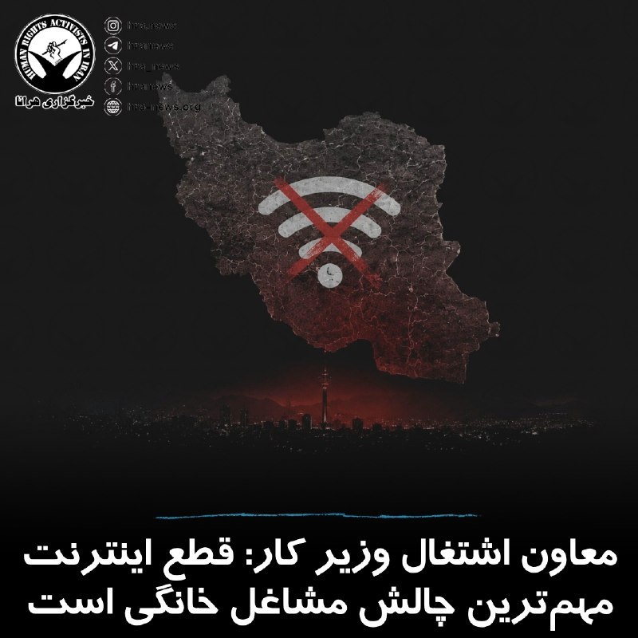

معاون توسعه کارآفرینی و اشتغال وزیر کار، اعلام کرد که #قطع_اینترنت و توقف فروش اینترنتی، مهم‌ترین مشکل مشاغل خانگی در ماه‌های اخیر بوده است. مالک حسینی، در نشست روز ملی مشاغل خانگی گفت که همزمان با محدودیت‌های اینترنتی و توقف نمایشگاه‌های فصلی، بسیاری از فعالان این حوزه امکان فروش محصولات خود را از دست داده‌اند. وی با اشاره به اینکه حدود ۸۰٪ مشاغل خانگی را زنان تشکیل می‌دهند، اظهار داشت که بخش عمده این افراد از خانوارهای کم‌درآمد هستند.

صبح امروز، نت‌بلاکس، نهاد ناظر بر اختلالات #اینترنت در جهان، اعلام کرد که قطع گسترده اینترنت در ایران وارد هفتاد و چهارمین روز خود شده و از مرز ۱۷۵۲ ساعت گذشته است.

↘️
@hranews_bot تماس ✉️ - @Hranews کانال هرانا 🆑

## Hranews — post 112909

  

انجمن قلم (پن) آمریکا در گزارش سالانه «شاخص آزادی نوشتن» اعلام کرده است که ایران با ۵۳ نویسنده زندانی، پس از چین در رتبه دوم جهان از نظر شمار #نویسندگان در بند قرار گرفته است. بر اساس این گزارش، طی سال گذشته شدیدترین موج بازداشت نویسندگان در ایران ثبت شده و با ۱۷ مورد بازداشت جدید، شمار نویسندگان زندانی بار دیگر به سطح دوران اعتراض‌های «زن، زندگی، آزادی» در سال ۱۴۰۱ نزدیک شده است. این گزارش همچنین به تشدید سرکوب‌ها در ایران پس از جنگ ۱۲ روزه میان ایران و اسرائیل اشاره دارد و آن را عامل گسترش فضای امنیتی در کشور دانسته است.

کارین دویچ کارلکار، مدیر برنامه «نویسندگان در معرض خطر» در انجمن قلم، در این رابطه گفته است: «مقام‌های جمهوری اسلامی ایران به‌دلیل کارزار بی‌رحمانه‌شان علیه صداهای مستقل بیش از همه جلب توجه می‌کنند. شاعران، مترجمان، پژوهشگران، ترانه‌سرایان، دیدگاه‌نویسان، مدافعان حقوق بشر و ستون‌نویسان همگی در زندان‌های ایران گرفتار می‌شوند، در حالی که حکومت تلاش دارد بحث، انتقاد و مخالفت را خاموش کند.»

↘️
@hranews_bot تماس ✉️ - @Hranews کانال هرانا 🆑

## Hranews — post 112908

  

عدم رسیدگی پزشکی؛ گزارش جدید از وضعیت محشر پرندین، نوکیش مسیحی در زندان اوین

❗️
❗️
❗️
❗️
❗️– محشر (محترم) پرندین، نوکیش مسیحی محبوس در زندان اوین، با وجود ابتلا به بیماری قلبی و همچنین دو تومور در ناحیه زیر گلو و مجاورت مخچه، از رسیدگی تخصصی پزشکی و اعزام به مراکز درمانی خارج از زندان محروم مانده است.

به گزارش خبرگزاری هرانا، ارگان خبری مجموعه فعالان حقوق بشر در ایران، محشر (محترم) پرندین، نوکیش مسیحی محبوس در #زندان_اوین از رسیدگی درمانی محروم مانده است.

یک منبع مطلع از وضعیت جسمانی این نوکیش مسیحی، ضمن تایید این خبر به هرانا گفت: “محشر پرندین از بیماری حاد قلبی و همچنین دو تومور در ناحیه زیر گلو و مجاورت مخچه رنج می‌برد. بنا بر تشخیص پزشک زندان، وضعیت جسمی وی نگران‌کننده بوده و این تومورها نیازمند جراحی فوری هستند. با این حال، وی تاکنون از اعزام به مراکز درمانی تخصصی محروم مانده است.”
به گفته یک منبع مطلع، تومور قرارگرفته در مجاورت مخچه بر وضعیت جسمانی خانم پرندین اثر گذاشته و موجب اختلال در تعادل، حرکت و تکلم او شده است؛ به‌طوری که گفتار وی با مکث‌های محسوس همراه است.

ادامه مطلب

#محشر_پرندین
#محترم_پرندین

↘️
@hranews_bot تماس ✉️ -  @Hranews  کانال هرانا 🆑

## Hranews — post 112907

  

💥 دعوت به همکاری با خبرگزاری هرانا

خبرگزاری هرانا، با بیش از دو دهه سابقه در حوزه گزارشگری و مستندسازی حقوق بشر، در راستای توسعه فعالیت‌های خود از علاقه‌مندان واجد شرایط برای همکاری دعوت می‌کند.

هرانا در این مرحله بیش از آن‌که به دنبال افراد با سابقه حرفه‌ای باشد، به دنبال افرادی متعهد، دقیق و آموزش‌پذیر است؛ کسانی که دغدغه واقعی حقوق بشر دارند و مایل‌اند در یک چارچوب حرفه‌ای، مهارت‌های خود را توسعه دهند.

زمینه‌های همکاری شامل:
گزارشگری، ویراستاری، ترجمه، مدیریت شبکه‌های اجتماعی و سایر حوزه‌های مرتبط

ویژگی‌های مورد انتظار:

* تسلط کافی به زبان فارسی (خواندن و نوشتن)
* دقت، مسئولیت‌پذیری و توانایی یادگیری مستمر
* علاقه و حساسیت نسبت به موضوعات حقوق بشر
* آمادگی برای فعالیت در چارچوب‌های سازمان‌یافته و حرفه‌ای

❗️ توجه: این فرصت همکاری فقط شامل کسانی است که به زبان فارسی مسلط و ساکن یکی از کشورهای "ترکیه، قبرس شمالی، هندوستان، مصر، قرقیزستان، ازبکستان، کلمبیا، پاراگوئه، قزاقستان، سریلانکا، بلغارستان و رومانی" هستند.

همکاری با هرانا فرصتی است برای کسب تجربه عملی در حوزه مستندسازی و فعالیت‌های حقوق بشری در یک نهاد با سابقه و ساختار حرفه‌ای.

📎 برای ثبت درخواست همکاری، لطفا فرم زیر را تکمیل کنید:
https://hra.news/4cBjHqs

📩 در صورت بروز مشکل در تکمیل فرم، می‌توانید رزومه و اطلاعات تماس خود را به آدرس زیر ارسال نمایید:
info@hra-news.org

↘️
@hranews_bot تماس ✉️ -  @Hranews  کانال هرانا 🆑

## Hranews — post 112906

یک شهروند توسط نیروهای اداره اطلاعات در ازنا بازداشت شد

❗️
❗️
❗️
❗️
❗️– یک شهروند در شهرستان ازنا به دلیل آنچه ارتباط و همکاری با یکی از گروه‌های مخالف نظام عنوان شده است، توسط نیروهای اداره اطلاعات #بازداشت شد.

ادامه مطلب

↘️
@hranews_bot تماس ✉️ -  @Hranews  کانال هرانا 🆑

## Hranews — post 112905

  

افزایش هزینه مسکن و اجاره‌بها، فشار معیشتی بر خانوارهای کارگری را تشدید کرده و سهم مسکن را به بخش عمده سبد هزینه خانواده‌ها در برخی کلان‌شهرها رسانده است. خبرگزاری ایلنا با انتشار گزارشی در این رابطه، به پیامدهای رشد #تورم، افزایش هزینه ساخت‌وساز و کاهش قدرت خرید پرداخته است. بر اساس این گزارش، بسیاری از خانواده‌ها ناچار شده‌اند برای تامین هزینه سرپناه، از مخارج ضروری مانند خوراک، درمان و آموزش بکاهند.

کارشناسان اقتصادی همچنین از گسترش فقر مسکن، افزایش جابه‌جایی اجباری مستاجران به مناطق پایین‌تر و تشدید فشار بر خانوارهای کم‌درآمد خبر می‌دهند. به گفته آنان، ادامه رکود اقتصادی و #بیکاری، در کنار ناکارآمدی سیاست‌های حمایتی دولت، موجب شده بخش قابل توجهی از مستاجران با دشواری بیشتری در تامین هزینه‌های زندگی روبه‌رو شوند.

↘️
@hranews_bot تماس ✉️ - @Hranews کانال هرانا 🆑

## Hranews — post 112904

پخش اعترافات اجباری؛ گزارشی از بازداشت سه شهروند توسط ماموران اطلاعات سپاه

❗️
❗️
❗️
❗️
❗️– سه شهروند در استان کهگیلویه و بویراحمد به دلایلی همچون استفاده از استارلینک برای ارتباط با گروه‌های مخالف نظام و تصویربرداری از اماکن خاص و ارسال تصاویر آن به رسانه‌های خارج از کشور توسط ماموران سازمان اطلاعات سپاه #بازداشت شدند. ویدیویی از اعترافات اجباری این افراد نیز منتشر شده که شرایط ضبط آن مشخص نیست.

ادامه مطلب

↘️
@hranews_bot تماس ✉️ -  @Hranews  کانال هرانا 🆑

## Hranews — post 112903

  

مطهره گونه‌ای مجددا به دادسرا فراخوانده شد

❗️
❗️
❗️
❗️
❗️– مطهره گونه‌ای، فعال دانشجویی، برای دومین بار طی یک ماه اخیر به دادسرای عمومی و انقلاب ناحیه ۳۱ تهران احضار شد.

به گزارش خبرگزاری هرانا، ارگان خبری مجموعه فعالان حقوق بشر در ایران، مطهره گونه‌ای، فعال دانشجویی احضار شد.

وی با انتشار مطلبی در این خصوص نوشت: «امروز احضاریه جدید آمد. این بار، جهت دفاع از اتهام انتسابی نشر اکاذیب باید به دادسرای عمومی و انقلاب ناحیه ۳۱ تهران مراجعه کنم.»

ادامه مطلب

#مطهره_گونه‌ای

↘️
@hranews_bot تماس ✉️ -  @Hranews  کانال هرانا 🆑

## Hranews — post 112902

  

زندان وکیل‌آباد؛ احراز هویت ۳۰ زن بازداشت‌شده در اعتراضات و تحولات امنیتی همزمان با جنگ

❗️
❗️
❗️
❗️
❗️– دست‌کم ۳۰ زن در جریان اعتراضات دی‌ماه ۱۴۰۴ و همچنین تحولات امنیتی همزمان با جنگ، در استان خراسان رضوی بازداشت و به بند «آرامش» و قرنطینه زندان وکیل‌آباد مشهد منتقل شدند. هم‌اکنون ۲۵ نفر از این شهروندان کماکان در این زندان نگهداری می‌شوند و ۵ نفر از آنها نیز با تأمین قرار کیفری آزاد شده‌اند. گزارش پیش رو، به هویت و جزئیات پرونده آنان میپردازد.

به گزارش خبرگزاری هرانا، ارگان خبری مجموعه فعالان حقوق بشر در ایران، هویت ۳۰ زن بازداشت‌شده در استان خراسان رضوی احراز شده است.

بر اساس اطلاعات دریافتی هرانا، این شهروندان در جریان اعتراضات دی‌ماه ۱۴۰۴ و همچنین تحولات امنیتی همزمان با جنگ بازداشت شده‌اند و ۲۵ تن از آنها همچنان در زندان به سر می‌برند. مریم نوری، آرزو دهقان، نادیا صدق‌علی، سهیلا حسینی، نجمه امینی، مهدیه افقهی، حدیثه مرواریدی، فائره صالح‌آبادی، شهرزاد ضمیری، طاهره دهقان، آذر یاهو، آسیه نعیمی، عادله نعیمی، مهسا بهداری، محبوبه شعبانی، مرضیه مشهدی، سیما انبایی، زهرا موسوی، معصومه یعقوبی، فاطمه رضوانی‌فر، سیده زینب موسوی، حدیثه بابازاده، ملیکا خاوری خراسانی، مینا زارعی و ریحانه کفشکنان ۲۵ زندانی هستند که هویتشان توسط هرانا احراز شده و کماکان در زندان وکیل‌آباد مشهد محبوس هستند.
همچنین هویت پنج بازداشتی که اخیراً از این زندان آزاد شده‌اند، سمیرا بیات، نگار فرهمند، فاطمه ارم، نجمه روحند و الناز اقبالی نیز توسط هرانا احراز شده است.

ادامه مطلب

↘️
@hranews_bot تماس ✉️ -  @Hranews  کانال هرانا 🆑

## Hranews — post 112901

  

کیفرخواست پرونده روح الله کرکی صادر شد

❗️
❗️
❗️
❗️
❗️– پرونده روح الله کرکی، شهروند اهل اندیمشک، با صدور کیفرخواست توسط شعبه ۹ دادسرای عمومی و انقلاب اهواز به دادگاه کیفری ۲ این شهرستان ارجاع شد.

به گزارش خبرگزاری هرانا، ارگان خبری مجموعه فعالان حقوق بشر در ایران، کیفرخواست پرونده روح الله کرکی صادر شد.

براساس اطلاعات دریافتی هرانا، پرونده آقای کرکی با صدور کیفرخواست از بابت اتهامات «انتشار و افشای اسناد محرمانه»، «همکاری با سازمان مجاهدین خلق»، «جاسوسی برای اسرائیل و تبادل اطلاعات نظامی و امنیتی»، «توهین به مقدسات و مقامات» و «اقدام علیه امنیت ملی» توسط شعبه ۹ اظهارنظر دادسرای عمومی و انقلاب اهواز صادر و به دادگاه کیفری ۲ این شهرستان ارجاع شده است.

ادامه مطلب

#روح_الله_کرکی

↘️
@hranews_bot تماس ✉️ -  @Hranews  کانال هرانا 🆑

## Hranews — post 112900

  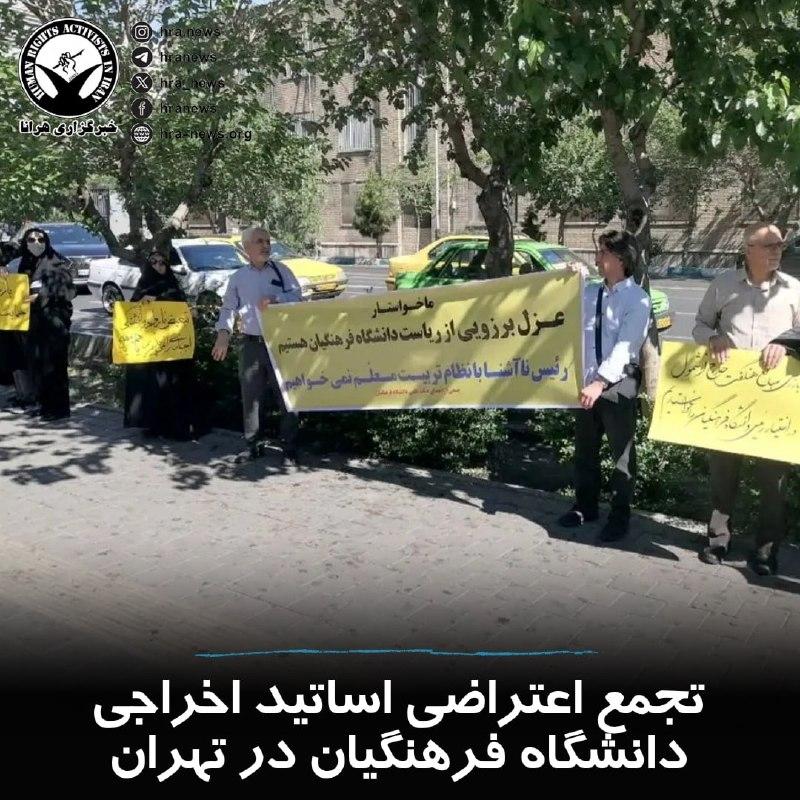

روز یکشنبه ۲۰ اردیبهشت‌ماه، شماری از اساتید اخراجی دانشگاه فرهنگیان در مقابل ساختمان های سازمان بازرسی کل کشور و وزارت آموزش و پرورش دست به #تجمع اعتراضی زدند.

این اساتید نسبت به اخراج بیش از ۳۰۰ عضو هیئت علمی دانشگاه و قطع حدود ۱۰ ماه از حقوق و مزایای‌شان اعتراض کرده و خواستار رسیدگی به مطالبات خود و عزل رئیس دانشگاه فرهنگیان شدند.

↘️
@hranews_bot تماس ✉️ - @Hranews کانال هرانا 🆑

## Hranews — post 112899

  

عرفان عربی به ۸ سال حبس محکوم شد

❗️
❗️
❗️
❗️
❗️– عرفان عربی، دانشجوی مهندسی کامپیوتر دانشگاه آزاد بیرجند، توسط دادگاه انقلاب به هشت سال حبس محکوم شد. آقای عربی، در بهمن ماه سال گذشته در رابطه با اعتراضات سراسری بازداشت شده بود.

به گزارش خبرگزاری هرانا، ارگان خبری مجموعه فعالان حقوق بشر در ایران، عرفان عربی به حبس محکوم شد.

یک منبع مطلع نزدیک به خانواده این دانشجوی دانشگاه آزاد بیرجند، میزان حبس صادر شده علیه آقای عربی را ۸ سال عنوان کرد. به گفته وی، دادگاه انقلاب حکم مذکور را امروز سه‌شنبه، به صورت شفاهی به عرفان عربی ابلاغ کرده است. با اعمال ماده ۱۳۴ قانون مجازات اسلامی، مجازات اشد یعنی ۵ سال حبس در خصوص وی قابل اجرا خواهد بود.

ادامه مطلب

#عرفان_عربی

↘️
@hranews_bot تماس ✉️ -  @Hranews  کانال هرانا 🆑

## manototv — post 105363

  <a href="telegram/content/manototv_105363_1778607951.mp4" target="_blank">🎬 Download video</a>

جان هیلی، وزیر دفاع بریتانیا، اعلام کرد لندن جنگنده، پهپاد و یک ناو جنگی را به مأموریت چندملیتی حفاظت از تردد کشتی‌ها در تنگه هرمز اعزام خواهد کرد.

هیلی این خبر را پس از نشست مشترک با وزرای دفاع ۴۰ کشور اعلام کرد؛ نشستی که با هدف جلب حمایت برای مأموریت تحت رهبری بریتانیا جهت تأمین امنیت کشتیرانی در تنگه هرمز برگزار شد.

بریتانیا می‌گوید این مأموریت در واکنش به محاصره تنگه هرمز از سوی جمهوری اسلامی انجام می‌شود.

## manototv — post 105362

  <a href="telegram/content/manototv_105362_1778607951.mp4" target="_blank">🎬 Download video</a>

سازمان جهانی بهداشت هشدار داد شمار موارد ابتلا به هانتاویروس، پس از شیوع این ویروس در یک کشتی گردشگری در اقیانوس اطلس، احتمالاً افزایش پیدا خواهد کرد.
تدروس آدهانوم، مدیرکل سازمان جهانی بهداشت، اعلام کرد تاکنون ۹ مورد ابتلای قطعی و دو مورد مشکوک ثبت شده و انتظار می‌رود افراد بیشتری نیز به ویروس مبتلا شده باشند. با این حال او تأکید کرد خطر شیوع گسترده جهانی همچنان «پایین» ارزیابی می‌شود.
شیوع بیماری در کشتی «ام‌وی هوندیوس» آغاز شد؛ جایی که سه مسافر، شامل یک زوج هلندی و یک زن آلمانی، جان خود را از دست دادند. این کشتی در حال سفر ۳۵ روزه در اقیانوس اطلس بود.
هانتاویروس معمولاً از طریق ادرار، بزاق یا فضولات جوندگان منتقل می‌شود. گونه «آندِس» تنها نوع شناخته‌شده‌ای است که می‌تواند از انسان به انسان منتقل شود.
در پی این بحران، صدها مسافر و خدمه در کشورهای مختلف تحت قرنطینه یا مراقبت پزشکی قرار گرفته‌اند. مقام‌های بهداشتی در اروپا و آمریکا نیز در حال ردیابی تماس‌های مرتبط با مبتلایان هستند.

## manototv — post 105361

  <a href="telegram/content/manototv_105361_1778607952.mp4" target="_blank">🎬 Download video</a>

مقام‌های آمریکایی اعلام کردند نیروهای این کشور مانع عبور یک نفتکش با پرچم جمهوری مالت از تنگه هرمز شده‌اند.
سخنگوی ستاد فرماندهی مرکزی آمریکا سنتکام؛ به الجزیره گفت نفتکش «آگیوس فانوریوس» به‌دلیل نقض محاصره دریایی، اجازه عبور پیدا نکرده است. به گفته او، این کشتی حامل نفت ایران نبوده است.
مقام‌های آمریکایی همچنین اعلام کردند چند نفتکش دیگر نیز به‌دلیل نقض تحریم‌ها و محاصره اعمال‌شده علیه بنادر ایران، متوقف شده‌اند.

## manototv — post 105360

  <a href="telegram/content/manototv_105360_1778607952.mp4" target="_blank">🎬 Download video</a>

«اینترنت را قطع کردند تا صدای مردم خاموش شود.»

## manototv — post 105359

  <a href="telegram/content/manototv_105359_1778607954.mp4" target="_blank">🎬 Download video</a>

شورای همکاری خلیج فارس ورود نیروهایی از سپاه پاسداران به جزیره بوبیان کویت را محکوم کرد.

جاسم البدیوی، دبیرکل شورای همکاری خلیج فارس، گفت: «نفوذ عناصر سپاه پاسداران به جزیره بوبیان کویت و برنامه‌ریزی آن‌ها برای اقدامات خصمانه را محکوم می‌کنیم.»

او همچنین تأکید کرد شورای همکاری خلیج فارس از کویت در همه اقداماتی که برای حفظ امنیت و ثبات خود انجام دهد، حمایت می‌کند.

## manototv — post 105358

  <a href="telegram/content/manototv_105358_1778607954.mp4" target="_blank">🎬 Download video</a>

وزارت خارجه کویت اعلام کرد در پی آنچه «نفوذ» اعضای مسلح وابسته به سپاه پاسداران خوانده شده، سفیر جمهوری‌اسلامی در این کشور را احضار و یادداشت اعتراضی رسمی به او تحویل داده است.
به گفته مقام‌های کویتی، چهار عضو منتسب به سپاه قصد داشتند از راه دریا وارد کویت شوند و «اقدامات خصمانه» انجام دهند. وزارت کشور کویت اعلام کرد در درگیری با نیروهای امنیتی، یک نیروی کویتی زخمی شده و دو نفر از متهمان نیز فرار کرده‌اند.
معاون وزیر خارجه کویت این اقدام را «نقض آشکار حاکمیت کویت» و مغایر با قوانین بین‌المللی و منشور سازمان ملل توصیف کرد و از تهران خواست فوراً چنین اقداماتی را متوقف کند.

## manototv — post 105357

  <a href="telegram/content/manototv_105357_1778607955.mp4" target="_blank">🎬 Download video</a>

تورم در آمریکا افزایش یافته و طبق آمار رسمی اداره آمار کار آمریکا، این افزایش عمدتا به عوامل مرتبط با جنگ ایران مربوط می‌شود.
شاخص قیمت مصرف‌کننده در ماه آوریل به ۳.۸ درصد رسید؛ در حالی‌ که این رقم در ماه مارس ۳.۳ درصد بود. افزایش قیمت بنزین از مهم‌ترین دلایل این رشد اعلام شده است.
این آمار نشان می‌دهد بالا رفتن قیمت نفت، که ناشی از اختلال مؤثر در تردد از تنگه هرمز بوده، باعث افزایش بیشتر قیمت‌ها شده است.
بر اساس این گزارش، افزایش هزینه انرژی و سوخت اصلی‌ترین عامل رشد ۰.۵ واحد درصدی تورم بوده است.
تحلیلگران می‌گویند این وضعیت علاوه بر فشار بر مصرف‌کنندگان آمریکایی و اقتصاد آمریکا، ممکن است یک پیامد سیاسی هم داشته باشد؛ چرا که فشار اقتصادی بر رأی‌دهندگان می‌تواند دونالد ترامپ را به بازگشت به میز مذاکره سوق دهد.

## manototv — post 105356

  <a href="telegram/content/manototv_105356_1778607955.mp4" target="_blank">🎬 Download video</a>

تماسی از ایران؛ «می‌گفت تو این شرایط، به دور و برمون نگاه کنیم و دستِ همدیگه رو بگیریم…
تو هر خانواده و آشنایی یکی هست که بی‌صدا به کمک نیاز داره.»

## manototv — post 105355

  <a href="telegram/content/manototv_105355_1778607957.mp4" target="_blank">🎬 Download video</a>

دونالد ترامپ، رئیس‌جمهور آمریکا، با وجود توقف مذاکرات با جمهوری‌اسلامی، در یک گفتگو، اعلام کرده تهران صددرصد غنی‌سازی اورانیوم و هرگونه تلاش برای ساخت سلاح هسته‌ای را متوقف خواهد کرد.
ترامپ در گفت‌وگو با رادیوی WABC گفت شخصاً با مقام‌های جمهوری‌اسلامی در تماس بوده و افزود: «آن‌ها گفتند ما غبار هسته‌ای را تحویل خواهیم گرفت.»
او همچنین تأکید کرد آمریکا برای رسیدن به توافق عجله‌ای ندارد و گفت: «ما محاصره را در اختیار داریم.»

## manototv — post 105354

  <a href="telegram/content/manototv_105354_1778607957.mp4" target="_blank">🎬 Download video</a>

تماسی از تجربه‌اش با بهزیستی
می‌گفت برای بیمه و تأیید مشکلش هزار تا ایراد گرفتن
اما وقتی پای کمک رسید، گفتن هیچ مشکلی نداری

## manototv — post 105353

  <a href="telegram/content/manototv_105353_1778607958.mp4" target="_blank">🎬 Download video</a>

در جلسه استماع کنگره آمریکا، مقام‌های ارشد پنتاگون اعلام کردند هزینه تسلیحات و تجهیزات مصرف‌شده آمریکا در جنگ با ایران تاکنون به حدود ۲۴ میلیارد دلار رسیده است.
پیت هگست، وزیر دفاع آمریکا، به همراه رئیس ستاد مشترک ارتش و مقام مالی وزارت جنگ در این جلسه حضور داشتند. به گفته جولز هرست، این رقم شامل مهمات، موشک‌ها و سایر تجهیزات نظامی استفاده‌شده در جنگ است.
پنتاگون ماه گذشته نیز اعلام کرده بود مجموع هزینه‌های جنگ با ایران تاکنون به ۲۹ میلیارد دلار رسیده است.

## manototv — post 105352

  <a href="telegram/content/manototv_105352_1778607959.mp4" target="_blank">🎬 Download video</a>

ابراهیم رضایی، سخنگوی کمیسیون امنیت ملی و سیاست خارجی مجلس شورای اسلامی در شبکه اکس تهدید کرده، غنی سازی ۹۰ درصد به عنوان یکی از گزینه‌های جمهوری‌اسلامی در صورت حمله مجدد، بررسی می‌شود.

## manototv — post 105351

  <a href="telegram/content/manototv_105351_1778607959.mp4" target="_blank">🎬 Download video</a>

متاثر از پیچیده‌تر شدن سرنوشت مذاکرات جمهوری‌اسلامی و آمریکا، قیمت جهانی نفت، بیش از ۳ درصد افزایش یافت.
بهای نفت برنت به حدود ۱۰۸ دلار و نفت وست‌تگزاس آمریکا به بیش از ۱۰۱ دلار در هر بشکه رسید. تحلیلگران می‌گویند رد پیشنهادهای دو طرف، نگرانی‌ها درباره اختلال در عرضه نفت را دوباره افزایش داده است.
مدیرعامل آرامکوی عربستان هشدار داد هرگونه اختلال در صادرات نفت از تنگه هرمز می‌تواند بازگشت ثبات به بازار را تا سال ۲۰۲۷ به تعویق بیندازد.
کارشناسان همچنین گفته‌اند در صورت توافق واقعی میان تهران و واشنگتن، قیمت نفت ممکن است ۸ تا ۱۲ دلار کاهش پیدا کند، اما تشدید تنش‌ها می‌تواند قیمت نفت برنت را دوباره به بالای ۱۱۵ دلار برساند.

## manototv — post 105350

  <a href="telegram/content/manototv_105350_1778607960.mp4" target="_blank">🎬 Download video</a>

دونالد ترامپ در پیامی در شبکه اجتماعی تروث سوشال گفت کوبا از آمریکا درخواست کمک کرده و واشینگتن با هاوانا گفت‌وگو خواهد کرد.

ترامپ در این پیام نوشت هیچ جمهوری‌خواهی تاکنون درباره کوبا با او صحبت نکرده و این کشور را «شکست‌خورده» توصیف کرد که به گفته او تنها در مسیر «سقوط» حرکت می‌کند.

او افزود: «کوبا درخواست کمک کرده و ما گفت‌وگو خواهیم کرد.» ترامپ در پایان این پیام نوشت همزمان عازم چین است.

## manototv — post 105349

  <a href="telegram/content/manototv_105349_1778607960.mp4" target="_blank">🎬 Download video</a>

«حکومت بقای خود را در طناب دار می‌بیند»

## manototv — post 105348

  <a href="telegram/content/manototv_105348_1778607962.mp4" target="_blank">🎬 Download video</a>

مارک روته، دبیرکل ناتو، اعلام کرد موضوع جمهوری‌اسلامی و نحوه کمک کشورهای اروپایی برای مدیریت وضعیت تنگه هرمز، محور اصلی گفت‌وگوهای کنونی این ائتلاف است.
روته در نشست خبری در مونته‌نگرو گفت کشورهای عضو در حال بررسی راه‌هایی هستند تا متحدان اروپایی بتوانند در شرایط مرتبط با تنگه هرمز کمک کنند.
او با اشاره به افزایش بودجه دفاعی کشورهای اروپایی و کانادا، تأکید کرد نسبت به آینده ناتو «بسیار خوش‌بین» است.

## manototv — post 105347

  <a href="telegram/content/manototv_105347_1778607962.mp4" target="_blank">🎬 Download video</a>

دکتر حمید گیلوری فعال سیاسی و عضو حزب ایران نوین در گردهمایی ایرانیان روبروی دادگاه لاهه در هلند گفت: «اروپا نباید با جمهوری اسلامی مماشات کند».

## manototv — post 105346

  <a href="telegram/content/manototv_105346_1778607964.mp4" target="_blank">🎬 Download video</a>

وزارت خارجه امارات متحده عربی در بیانیه‌ای نفوذ اعضایی از سپاه از سوی نیروی دریایی جمهوری اسلامی به جزیره بوبیان کویت را محکوم کرد و آن را اقدامی در چارچوب «طرحی تروریستی» برای انجام عملیات خصمانه خواند.

در این بیانیه آمده است شیخ عبدالله بن زاید آل نهیان، وزیر خارجه امارات، در پیامی به عبدالله علی الیحیا، وزیر خارجه کویت، همبستگی کامل ابوظبی را با کویت اعلام کرده است.

بوبیان دومین جزیره بزرگ خلیج فارس بعد از جزیره قشم است.

## manototv — post 105345

  <a href="telegram/content/manototv_105345_1778607964.mp4" target="_blank">🎬 Download video</a>

دولت بریتانیا اعلام کرد از آوریل ۲۰۲۶، میزان کمک‌هزینه هفتگی برای «همسران اضافی» در ازدواج‌های چندهمسریِ ثبت‌شده در خارج از کشور، به ۱۲۵ پوند و ۲۵ پنس افزایش یافته است.
این مبلغ نسبت به سال گذشته ۴.۸ درصد افزایش داشته و شامل افرادی می‌شود که به سن بازنشستگی رسیده و از مزایایی مانند «پنشـن کردیت» یا کمک‌هزینه مسکن استفاده می‌کنند.
چندهمسری در بریتانیا غیرقانونی است، اما برخی ازدواج‌های چندهمسری که به‌طور قانونی در خارج از کشور ثبت شده‌اند، برای دریافت بعضی مزایای رفاهی به رسمیت شناخته می‌شوند.
دولت بریتانیا تأکید کرده «یونیورسال کردیت» شامل این نوع خانوارها نمی‌شود و قوانین مهاجرتی نیز اجازه حمایت برای ورود همسر دوم را نمی‌دهد، اگر ازدواج اول همچنان پابرجا باشد.

## manototv — post 105344

  <a href="telegram/content/manototv_105344_1778607964.mp4" target="_blank">🎬 Download video</a>

مونترال‌ | کانادا؛ گردهمایی ایرانیان

## alonews — post 119543

  <a href="telegram/content/alonews_119543_1778607966.webm" target="_blank">🎬 Download video</a>

👈سفیر ایران در چین: آمریکا نمی‌تواند مواضع چین درباره ایران را تغییر دهد

✅ @AloNews خبر جنگ

## alonews — post 119542

  <a href="telegram/content/alonews_119542_1778607966.mp4" target="_blank">🎬 Download video</a>

👈خوش‌چشم کارشناس ارشد صداوسیما:
این دفعه جنگ بشه اصلا مهم نیست ساختمون اینتل تو اسرائیل چند طبقه زیر زمینه، کل دیتاسنترهای اینتل میخوره، پروژه مشترک گوگل و آمازونم که میخوره، بقیشم هرچی هست میخوره

✅ @AloNews خبر جنگ

## alonews — post 119541

  <a href="telegram/content/alonews_119541_1778607968.webm" target="_blank">🎬 Download video</a>

👈وزارت دفاع عراق: هیچ‌گونه فعالیت یا تأسیسات نظامی ناشناس در صحرای نجف وجود ندارد

✅ @AloNews خبر جنگ

## alonews — post 119540

  <a href="telegram/content/alonews_119540_1778607968.webm" target="_blank">🎬 Download video</a>

👈تصاویر ماهواره‌ای نشان می‌دهد یک فروند نفتکش ایرانی در ۱۰ می در جزیره خارک در حال بارگیری نفت ایران بوده است که نشان از تداوم بارگیری نفت خام در جزیره خارک دارد.این نفتکش بدون مشکل بارگیری کرد

✅ @AloNews خبر جنگ

## alonews — post 119539

  <a href="telegram/content/alonews_119539_1778607968.webm" target="_blank">🎬 Download video</a>

👈کاظم غریب‌آبادی، معاون وزیر خارجه، در شبکه ایکس نوشت: صلح واقعی با ادبیات تحقیر، تهدید و امتیازگیری اجباری ساخته نمی‌شود.

✅ @AloNews خبر جنگ

## alonews — post 119538

  <a href="telegram/content/alonews_119538_1778607968.mp4" target="_blank">🎬 Download video</a>

👈وزارت دفاع روسیه فیلمی منتشر کرده است که آزمایش موفقیت‌آمیز سامانه موشکی جدید هسته‌ای‌پرتاب روسیه به نام «سرمات» را نشان می‌دهد

✅ @AloNews خبر جنگ

## alonews — post 119537

  <a href="telegram/content/alonews_119537_1778607970.webm" target="_blank">🎬 Download video</a>

👈بلومبرگ: نیروگاه اصلی گاز طبیعی که سوخت مورد نیاز امارات متحده عربی را تأمین می‌کند، سال آینده به ظرفیت کامل بازخواهد گشت که این موضوع نشان‌دهنده زمان طولانی بازیابی برای برخی از حیاتی‌ترین زیرساخت‌های منطقه در پی جنگ اخیر است.

✅ @AloNews خبر جنگ

## alonews — post 119536

  <a href="telegram/content/alonews_119536_1778607970.webm" target="_blank">🎬 Download video</a>

👈بیانیه دولت بریتانیا: ما پهپادها، جت‌های جنگنده و یک ناو جنگی را به ماموریت چندملیتی برای تأمین امنیت تنگه هرمز اعزام خواهیم کرد

🔴کمک ما شامل تجهیزات مین‌یاب خودکار، جت‌های جنگنده تایفون و یک کشتی جنگی خواهد بود.

✅ @AloNews خبر جنگ

## alonews — post 119535

  <a href="telegram/content/alonews_119535_1778607970.webm" target="_blank">🎬 Download video</a>

👈سی‌ان‌ان : کشتی روسی حامل راکتورهای هسته‌ای زیردریایی به کره شمالی تو شرایط مرموزی غرق شده !

✅ @AloNews خبر جنگ

## alonews — post 119534

  <a href="telegram/content/alonews_119534_1778607970.webm" target="_blank">🎬 Download video</a>

👈الجزیره: رهبر ایران ۵ شرط را برای آمریکا پیش از ورود به مذاکره در مورد بحث هسته ای تعیین کرده است:

🔴 پایان دادن به جنگ در همه جبهه‌ها

🔴 رفع همه تحریم‌ها

🔴آزادسازی دارایی‌های مسدود شده

🔴 جبران خسارات و زیان‌های جنگ

🔴 به رسمیت شناختن حق حاکمیت ایران بر تنگه هرمز

✅ @AloNews خبر جنگ

## alonews — post 119533

  <a href="telegram/content/alonews_119533_1778607970.webm" target="_blank">🎬 Download video</a>

👈بلومبرگ: امارات دو بار با هماهنگی اسرائیل به ایران حمله کرده؛ یک‌بار به یک تأسیسات پتروشیمی در عسلویه و بار دیگر به پالایشگاهی در جزیره لاوان.

✅ @AloNews خبر جنگ

## alonews — post 119532

  <a href="telegram/content/alonews_119532_1778607970.webm" target="_blank">🎬 Download video</a>

👈طبق گزارش WSJ، گوگل در حال مذاکره با اسپیس‌ایکس برای توافق پرتاب موشک است که به برنامه‌های گوگل برای توسعه مراکز داده مداری در فضا مرتبط است

✅ @AloNews خبر جنگ

## alonews — post 119531

  <a href="telegram/content/alonews_119531_1778607970.mp4" target="_blank">🎬 Download video</a>

👈سناتور گراهام: اگر میانجی (پاکستان) اجازه می‌دهد هواپیماهای شناسایی در پایگاه‌های هوایی پاکستان پارک شوند، فکر می‌کنید این با نقش میانجی منصفانه سازگار است؟

🔴وزیر جنگ هگستث: من نمی‌خواهم وسط این مذاکرات قرار بگیرم.

🔴سناتور گراهام: خب، من می‌خواهم وسط این مذاکرات قرار بگیرم. من به پاکستان به اندازه‌ای که بتوانم آنها را پرتاب کنم اعتماد ندارم.

🔴اگر واقعاً هواپیماهای ایرانی در پایگاه‌های پاکستانی برای محافظت از دارایی‌های نظامی ایران پارک شده‌اند، این به من می‌گوید که شاید باید به دنبال شخص دیگری برای میانجیگری باشیم. جای تعجب نیست که این لعنتی به جایی نمی‌رسد.

✅ @AloNews خبر جنگ

## alonews — post 119529

  <a href="telegram/content/alonews_119529_1778607972.mp4" target="_blank">🎬 Download video</a>

👈سربازان روسی در حال استفاده از پهپاد رهگیر «یولکا» (Yolka) علیه پهپادهای اوکراینی هستند که براحتی با لانچر بسیار کوچک دستی به سرعت پرتاب میشود

✅ @AloNews خبر جنگ

## alonews — post 119528

  <a href="telegram/content/alonews_119528_1778607973.webm" target="_blank">🎬 Download video</a>

👈وزارت انرژی آمریکا ادعا کرد تصور می‌کند که تنگه هرمز تا اواخر ماه مه میلادی (۱۹ روز دیگر) بسته خواهد ماند.

✅ @AloNews خبر جنگ

## alonews — post 119527

  <a href="telegram/content/alonews_119527_1778607974.webm" target="_blank">🎬 Download video</a>

🔴فوری / سی‌ان‌ان: ترامپ جدی‌تر از گذشته به از سرگیری جنگ فکر می‌کند

✅ @AloNews خبر جنگ

## alonews — post 119526

  <a href="telegram/content/alonews_119526_1778607974.webm" target="_blank">🎬 Download video</a>

👈فهرست کامل مدیران شرکت‌های بزرگ آمریکایی که دونالد ترامپ را در سفر به چین همراهی خواهند کرد.

✅ @AloNews خبر جنگ

## alonews — post 119525

  <a href="telegram/content/alonews_119525_1778607974.mp4" target="_blank">🎬 Download video</a>

👈نماینده کنگره : دولت بررسی کرده که از کنگره مجوز استفاده از نیروی نظامی بگیره؟

🔴 پیت هگست : نظر ما اینه که اگه رئیس‌جمهور تصمیم بگیره دوباره شروع کنه، ما طبق اصل ۲ قانون اساسی همه اختیارات لازم رو داریم برای انجامش

✅ @AloNews خبر جنگ

## alonews — post 119524

  <a href="telegram/content/alonews_119524_1778607975.webm" target="_blank">🎬 Download video</a>

👈 دونالد ترامپ تصویر خودش روی اسکناس ۱۰۰ دلاری را قرار داد! پشت این اسکناس خیالی هم بجای «خدا به آمریکا برکت دهد»، نوشته شده «خدا به ترامپ برکت دهد»!

✅ @AloNews خبر جنگ

---
📅 بروزرسانی: 1405/02/22 14:33
---

## VahidOOnLine — post 239682

  <a href="telegram/content/VahidOOnLine_239682_1778583793.mp4" target="_blank">🎬 Download video</a>

محمد بن عبدالرحمن آل‌ثانی، نخست‌وزیر و وزیرخارجه قطر، در نشست خبری مشترک با هاکان فیدان، وزیر خارجه ترکیه، گفت دو کشور درباره شرایط بحرانی خاورمیانه در پی جنگ ایران گفت‌وگو کرده‌اند.
او گفت بحران تنگه هرمز باعث محدود شدن آزادی تردد دریایی شده و این آبراه عملاً به «سلاحی در این جنگ» تبدیل شده است.
نخست‌وزیر قطر افزود این وضعیت پیامدهای سنگینی، به‌ویژه اقتصادی، برای کشورهای حوزه خلیج فارس به همراه داشته است.
‌🏁 🇬🇧 ManotoTV

🤖 @VahidOOnLine

## VahidOOnLine — post 239681

  <a href="telegram/content/VahidOOnLine_239681_1778583793.mp4" target="_blank">🎬 Download video</a>

وزارت کشور کویت اعلام کرد چهار نفوذی وابسته به سپاه پاسداران جمهوری‌اسلامی را که قصد ورود دریایی به این کشور را داشتند، بازداشت کرده است.
خبرگزاری رسمی کویت گزارش داد در درگیری با این افراد، یکی از نیروهای مسلح کویت زخمی شده است.
‌🏁 🇬🇧 ManotoTV

🤖 @VahidOOnLine

## VahidOOnLine — post 239680

  <a href="telegram/content/VahidOOnLine_239680_1778583794.mp4" target="_blank">🎬 Download video</a>

شرکت ژاپنی «کالبی»، بزرگ‌ترین تولیدکننده چیپس در ژاپن، اعلام کرد به‌دلیل اختلال در زنجیره تأمین ناشی از جنگ آمریکا و اسرائیل با ایران، بسته‌بندی محصولاتش را تغییر می‌دهد.
این شرکت گفته از اواخر ماه جاری، بسته‌بندی ۱۴ محصول خود را به‌جای رنگ‌های معروف نارنجی و زرد، فقط با دو رنگ سیاه و سفید تولید خواهد کرد.
کالبی دلیل این تصمیم را «بی‌ثباتی در تأمین برخی مواد اولیه به‌دلیل تنش‌های فزاینده در خاورمیانه» اعلام کرده است.
رسانه‌های ژاپنی گزارش دادند کمبود نفتا، یکی از فرآورده‌های نفتی مورد استفاده در تولید جوهر چاپ، باعث اختلال در تأمین جوهر بسته‌بندی این شرکت شده است.
‌🏁 🇬🇧 ManotoTV

🤖 @VahidOOnLine

## VahidOOnLine — post 239679

  <a href="telegram/content/VahidOOnLine_239679_1778583794.mp4" target="_blank">🎬 Download video</a>

مایک هاکبی، سفیر آمریکا در اسرائیل، اعلام کرد اسرائیل برای کمک به دفاع امارات در جریان جنگ ایران، سامانه‌های پدافندی گنبد آهنین را به این کشور منتقل کرده است.
به گفته او، باتری‌های ضد موشکی و نیروهای عملیاتی این سامانه به امارات اعزام شده‌اند. امارات در سال ۲۰۲۰ و در چارچوب توافق ابراهیم، روابط دیپلماتیک با اسرائیل برقرار کرد.
هاکبی همچنین گفت نسبت به پیوستن کشورهای بیشتر منطقه به توافق عادی‌سازی روابط با اسرائیل خوش‌بین است.
او افزود کشورهای خلیج فارس اکنون باید انتخاب کنند که «احتمال حمله از سوی ایران بیشتر است یا اسرائیل». به گفته هاکبی، «اسرائیل به ما کمک کرد و ایران به ما حمله کرد».
‌🏁 🇬🇧 ManotoTV

🤖 @VahidOOnLine

## DEJradio — post 4589

  <a href="telegram/content/DEJradio_4589_1778583795.mp4" target="_blank">🎬 Download video</a>

🔺🎥 “این قیافه پیروزیه که سـ.ـپاه میگه، هیچی نداریم!

#IRGCterrorists #تورم
@DEJradio

## DEJradio — post 4588

  <a href="telegram/content/DEJradio_4588_1778583797.webm" target="_blank">🎬 Download video</a>

🚨📢 ادعای وزارت خارجه پاکستان:
هواپیماهای ایرانی «موقت» در پاکستان مستقر هستند

سی‌بی‌اس گزارش داده بود که جمهوری اسلامی بخشی از ناوگان نیروی هوایی [تجاری و نظامی] خود را در طی جنگ ۴۰ روزه به پایگاه هوایی «نورخان» پاکستان منتقل کرده بود. در واکنش به این گزارش وزارت خارجه پاکستان به طور رسمی این گزارش را «گمراه‌کننده» خواند و تأکید کرد که این هواپیماها صرفاً برای تسهیل رفت‌وآمد دیپلمات‌ها و به صورت موقت مستقر شده‌اند.
در بیانیه وزارت خارجه پاکستان آمده «هواپیماهای نظامی ایران نه برای مصون ماندن از حملات آمریکا که در انتظار دورهای بعدی مذاکرات، در پایگاه نورخان مانده‌اند.»

همچنین تأکید شده، «هواپیماهای ایرانی که هم‌اکنون در خاک ما هستند، به هیچ گونه ترتیبات نظامی مرتبط نمی‌باشند». پاکستان همچنین تصریح کرد که ارتباط منظم خود را با همه طرف‌های ذی‌نفع حفظ کرده و متعهد است از تمامی تلاش‌هایی که به تقویت گفت‌وگو، کاهش تنش و پیشبرد صلح کمک می‌کند، حمایت کند.
در جریان جنگ ۱۲ روزه نیز نیروی هوایی جمهوری اسلامی بخشی از ناوگان خود را به پاکستان منتقل کرده بود تا کمتر آسیب ببینند.

#جنگ۴۰روزه #جمهوری_اسلامی #جنگ۱۲روزه
@DEJradio

## IranIntlTV — post 336797

  <a href="telegram/content/IranIntlTV_336797_1778583797.mp4" target="_blank">🎬 Download video</a>

یک شهروند با ارسال پیامی به ایران‌اینترنشنال می‌گوید هزینه برق در کمتر از یک سال حدود ۲۰۰ درصد افزایش یافته است.

## ManotoTV — post 105341

  <a href="telegram/content/ManotoTV_105341_1778583799.mp4" target="_blank">🎬 Download video</a>

محمد بن عبدالرحمن آل‌ثانی، نخست‌وزیر و وزیرخارجه قطر، در نشست خبری مشترک با هاکان فیدان، وزیر خارجه ترکیه، گفت دو کشور درباره شرایط بحرانی خاورمیانه در پی جنگ ایران گفت‌وگو کرده‌اند.
او گفت بحران تنگه هرمز باعث محدود شدن آزادی تردد دریایی شده و این آبراه عملاً به «سلاحی در این جنگ» تبدیل شده است.
نخست‌وزیر قطر افزود این وضعیت پیامدهای سنگینی، به‌ویژه اقتصادی، برای کشورهای حوزه خلیج فارس به همراه داشته است.

## ManotoTV — post 105340

  <a href="telegram/content/ManotoTV_105340_1778583800.mp4" target="_blank">🎬 Download video</a>

وزارت کشور کویت اعلام کرد چهار نفوذی وابسته به سپاه پاسداران جمهوری‌اسلامی را که قصد ورود دریایی به این کشور را داشتند، بازداشت کرده است.
خبرگزاری رسمی کویت گزارش داد در درگیری با این افراد، یکی از نیروهای مسلح کویت زخمی شده است.

## ManotoTV — post 105339

  <a href="telegram/content/ManotoTV_105339_1778583800.mp4" target="_blank">🎬 Download video</a>

شرکت ژاپنی «کالبی»، بزرگ‌ترین تولیدکننده چیپس در ژاپن، اعلام کرد به‌دلیل اختلال در زنجیره تأمین ناشی از جنگ آمریکا و اسرائیل با ایران، بسته‌بندی محصولاتش را تغییر می‌دهد.
این شرکت گفته از اواخر ماه جاری، بسته‌بندی ۱۴ محصول خود را به‌جای رنگ‌های معروف نارنجی و زرد، فقط با دو رنگ سیاه و سفید تولید خواهد کرد.
کالبی دلیل این تصمیم را «بی‌ثباتی در تأمین برخی مواد اولیه به‌دلیل تنش‌های فزاینده در خاورمیانه» اعلام کرده است.
رسانه‌های ژاپنی گزارش دادند کمبود نفتا، یکی از فرآورده‌های نفتی مورد استفاده در تولید جوهر چاپ، باعث اختلال در تأمین جوهر بسته‌بندی این شرکت شده است.

## ManotoTV — post 105338

  <a href="telegram/content/ManotoTV_105338_1778583801.mp4" target="_blank">🎬 Download video</a>

مایک هاکبی، سفیر آمریکا در اسرائیل، اعلام کرد اسرائیل برای کمک به دفاع امارات در جریان جنگ ایران، سامانه‌های پدافندی گنبد آهنین را به این کشور منتقل کرده است.
به گفته او، باتری‌های ضد موشکی و نیروهای عملیاتی این سامانه به امارات اعزام شده‌اند. امارات در سال ۲۰۲۰ و در چارچوب توافق ابراهیم، روابط دیپلماتیک با اسرائیل برقرار کرد.
هاکبی همچنین گفت نسبت به پیوستن کشورهای بیشتر منطقه به توافق عادی‌سازی روابط با اسرائیل خوش‌بین است.
او افزود کشورهای خلیج فارس اکنون باید انتخاب کنند که «احتمال حمله از سوی ایران بیشتر است یا اسرائیل». به گفته هاکبی، «اسرائیل به ما کمک کرد و ایران به ما حمله کرد».

## manototv — post 105341

  <a href="telegram/content/manototv_105341_1778583801.mp4" target="_blank">🎬 Download video</a>

محمد بن عبدالرحمن آل‌ثانی، نخست‌وزیر و وزیرخارجه قطر، در نشست خبری مشترک با هاکان فیدان، وزیر خارجه ترکیه، گفت دو کشور درباره شرایط بحرانی خاورمیانه در پی جنگ ایران گفت‌وگو کرده‌اند.
او گفت بحران تنگه هرمز باعث محدود شدن آزادی تردد دریایی شده و این آبراه عملاً به «سلاحی در این جنگ» تبدیل شده است.
نخست‌وزیر قطر افزود این وضعیت پیامدهای سنگینی، به‌ویژه اقتصادی، برای کشورهای حوزه خلیج فارس به همراه داشته است.

## manototv — post 105340

  <a href="telegram/content/manototv_105340_1778583802.mp4" target="_blank">🎬 Download video</a>

وزارت کشور کویت اعلام کرد چهار نفوذی وابسته به سپاه پاسداران جمهوری‌اسلامی را که قصد ورود دریایی به این کشور را داشتند، بازداشت کرده است.
خبرگزاری رسمی کویت گزارش داد در درگیری با این افراد، یکی از نیروهای مسلح کویت زخمی شده است.

## manototv — post 105339

  <a href="telegram/content/manototv_105339_1778583803.mp4" target="_blank">🎬 Download video</a>

شرکت ژاپنی «کالبی»، بزرگ‌ترین تولیدکننده چیپس در ژاپن، اعلام کرد به‌دلیل اختلال در زنجیره تأمین ناشی از جنگ آمریکا و اسرائیل با ایران، بسته‌بندی محصولاتش را تغییر می‌دهد.
این شرکت گفته از اواخر ماه جاری، بسته‌بندی ۱۴ محصول خود را به‌جای رنگ‌های معروف نارنجی و زرد، فقط با دو رنگ سیاه و سفید تولید خواهد کرد.
کالبی دلیل این تصمیم را «بی‌ثباتی در تأمین برخی مواد اولیه به‌دلیل تنش‌های فزاینده در خاورمیانه» اعلام کرده است.
رسانه‌های ژاپنی گزارش دادند کمبود نفتا، یکی از فرآورده‌های نفتی مورد استفاده در تولید جوهر چاپ، باعث اختلال در تأمین جوهر بسته‌بندی این شرکت شده است.

## manototv — post 105338

  <a href="telegram/content/manototv_105338_1778583803.mp4" target="_blank">🎬 Download video</a>

مایک هاکبی، سفیر آمریکا در اسرائیل، اعلام کرد اسرائیل برای کمک به دفاع امارات در جریان جنگ ایران، سامانه‌های پدافندی گنبد آهنین را به این کشور منتقل کرده است.
به گفته او، باتری‌های ضد موشکی و نیروهای عملیاتی این سامانه به امارات اعزام شده‌اند. امارات در سال ۲۰۲۰ و در چارچوب توافق ابراهیم، روابط دیپلماتیک با اسرائیل برقرار کرد.
هاکبی همچنین گفت نسبت به پیوستن کشورهای بیشتر منطقه به توافق عادی‌سازی روابط با اسرائیل خوش‌بین است.
او افزود کشورهای خلیج فارس اکنون باید انتخاب کنند که «احتمال حمله از سوی ایران بیشتر است یا اسرائیل». به گفته هاکبی، «اسرائیل به ما کمک کرد و ایران به ما حمله کرد».

## alonews — post 119470

  <a href="telegram/content/alonews_119470_1778583804.webm" target="_blank">🎬 Download video</a>

👈وزیر امور خارجه قطر: قطر و ترکیه در حال هماهنگی تلاش‌ها و حمایت از دیپلماسی پاکستان برای دستیابی به توافق در اسرع وقت هستند.

🔴 ما مسئولیت داریم که اطمینان حاصل کنیم جنگ از سر گرفته نمی‌شود و دیپلماسی راه پیش رو است.

✅ @AloNews خبر جنگ

---
📅 بروزرسانی: 1405/02/22 14:24
---

## WithYashar — post 11051

  <a href="telegram/content/WithYashar_11051_1778583275.mp4" target="_blank">🎬 Download video</a>

نفتکش ایرانی که در نزدیکی جاسک، در جنوب ایران، توسط نیروی دریایی ایالات متحده مورد اصابت قرار گرفت، پس از گذشت دو روز هنوز در حال سوختن است.
@withyashar

## pm_afshaa — post 90612

بقایی:اول باید داستان تنگه هرمز و پایان جنگ مشخص بشود تا راهی برای مذاکره در مورد انرژی هسته‌ای هم به وجود بیاید

💧 Rainbet.com the #1 Non-KYC Crypto Casino & Sportsbook @rainbetcom

😁 @Pm_Afshaa

## iaghapour — post 2601

⭕️ عصبانیت سخنگوی دولت از انتقاد خبرنگاران از قطع اینترنت

فاطمه مهاجرانی در نشست خبری امروز خود به اعتراض خبرنگاران بابت ادامه قطعی اینترنت واکنش نشان داد.
سخنگوی دولت گفت: «در شرایطی که رئیس جمهور آمریکا اعلام می‌کند آتش بس به دستگاه تنفس مصنوعی وصل است، پاسخ شما چیست؟ کشور در جنگ است. بپذیریم که ویژگی جنگ، امنیت مردم است.»

✍🏻 پ.ن: خانم مهاجرانی اگه دوباره عصبی نمیشید خواستم بگم کاش به فکر امنیت اقتصادی مردم هم بودید! کاش به فکر امنیت ذهنی و روانی مردم هم بودید! کاش یه فکری برای چند میلیون آدمی که با قطعی اینترنت بیکار و ناامید کردین هم بودید!

🆔 @iaghapour

## DEJradio — post 4586

  <a href="telegram/content/DEJradio_4586_1778583276.webm" target="_blank">🎬 Download video</a>

🔺📢 "نظامی‌های وطن‌دوست به مردم آموزش میدانی بدهند

شهاب عنایتی از پرسنل پیشین ارتش

#ارتش #گارد_جاویدان
@DEJradio

## mamlekate — post 103512

  <a href="telegram/content/mamlekate_103512_1778583277.mp4" target="_blank">🎬 Download video</a>

📝 حسین افشین، معاون علمی و فناوری مسعود پزشکیان، با اشاره به اینکه «در شرایط جنگی هم بستن اینترنت نمی‌تواند راهکار باشد» گفت: «دیدیم وقتی اینترنت کاملا بسته بود، ترورها همچنان وجود داشت.»

💎 پیشتر: ترور لاریجانی:
t.me/mamlekate/103477

## IranIntlTV — post 336796

  <a href="telegram/content/IranIntlTV_336796_1778583278.mp4" target="_blank">🎬 Download video</a>

شمار نمایندگان حزب کارگر که خواهان کناره‌گیری کی‌یر استارمر از سمت نخست‌وزیری بریتانیا شدند، به بیش از ۸۰ نفر رسید. این درخواست‌ پس از شکست سنگین این حزب در انتخابات شوراهای محلی بریتانیا مطرح شد.

گفت‌وگو با تاج‌الدین سروش، عضو تحریریه ایران‌اینترنشنال

@iranintltv

## FarsiVOA — post 217518

  

مدیر روابط عمومی فرودگاه خمینی تهران اعلام کرد پروازهای خارجی از این فرودگاه به بیش از ۲۰ مقصد بین‌المللی به ‌صورت عادی در حال انجام است. به گفته اهورا محمدی، بیشترین پروازها به استانبول، مسقط، نجف، مدینه، شانگهای، گوانگژو، بغداد و پکن است.

بر اساس این اعلام، روزانه بین ۳۵ تا ۴۰ پرواز ورودی و خروجی از این فرودگاه انجام می‌شود، و ایروان، مسکو، اربیل، کابل، آنکارا، بانکوک و باکو مقاصد مسافران است.

مدیرعامل شرکت شهر فرودگاهی فرودگاه خمینی نیز آمار پروازهای خارجی انجام شده در این فرودگاه را تا ۲۱ اردیبهشت ۵۳۴ مورد و تعداد مسافران جابه‌جا شده را هم بیش از ۴۸ هزار نفر اعلام کرد.

از زمان آغاز دیگری نظامی با آمریکا و اسرائیل، حریم هوایی ایران به روی پروازهای تجاری و مسافری بسته بود و فرودگاه‌های کشور هم تعطیل بودند اما در روزهای آخر فروردین، مقام‌ها مسئول از ازسرگیری تدریجی پروازها در برخی فرودگاه‌ها خبر دادند.
@FarsiVOA

## RadioFarda — post 157084

صنعت گردشگری ایران طی دو ماه اخیر «حدود پنج هزار میلیارد تومان» زیان دیده است

🔸گزارش‌ها از ایران حاکی از «تعطیل عملی» صنعت گردشگری کشور به‌دلیل ماه‌ها رکود، بی‌ثباتی اقتصادی، جنگ و اختلال و قطع اینترنت است.

🔸رئیس انجمن صنفی دفاتر خدمات مسافرت هوایی و جهانگردی ایران می‌گوید «دفاتر مسافرتی از نوروز سال گذشته تاکنون تقریباً هیچ فعالیت اقتصادی نداشته‌اند» و دست‌اندرکاران صنعت گردشگری هشدار می‌دهند در شرایط «نه جنگ نه صلح» و تبعات آن، عملاً کسب‌و‌کارهای مرتبط با این صنعت خوابیده است.

🔸حرمت‌الله رفیعی، روز سه‌شنبه ۲۲ اردیبهشت، گفت براساس برآوردهای ارائه‌شده به وزارت میراث‌ فرهنگی، گردشگری و صنایع‌دستی، صنعت گردشگری «تنها طی دو ماه اخیر حدود پنج هزار میلیارد تومان زیان دیده است».

🔸ایران از خرداد سال گذشته و در پی جنگ ۱۲ روزه با اسرائیل درگیر جنگ و یا سرکوب اعتراضات و پیامدهای آن‌ها بوده است. جنگ ۳۹ روزه‌ای هم که از نهم اسفند پارسال با حملات مشترک آمریکا و اسرائیل آغاز شد، همچنان در وضعیت آتش‌بس شکننده قرار دارد.

🔸خروج نیروی انسانی متخصص از حوزهٔ گردشگری در حال حاضر یکی دیگر از بحران‌های اصلی است که این صنعت با آن مواجه شده است.

🔸آن‌طور که آقای رفیعی خبر داده، «بسیاری از کارکنان آموزش‌دیدهٔ دفاتر مسافرتی به‌دلیل نبود درآمد، جذب مشاغل دیگری مانند آرایشگری و فعالیت‌های غیرمرتبط شده‌اند».

🔸روزنامه دنیای اقتصاد نیز نوشته است که برآوردها نشان می‌دهد حدود «یک ‌میلیون شغل» در این صنعت تحت‌تأثیر شرایط جنگی و قطع اینترنت قرار گرفته است.

🔸نسخه کامل این گزارش را در وب‌سایت رادیوفردا بشنوید.

@RadioFarda

## IranianMinds — post 20000

  

🔴علی خضریان نمایند مجلس، خیلی شیک و مجلسی یه پتروشیمی بسیار مهم کشور را رو کرد.

@IranianMinds

## BBCPersian — post 280836

🔻فیدان در قطر: از تنگه هرمز نباید به‌عنوان سلاح استفاده شود

وزیر خارجه ترکیه که به قطر سفر کرده است، می‌گوید آنکارا از تلاش‌ها برای باز کردن تنگه هرمز حمایت می‌کند.

هاکان فیدان در کنفرانس خبری مشترک با همتای قطری خود در دوحه در عین حال گفت که از تنگه هرمز به‌عنوان «سلاح» استفاده شود.

محمد بن عبدالرحمن آل ثانی، نخست‌وزیر و وزیر خارجه قطر، هم گفت که ایران نباید از تنگه هرمز به‌عنوان ابزاری برای اعمال فشار یا «باج‌گیری» از کشورهای منطقه خلیج فارس استفاده کند.

وزیر خارجه قطر همچنین گفت که سفر اخیرش به آمریکا برای کمک به پایان دادن جنگ با ایران بوده است.

@BBCPersian

## Dirty_Kids — post 389308

بعد از ۸۸ تنها کسی که تونست اشک خامنه‌ای رو دربیاره ترامپ بود با کتلت کردن سلیمانی، چندسال بعدشم خودش رو فرستاد یخچال. واقعا چه مادری این بزرگمرد از شیعه گایید ما خیلی قدرنشناسیم

@Dirty_Kids 👻

## Dirty_Kids — post 389306

گه تو قبر بابات. چه قدر چرک و بی‌پرنسیپی

کاسبی‌ کردن با دردهای مردم، فقط از یه ذهن مریض‌ و هرزه برمیاد که توی زندگی شخصیشم‌‌ بویی از اخلاق نبرده و مرزهای وقاحت رو جابجا کرده‌ و عجیب نیست که‌بخواد از عمیق‌ترین زخم‌های‌ این مردم هم پول‌دربیاره.‌ این تیشرت‌ها برند نیست، نشان بی‌شرفی‌سازنده‌شه. پول دادن به این انگل‌بی‌ریشه، توهین به‌انسانیته.

@Dirty_Kids 👻

## Hranews — post 112898

  

جلسه دادگاه رسیدگی به اتهامات حشمت‌الله طبرزدی برگزار شد

❗️
❗️
❗️
❗️
❗️– جلسه دادگاه رسیدگی به اتهامات حشمت‌الله طبرزدی، زندانی سیاسی محبوس در زندان دستگرد اصفهان، روز شنبه ۱۹ اردیبهشت ماه، در شعبه ۵ دادگاه انقلاب اصفهان برگزار شد.

به گزارش خبرگزاری هرانا، ارگان خبری مجموعه فعالان حقوق بشر در ایران، جلسه دادگاه رسیدگی به اتهامات حشمت‌الله طبرزدی برگزار شد.

روز شنبه ۱۹ اردیبهشت ماه جلسه دادگاه آقای طبرزدی در شعبه ۵ دادگاه انقلاب اصفهان به ریاست قاضی شاهینی برگزار شد. در جریان این جلسه این زندانی سیاسی از بابت اتهامات تبلیغ علیه نظام، توهین به رهبری و تشویش و تحریک به خشونت و کشتار از خود دفاع کرده است.

ادامه مطلب

#حشمت‌الله_طبرزدی

↘️
@hranews_bot تماس ✉️ -  @Hranews  کانال هرانا 🆑

## alonews — post 119469

  <a href="telegram/content/alonews_119469_1778583282.webm" target="_blank">🎬 Download video</a>

👈هاکان فیدان: بازگشت به جنگ جز خسارت و ویرانی چیزی به بار نمیاره.

✅ @AloNews خبر جنگ

## alonews — post 119468

  <a href="telegram/content/alonews_119468_1778583282.webm" target="_blank">🎬 Download video</a>

👈پنج پیش شرط ایران برای مذاکره

🔴این 5 شرط که هم در ویراست رئیس سازمان تبلیغات امده است و هم در مصاحبه سردار جعفری بدین شرح است:

🔴یکم : پایان جنگ در تمام جبهه مقاومت،

🔴دوم : رفع تحریم

🔴سوم: آزادسازی اموال

🔴چهارم: پرداخت غرامت

🔴پنجم : حاکمیت بر هرمز

✅ @AloNews خبر جنگ

---
📅 بروزرسانی: 1405/02/22 14:13
---

## IranianMinds — post 19999

🔴اسماعیل بقایی، سخنگوی وزارت امور خارجه:

اول باید داستان تنگه هرمز و پایان جنگ مشخص بشود تا راهی برای مذاکره در مورد انرژی هسته‌ای هم به وجود بیاید.

@IranianMinds

---
📅 بروزرسانی: 1405/02/22 14:07
---

## VahidOOnLine — post 239678

🗣روایت شما از بحران اقتصادی و زندگی در آتش‌بس- سه‌شنبه ۲۲ اردیبهشت:

🔹بهار پارسال قبض برق ۲۸۰ هزار تومان می‌آمد الان با چند کیلووات تفاوت، شده ۸۹۰ هزار تومان! چطور می‌شود در کمتر از یک سال بالای ۲۰۰ درصد افزایش هزینه برق داشته باشیم، اما حقوق فقط ۲۵ درصد اضافه شود؟

🔹کاش فکری به حال بازنشسته‌های فولاد و ذوب آهن شود که چند ماهه بیمه‌شان قطع شده. درحالی‌که بسیاری از بازنشسته‌ها دچار مشکلات سلامتی هستند و نیاز به بیمه برای روند درمانی‌شان دارند.

🔹از نیشابور پیام می‌دهم؛ وضعیت ‌آن‌چنان اسفناک شده که با سه شیفت کار کردن نمی‌شود حتی شکم را هم سیر کرد.

🔹تهیه مواد خوراکی سخت شده و تورم و بیکاری بیداد می‌کند. اکثر شرکت‌ها نیروهایشان را تعلیق کرده‌اند. کسب‌وکارهای آزاد هم خوابیده‌اند و مشتری ندارند، حتی در بخش خدمات.

🔹بازار خرید و فروش ماشین و ملک نوسان لحظه‌ای دارد. یک خودروی ۵۰۰ میلیون تومانی این هفته حدود ۲۰۰ میلیون تومان افزایش قیمت داشته.

🔹یک جعبه قرص مدیسن برای نقرس که قیمتش ۳۶۰ هزار تومان است را چون در داروخانه‌ها پیدا نمی‌شد، در بازار آزاد به قیمت ۵ میلیون تومان خریدم.

🔹داروی اربیتوکس برای بیماران مبتلا به سرطان از حدود ۵ میلیون تومان به هر ویال ۲۵ میلیون تومان افزایش یافته. برای یکی جلسه شیمی‌درمانی حدود شش ویال نیاز است.

🔹قیمت مسکن‌های نوافن، ریفن و آسیفن از ۳۰ هزار تومن برای هر ورق ۱۰تایی به ۶۸ هزار تومن افزایش یافته است.
‌🏁 🇬🇧 IranintlTV

🤖 @VahidOOnLine

## VahidOOnLine — post 239677

  

♦️وزارت کشور کویت روز سه‌شنبه ۲۲ اردیبهشت اعلام کرد چهار مامور «نفوذی» مرتبط با سپاه پاسداران در زمان تلاش برای ورود به خاک این کشور از طریق دریا بازداشت شدند.

به گزارش خبرگزاری دولتی کویت، یکی از نیروهای امنیتی این کشور در جریان درگیری با «ماموران نفوذی» مرتبط با سپاه بازداشت شده است.

در جریان جنگ اخیر بین جمهوری اسلامی ایران با آمریکا و اسرائیل، کویت بارها هدف حملات موشکی و پهپادی سپاه و شبه‌نظامیان عراقی حامی حکومت ایران قرار گرفت.
‌🇸🇦 Indypersian

🤖 @VahidOOnLine

## WithYashar — post 11050

رسانه اسرائیلی «والا نیوز» :
دستگاه امنیتی اسرائیل باور داره «مجتبی خامنه‌ای» الان اصلی ترین مانع پیشرفت مذاکرات بین ایران و آمریکا‌ست.
@withyashar

## FoxNewsTwitter — post 341571

  <a href="telegram/content/FoxNewsTwitter_341571_1778582272.mp4" target="_blank">🎬 Download video</a>

Fox News (Twitter/X)

NEW: Confirmed hantavirus cases climb to 9 as WHO officials say they expect to see that number increase even more while insisting containment plans are being followed.

In the U.S., officials report 1 confirmed case and 1 person showing symptoms, while 16 others remain isolated in Nebraska.

Eight states are now monitoring for potential symptoms as the White House says it’s tracking the situation closely. The incubation period remains long, raising continued caution.

@AlexHoganTV

## IranIntlTV — post 336795

🗣روایت شما از بحران اقتصادی و زندگی در آتش‌بس- سه‌شنبه ۲۲ اردیبهشت:

🔹بهار پارسال قبض برق ۲۸۰ هزار تومان می‌آمد الان با چند کیلووات تفاوت، شده ۸۹۰ هزار تومان! چطور می‌شود در کمتر از یک سال بالای ۲۰۰ درصد افزایش هزینه برق داشته باشیم، اما حقوق فقط ۲۵ درصد اضافه شود؟

🔹کاش فکری به حال بازنشسته‌های فولاد و ذوب آهن شود که چند ماهه بیمه‌شان قطع شده. درحالی‌که بسیاری از بازنشسته‌ها دچار مشکلات سلامتی هستند و نیاز به بیمه برای روند درمانی‌شان دارند.

🔹از نیشابور پیام می‌دهم؛ وضعیت ‌آن‌چنان اسفناک شده که با سه شیفت کار کردن نمی‌شود حتی شکم را هم سیر کرد.

🔹تهیه مواد خوراکی سخت شده و تورم و بیکاری بیداد می‌کند. اکثر شرکت‌ها نیروهایشان را تعلیق کرده‌اند. کسب‌وکارهای آزاد هم خوابیده‌اند و مشتری ندارند، حتی در بخش خدمات.

🔹بازار خرید و فروش ماشین و ملک نوسان لحظه‌ای دارد. یک خودروی ۵۰۰ میلیون تومانی این هفته حدود ۲۰۰ میلیون تومان افزایش قیمت داشته.

🔹یک جعبه قرص مدیسن برای نقرس که قیمتش ۳۶۰ هزار تومان است را چون در داروخانه‌ها پیدا نمی‌شد، در بازار آزاد به قیمت ۵ میلیون تومان خریدم.

🔹داروی اربیتوکس برای بیماران مبتلا به سرطان از حدود ۵ میلیون تومان به هر ویال ۲۵ میلیون تومان افزایش یافته. برای یکی جلسه شیمی‌درمانی حدود شش ویال نیاز است.

🔹قیمت مسکن‌های نوافن، ریفن و آسیفن از ۳۰ هزار تومن برای هر ورق ۱۰تایی به ۶۸ هزار تومن افزایش یافته است.

## FarsiVOA — post 217517

🔺جمهوری اسلامی منشأ لکه نفتی اطراف خارک را «نفتکش خارجی» اعلام کرد

▪️رئیس سازمان حفاظت محیط زیست ایران درباره لکه نفتی دیده شده در آب‌های اطراف جزیره خارک در خلیج فارس گفت که منشأ آلودگی مربوط به نشت «آب توازن آلوده به مواد نفتی مربوط به یک نفتکش غیرایرانی» بوده است.

▪️او جزئیات دقیق‌تری در این زمینه ارائه نکرد و اسم این نفتکش یا کشوری را که به آن تعلق دارد، اعلام نکرد.

▪️همچنین مشخص نیست که این نفتکش بر اثر چه حادثه‌ای آسیب دیده است.

▪️در حالی که پیشتر مقامات جمهوری اسلامی آلودگی آب‌های اطراف جزیره خارک را تکذیب کرده بودند، سازمان حفاظت محیط‌زیست ایران، دوشنبه ۲۱ اردیبهشت وجود این آلودگی را تأیید و اعلام کرد که ناشی از «نشت آب توازن یک نفتکش» بوده است.

⬇️ بیشتر بخوانید:
https://ir.voanews.com/a/8149155.html

## DW_Farsi — post 124588

  

🔶نظرسنجی رویترز: اکثریت آمریکایی‌ها معتقدند ترامپ اهداف جنگ با ایران را روشن نکرده است

طبق یک نظرسنجی که توسط خبرگزاری رویترز و مؤسسه ایپسوس انجام شده، از هر سه آمریکایی دو نفر معتقدند دونالد ترامپ اهداف جنگ با ایران را به طور شفاف توضیح نداده است.

در این نظرسنجی که نتایج آن روز دوشنبه ۱۱ مه (۲۱ اردیبهشت) منتشر شد، حدود ۶۶ درصد پاسخ‌دهندگان گفته‌اند که رئیس جمهور آمریکا اهداف مداخله نظامی ایالات متحده در ایران را به روشنی توضیح نداده است.

همچنین ۶۳ درصد گفته‌اند که افزایش هزینه‌های انرژی به وضعیت مالی خانوارهایشان فشار وارد آورده است. این رقم در نظرسنجی دیگری که اواسط ماه مارس انجام شده بود ۵۵ درصد بود.

@dw_farsi

## BBCPersian — post 280835

🔻سفیر آمریکا در سازمان ملل: اسرائیل در جریان جنگ، به امارات گنبد آهنین داد

روزنامه «اسرائیل هیوم» به نقل از سفیر آمریکا در سازمان ملل نوشت که اسرائیل در جریان جنگ اخیر، سامانه پدافند گنبد آهنین در اختیار امارات متحده عربی قرار داده است.

پیش از گزارش این روزنامه راستگرا، سایت خبری اکسیوس هم به نقل از مقام‌های آمریکایی و اسرائیلی بدون ذکر نام این خبر را داده بود.

اسرائیل هیوم از مایک والتس، سفیر آمریکا در سازمان ملل، نقل کرده است که «ما شاهد استفاده امارات از (سامانه) گنبد آهنین بودیم که اسرائیل در اختیار آنها قرار داده است.»

این روزنامه می‌گوید که آقای والتس از جزئیاتی پرده برداشته است که نشانگر «تعمیق» روابط اسرائیل و امارات است.

پیشتر روزنامه آمریکایی وال‌استریت جورنال گزارش داده بود که امارات متحده عربی مخفیانه در اوايل ماه آوريل گذشته و هم‌زمان با اعلام آتش‌بس، چند حمله هوایی به تاسیسات نفتی ایران انجام داده است.

بنیامین نتانیاهو، نخست‌وزیر اسرائیل، مکررا وعده «خاورمیانه‌ جدید» را داده است که به گفته او شاهد افزایش همکاری اسرائیل و کشورهای منطقه خلیج فارس علیه ایران خواهد بود.

رسانه‌های اسرائیل هم در جریان جنگ اخیر بارها از «همکاری بی‌سابقه» با کشورهای منطقه خلیج فارس خبر داده بودند.

با آغاز حملات آمریکا و اسرائیل به ایران در نهم اسفند، سپاه پاسداران پایگاه‌های آمریکا و برخی نقاط را در برخی کشورهای حاشیه خلیج فارس هدف قرار داد.

ایران این کشورها را به همکاری با آمریکا و اسرائیل در حمله به ایران متهم می‌کند.

@BBCPersian

## Dirty_Kids — post 389305

‏یه وی‌پی‌ان ارزون دارم با نفت کار میکنه اول تلگرامو باز میکنم یکم گُر گرفت میرم توییتر و اینستا

@Dirty_Kids 👻

## Dirty_Kids — post 389304

  

بالاخره هر رهبری یک اثری از خودش بجا میزاره

@Dirty_Kids 👻

## Dirty_Kids — post 389303

  <a href="https://t.me/Dirty_Kids/389303" target="_blank">📎 Download file</a>

✅ اپلیکیشن اندروید سایت جهانی دربی بت

💰اولین سایت جهانی با امکان شارژ و برداشت ریالی(کارت به کارت)

🔗 برای ورود فیلترشکن روی کشور مناسب قرار دهید مانند فنلاند و المان و....

😀Telegram Channel
👇
https://t.me/+bcynkEgSW2dlYTc0

## Dirty_Kids — post 389302

  

😤دنبال یه سایت شرط بندی بین المللی بودی که به ایرانیا خدمات بده؟!
⛔

👍دربی بت همون انتخاب  100%

💎ویژگی های سایت جهانی Derby Bet:

⬅️امکان شارژ امن با کارت بانکی

⬅️واریز اول دوبل شارژ می شوید(بونوس۱۰۰٪)

⬅️پر اپشن ترین سایت فعال در ایران

⬅️تسویه حساب کمتر از 5 دقیقه

⬅️برگشت بخشی از باخت به صورت هفتگی

🚨کد هدیه ثبت نام:GG007

⚠️برای دانلود اپلکیشن کلیک کنید
👉

🔔کانال دربی بت :

🪙https://t.me/+bcynkEgSW2dlYTc0

## Dirty_Kids — post 389301

  <a href="telegram/content/Dirty_Kids_389301_1778582275.mp4" target="_blank">🎬 Download video</a>

🐁🐀خواهران جان فدا .V.S موش🐭🐁

@Dirty_Kids 👻

## alonews — post 119467

  <a href="telegram/content/alonews_119467_1778582277.webm" target="_blank">🎬 Download video</a>

👈علیرضا دبیر عکس‌ کارولین لیویت سخنگوی کاخ سفید با بچش رو گذاشت و نوشت الهی داغشو ببینی

✅ @AloNews خبر جنگ

## alonews — post 119466

  <a href="telegram/content/alonews_119466_1778582277.webm" target="_blank">🎬 Download video</a>

👈سپاه اصفهان: امروز از ساعت ۱۵ تا ۱۸ در محدودهٔ زردنجان احتمال شنیدن صدای انفجار کنترل‌شده وجود خواهد داشت.

✅ @AloNews خبر جنگ

---
📅 بروزرسانی: 1405/02/22 13:54
---

## VahidOOnLine — post 239676

  

اسرائیل هیوم گزارش داد هزاران اسرائیلی از شامگاه ۲۲ اردیبهشت پیامک‌های تهدیدآمیز به زبان عبری دریافت کردند که در آن‌ها از سوی هکرهای منتسب به تهران خواسته شده با جمهوری اسلامی همکاری کنند.

در این پیام‌ها آمده است: «جمهوری اسلامی شما را به همکاری اطلاعاتی دعوت می‌کند و به‌زودی خورشید را در آسمان شب خواهید دید.»

اداره ملی سایبری اسرائیل اعلام کرد این پیام‌ها با هدف ایجاد هراس و جمع‌آوری اطلاعات شخصی ارسال شده و از شهروندان خواست آن‌ها را نادیده بگیرند و گزارش دهند.
‌🏁 🇬🇧 IranintlTV

🤖 @VahidOOnLine

## VahidOOnLine — post 239675

  

♦️نعیم قاسم، دبیر کل حزب‌الله لبنان روز سه‌شنبه ۲۲ اردیبهشت و در آستانه برگزاری دور سوم مذاکرات میان نمایندگان اسرائیل و دولت لبنان در واشنگتن، با صدور بیانیه‌ای بار دیگر تاکید کرد که خلع سلاح این گروه را نمی‌پذیرد.

نعیم قاسم با تشکر از جمهوری اسلامی برای «نگرانی از شرایط لبنان» در این بیانیه نوشت بهترین راه پایان جنگ با اسرائیل، آتش‌بس میان ایران و آمریکا است که لبنان هم جزئی از آن باشد.

دبیرکل حزب‌الله لبنان که از حدود یک ماه پیش دیگر پیام ویدیویی صادر نمی‌کند اعلام کرد اعضای این گروه با وجود تجهیزات اندک، در برابر ارتش اسرائیل به خوبی مقاومت می‌کنند و جنگ را ادامه می‌دهند.
‌🇸🇦 Indypersian

🤖 @VahidOOnLine

## mwarmonitor — post 8957

🇮🇱«احزاب فوق‌ارتدوکس اسرائیل تهدید کرده‌اند که پارلمان را منحل کرده و احتمالاً انتخابات جدیدی را به جریان بیندازند، پس از آنکه بنیامین نتانیاهو، نخست‌وزیر، به آن‌ها اعلام کرد در حال حاضر اکثریتی برای تصویب قانونی که بسیاری از دانشجویان مذهبی را از خدمت سربازی معاف کند وجود ندارد.

🔸گزارش‌ها حاکی از آن است که یک بحران سیاسی میان دفتر نتانیاهو و موشه گافنی، یکی از رهبران ارشد جریان فوق‌ارتدوکس، در حال شکل‌گیری است و گفته می‌شود او تماس‌های نخست‌وزیر را پاسخ نمی‌دهد.»

@mwarmonitor

## mwarmonitor — post 8956

🔴« (رویترز) - مایک هاکبی، سفیر آمریکا در اسرائیل، روز سه‌شنبه گفت اسرائیل سامانه‌های باتری دفاع هوایی گنبد آهنین به همراه نیروهای عملیاتی آن را به امارات متحده عربی ارسال کرده است.»

@mwarmonitor

## mwarmonitor — post 8955

🔴«گروهی از مردان که به اتهام تلاش برای ورود به کشور از طریق دریا بازداشت شده بودند، در جریان بازجویی اعتراف کردند که عضو سپاه پاسداران انقلاب اسلامی ایران هستند، به گفته وزارت کشور کویت.»

@mwarmonitor

## IranIntlTV — post 336794

  <a href="telegram/content/IranIntlTV_336794_1778581445.mp4" target="_blank">🎬 Download video</a>

هم‌زمان با ادامه قطع سراسری اینترنت در ایران و افزایش انتقادها به دسترسی طبقاتی، فاطمه مهاجرانی، سخنگوی دولت جمهوری اسلامی، اعلام کرد طرح اینترنت پرو مصوبه شورای عالی امنیت ملی است و تا شرایط عادی نشود این طرح ادامه خواهد داشت.
گفت‌وگو با نیما اکبرپور، کارشناس فناوری
@iranintltv

## IranIntlTV — post 336793

  

اسرائیل هیوم گزارش داد هزاران اسرائیلی از شامگاه ۲۲ اردیبهشت پیامک‌های تهدیدآمیز به زبان عبری دریافت کردند که در آن‌ها از سوی هکرهای منتسب به تهران خواسته شده با جمهوری اسلامی همکاری کنند.

در این پیام‌ها آمده است: «جمهوری اسلامی شما را به همکاری اطلاعاتی دعوت می‌کند و به‌زودی خورشید را در آسمان شب خواهید دید.»

اداره ملی سایبری اسرائیل اعلام کرد این پیام‌ها با هدف ایجاد هراس و جمع‌آوری اطلاعات شخصی ارسال شده و از شهروندان خواست آن‌ها را نادیده بگیرند و گزارش دهند.
https://iranintl.com/202605121388

## IranianMinds — post 19998

🔴حریم هوای عراق کلیر شد.

@IranianMinds

## Hranews — post 112897

  

فریبرز کهن‌زاد با تودیع وثیقه آزاد شد

❗️
❗️
❗️
❗️
❗️– فریبرز کهن‌زاد، دانشجوی دانشگاه صنعتی شریف که پیشتر توسط نیروهای امنیتی بازداشت شده بود، روز یکشنبه ۲۰ اردیبهشت‌ماه با تودیع وثیقه آزاد شد.

به گزارش خبرگزاری هرانا، ارگان خبری مجموعه فعالان حقوق بشر در ایران، فریبرز کهن‌زاد آزاد شد.

آزادی آقای کهن‌زاد روز یکشنبه ۲۰ اردیبهشت ۱۴۰۴، با تودیع وثیقه صورت گرفته است.

ادامه مطلب

#فریبرز_کهن‌زاد

↘️
@hranews_bot تماس ✉️ -  @Hranews  کانال هرانا 🆑

---
📅 بروزرسانی: 1405/02/22 13:43
---

## WithYashar — post 11049

اسرائیل هیوم: هزاران اسرائیلی از شامگاه ۲۲ اردیبهشت پیامک‌های تهدیدآمیز به زبان عبری دریافت کردند که در آنها از سوی هکرهای منتسب به تهران خواسته شده با جمهوری اسلامی همکاری کنند
@withyashar

## WithYashar — post 11048

  <a href="telegram/content/WithYashar_11048_1778580804.mp4" target="_blank">🎬 Download video</a>

پست های دیروز رو ببینید و ویس های تحلیل ‌دیشب رو حتما از اینجا به پایین گوش کنید

## mwarmonitor — post 8954

🔴«برخی از مقام‌های دولت همچنین معتقدند که پاکستان اغلب نسخه‌ای مثبت‌تر از موضع ایران را به آمریکا منتقل می‌کند نسبت به آنچه در واقعیت وجود دارد، به گفته دو منبع.» CNN

📝عمان هم همین رویکرد را در پیش گرفته بود، اما پس از اینکه آمریکا متوجه شد، از نقش میانجی‌گری کنار گذاشته شد. حالا هم گزارش‌هایی درباره پنهان‌کاری پاکستان در مورد هواپیمای ایرانی مطرح شده است.

@mwarmonitor

## FarsiVOA — post 217516

🔺رایزنی‌های اقتصادی پکن و واشنگتن پیش از دیدار ترامپ و شی

▪️چین و آمریکا در آستانه دیدار دونالد ترامپ و شی جین‌پینگ در پکن، مذاکرات تازه‌ای را با محور تجارت، کشاورزی و انرژی دنبال می‌کنند.

▪️هه لی‌فنگ، معاون نخست‌وزیر چین، روز سه‌شنبه وارد کره جنوبی شد تا پیش از دیدار رهبران دو اقتصاد بزرگ جهان، با هیئت آمریکایی گفت‌وگو کند.

▪️شماری از مدیران ارشد شرکت‌های بزرگ آمریکایی، از جمله ایلان ماسک، تیم کوک، مدیرعامل اپل، و مدیران بوئینگ و جنرال الکتریک اروسپیس، ترامپ را در سفر به چین همراهی می‌کنند. به گفته یک مقام کاخ سفید، انتظار می‌رود چین خریدهایی در زمینه هواپیماهای بوئینگ، محصولات کشاورزی و انرژی آمریکا اعلام کند.

⬇️ بیشتر بخوانید:
https://ir.voanews.com/a/8149154.html

## alonews — post 119464

  <a href="telegram/content/alonews_119464_1778580805.webm" target="_blank">🎬 Download video</a>

👈به فاصله کمتر از یکسال بسیجی‌های دانشگاه تهران به اونایی که میگفتن قمار باز الان میگن شهید

✅ @AloNews خبر جنگ

---
📅 بروزرسانی: 1405/02/22 13:39
---

## VahidOOnLine — post 239674

  

⭕️نخست وزیر سابق قطر: «جمهوری اسلامی عادت کرده وارد مذاکرات شود و با به تاخیر انداختن آن موفقیت کسب کند»

♦️جاسم بن جابر آل ثانی، نخست وزیر و وزیر امور خارجه پیشین قطر روز دوشنبه ۲۱ اردیبهشت در یک مصاحبه گفت «جمهوری اسلامی عادت کرده وارد مذاکرات شود و با به تاخیر انداختن آن موفقیت کسب کند».

نخست وزیر پیشین قطر که کشورش برای مدت‌ها یکی از میانجی‌های تهران و واشنگتن بود در همین مصاحبه گفت: «برنامه هسته‌ای برای جمهوری اسلامی ماهیتی «وجودی و حاکمیتی» دارد و به نظر نمی‌رسد که حکومت ایران حاضر باشد در جریان مذاکرات با آمریکا، این برنامه را «رایگان» رها کند.»
‌🇸🇦 Indypersian

🤖 @VahidOOnLine

## mwarmonitor — post 8953

  <a href="telegram/content/mwarmonitor_8953_1778580541.mp4" target="_blank">🎬 Download video</a>

📝 ببین مرتیکه پزشکیان، تو که با اون زبون‌بازی و وعده‌های کثیفِ «برداشتن فیلترینگ» مثل یه لاشخور سیاسی روی رای مردم چنبره زدی، حالا دستت رو شده. دروغگوی رذل ، تو که می‌گفتی حق مردم اینترنت آزاده، چطور شد که حالا شدی سگِ نگهبانِ اینترنت طبقاتی؟ این «اینترنت پرو» دیگه چه لجن‌زاریه که برای دوشیدن بیشتر مردم راه انداختی؟
🔸شماها چه موجودات پست و رذلی هستید؛ ۲۴ ساعت کف خیابون مثل دیوونه‌ها پرچم می‌چرخونید و برای پیروزی‌های پوشالی‌تون عربده می‌کشید، اما وقتی نوبت به حق مردم می‌رسه، موش می‌شید و پشت «مصوبه امنیتی» قایم می‌شید. از بقال تا قصاب رو مجبور کردید برای یه ذره ارتباط، دنبال این کوفت و زهرماری که اسمشو گذاشتید «پرو» باشن. شما پیروز نشدید، شما فقط توی حروم‌زادگی و وقاحت رکورد زدید. با وعده آزادی اومدی و حالا داری اینترنت رو هم مثل بقیه زندگی مردم جیره‌بندی می‌کنی؛ ننگ بر تو و اون سیاست‌های کثیفت که از گرسنگی و محدودیت مردم برای خودتون دکان باز کردید.

@mwarmonitor

## IranIntlTV — post 336792

  <a href="telegram/content/IranIntlTV_336792_1778580543.mp4" target="_blank">🎬 Download video</a>

ارتش اسرائیل اعلام کرد از زمان آغاز آتش‌بس با حزب‌الله لبنان، هزار و ۱۰۰ موضع مرتبط با این گروه را در جنوب لبنان هدف قرار داده و بیش از ۳۵۰ نیروی آن را کشته است.

اشکان صفایی، خبرنگار ایران‌اینترنشنال، گزارش می‌دهد
@iranintltv

## Persian_Trend_Official — post 13972

لینک داخلی برای افراد داخل ایران: https://dl.persiantrend.com/Mostanad/RezaShah.mp4

## Persian_Trend_Official — post 13970

  <a href="telegram/content/Persian_Trend_Official_13970_1778580546.webm" target="_blank">🎬 Download video</a>

دیگه هر بچه مزلفی پیج میزنه و دیگران رو تهدید میکنه !
من اگه قرار بود با این چیزا بترسم هیچوقت کار سیاسی نمیکردم

## RadioFarda — post 157083

  

🔸در حالی که مسعود پزشکیان، رئیس جمهوری ایران می‌گوید اجازه «فشار بر معیشت مردم» را نمی‌دهد،‌ گزارش رسانه‌ها در ایران از فروش دانه‌ای میوه در فروشگاه‌های اینترنتی حکایت دارد.

🔸رسانه‌های اقتصادی در ایران با اشاره به گرانی قیمت میوه از عرضه و فروش دانه‌ای میوه در برخی پلتفرم‌های اینترنتی گزارش می‌دهند و آن را نشانه‌ای از فشار اقتصادی و تغییر الگوی مصرف خانوارها توصیف کرده‌اند.

🔸بنا بر گزارش‌ها تصاویر منتشر شده در برخی پلتفرم‌های اینترنتی نشان می‌دهد که آنها در حال فروش دانه‌ای سیب، موز، خیار و برخی دیگر از میوه‌ها و صیفی‌جات هستند؛ پدیده‌ای که برای فرهنگی مانند ایران که میوه همیشه بخشی جدانشدنی از سفره خانواده‌ها، مهمانی‌ها، عیادت‌ها و حتی خریدهای روزمره بوده، دور از ذهن به نظر می‌رسید.

🔸این تصاویر و گزارش‌ها در حالی منتشر شده است که مسعود پزشکیان، روز سه‌شنبه تاکید کرد که اجازه «سوءاستفاده از شرایط جنگی و فشار بر معیشت مردم» را نخواهد داد و یکی از سیاست‌های اساسی دولت در شرایط فعلی «کنترل مصرف و جلوگیری از شکل‌گیری تقاضای القایی و کاذب» است.

@RadioFarda

## IranianMinds — post 19997

🔴۷۴مین روز چال نشدن علی خامنه‌ای ملقب به موش‌علی.
حسن خرس‌الله هم ۱۴۹ روز چال نشده بود

@IranianMinds

## alonews — post 119463

  <a href="telegram/content/alonews_119463_1778580547.webm" target="_blank">🎬 Download video</a>

👈احتمال شنیده‌شدن صدای انفجار در تبریز

✅ @AloNews خبر جنگ

---
📅 بروزرسانی: 1405/02/22 13:33
---

## VahidOOnLine — post 239673

  <a href="telegram/content/VahidOOnLine_239673_1778580227.mp4" target="_blank">🎬 Download video</a>

دادگاه کیفری بحرین دو مرد و یک زن را به اتهام ارتباط با سپاه پاسداران و برنامه‌ریزی برای اقدامات «تروریستی و خصمانه» علیه این کشور، به حبس ابد محکوم کرد.
به گفته دادستانی بحرین، دو متهم مرد با سپاه در ارتباط بوده‌اند و برای جمع‌آوری اطلاعات از مراکز حساس، انتقال پول و حمایت از عملیات مورد نظر ایران همکاری می‌کردند. متهم اصلی پیش‌تر به ایران گریخته بود.
در پرونده‌ای جداگانه، یک زن نیز به اتهام انتشار تصاویر و مختصات مراکز حساس بحرین و حمایت از جمهوری اسلامی در شبکه‌های اجتماعی، به حبس ابد محکوم شد.
دادگاه همچنین هر یک از دو متهم مرد را به پرداخت ۱۰ هزار دینار بحرینی معادل تقریبا ۲۶۵۹۵٫۷۴ دلار آمریکا جریمه محکوم کرد.
‌🏁 🇬🇧 ManotoTV

🤖 @VahidOOnLine

## WithYashar — post 11047

کرملین: ولادیمیر پوتین، رئیس جمهور روسیه آماده دیدار با ولودیمیر زلنسکی، همتای اوکراینی خود در مسکو یا هر جای دیگر است. به پایان جنگ با اوکراین نزدیک می‌شویم.
@withyashar

## DEJradio — post 4585

  <a href="telegram/content/DEJradio_4585_1778580228.webm" target="_blank">🎬 Download video</a>

🚨📢 اختصاصی دژ؛
استقرار نیروهای تیپ ۴۵ تکاور شوشتر اطراف سایت هسته‌ای اصفهان

منابع اختصاصی دژ از ایران گزارش دادند، بخش عمده‌ای از نیروهای تیپ ویژه ۴۵ تکاور شوشتر با ادوات و تجهیزات به اطراف سایت هسته‌ای اصفهان مستقر شدند.
منبع نظامی دژ می‌گوید، استقرار تکاوران تیپ ۴۵ با هدف دفاع زمینی از تاسیسات هسته‌ای اصفهان صورت می‌گیرد.
با افزایش احتمال عملیات مجدد علیه جمهوری اسلامی با هدف خارج کردن اورانیوم‌ها از ایران، ارتش و سـ.ـپاه لایه‌های دفاعی تاسیسات اصفهان را تقویت کنند.
در جریان جنگ ۴۰ روزه هواپیماهای ترابری آمریکا در دشت مهیار اصفهان حوالی تاسیسات اتمی فرود آمدند و نیرو پیاده کردند.
بخشی از ماموریت ارتش مقابله با هلی‌برن نیروهای آمریکا یا اسرائیل است.

#تاسیسات_اتمی #تاسیسات_اصفهان
@DEJradio

## DEJradio — post 4584

  <a href="telegram/content/DEJradio_4584_1778580229.mp4" target="_blank">🎬 Download video</a>

🔺📢 شعارنویسی؛ سـ.ـپاهی‌ها شکمشون سیره، اما بچه‌های ما گرسنه‌اند

#تورم #جمهوری_اسلامی
@DEJradio

## kianmeli1 — post 87362

‏🔴رسانه‌های کویتی گزارش دادند افراد نفوذی وابسته به سپاه پاسداران قصد انجام اقدام‌های خصمانه علیه کویت را داشتند و تلاش کردند از طریق دریا وارد کشور شوند

‏رسانه‌های کویتی به نقل از وزارت کشور اعلام کردند چهار فرد نفوذی وابسته به سپاه پاسداران بازداشت شدند
https://t.me/kianmeli1

## IranIntlTV — post 336791

  <a href="telegram/content/IranIntlTV_336791_1778580232.mp4" target="_blank">🎬 Download video</a>

یک شهروند بازنشسته با ارسال پیامی به ایران‌اینترنشنال می‌گوید: «چند ماه است که بیمه بازنشستگان فولاد و ذوب‌آهن را قطع کرده‌اند.»

## IranIntlTV — post 336790

🔻شورای سردبیری نیویورک‌پست: تنگه هرمز را باز کنید و به بازیِ وقت‌کشی تهران پایان دهید

شورای سردبیری نیویورک‌پست دوشنبه ۲۱ اردیبهشت با اشاره به اظهارات دونالد ترامپ، رییس‌جمهوری آمریکا نوشت در حالی که آتش‌بس با ایران زیر «دستگاه تنفس مصنوعی» قرار دارد، وقت آن رسیده که ترامپ «پروژه آزادی» را از سر بگیرد و تنگه هرمز را به روی رفت‌وآمد عادی کشتی‌های تجاری باز کند.

این روزنامه بلافاصله تاکید کرده است که محاصره دریایی جمهوری اسلامی باید ادامه یابد، تهران از اورانیوم غنی‌شده خود دست بکشد و به‌صورتی قابل راستی‌آزمایی به برنامه هسته‌ایش پایان دهد.

شورای سردبیری نیویورک‌پست افزوده رییس‌جمهوری کاملا درست می‌گوید که جمهوری اسلامی «ما را سر کار گذاشته‌ و معطل نگه داشته‌ است»، پیشنهادهای متقابل «کاملا غیرقابل قبول» داده‌ و به‌طور کلی «در حال بازی کردن» است.

ترامپ از ابتدا گفته بود آتش‌بس مشروط به «بازگشایی کامل، فوری و امن» تنگه هرمز از سوی جمهوری اسلامی است، اما تهران نه‌تنها چنین کاری نکرده، بلکه کوشیده بازگشایی تنگه هرمز را تنها امتیازی قرار دهد که ارائه می‌کند؛ آن هم در ازای فهرستی بی‌پایان از امتیازهایی که آمریکا باید بدهد، از جمله پایان محاصره، پرداخت غرامت جنگی و به‌رسمیت شناختن حاکمیت ایران بر تنگه هرمز.

شورای سردبیری نیویورک‌پست نوشته است: «اینها توهین هستند، نه مذاکره‌ای صادقانه؛ آنها فکر می‌کنند این رییس‌جمهوری هم به همان اندازه باراک اوباما ساده‌لوح است.»
در این یادداشت گفته شده ترامپ همچنین درست می‌گوید که حکومت ایران دهه‌هاست غرب را به همین شیوه معطل کرده است: ابتدا مطالبه امتیاز برای صرف آغاز گفت‌وگو، سپس تقسیم مذاکرات به بخش‌های کوچک، و بعد کش دادن بی‌پایان هر بخش؛ آن‌هم در حالی که حتی توافق‌های «موقت» هم در میانه راه از بین می‌روند.

این روزنامه تاکید کرده است: «دیگر کافی است: متحدان ما در خلیج فارس اکنون از پروژه آزادی حمایت می‌کنند و باید در اجرای آن نیز مشارکت داشته باشند. دیگر متحدانی که خواهان ازسرگیری جریان نفت و تجارت هستند نیز باید کمک کنند: بریتانیا که دست‌کم یک کشتی به خلیج فارس فرستاده؛ آیا می‌تواند کاری فراتر از «زیر نظر گرفتن اوضاع» انجام دهد؟»

به‌نوشته شورای سردبیری نیویورک‌پست، آنچه نیاز است، صرفا اسکورت کشتی‌ها از سوی نیروی دریایی آمریکا نیست، بلکه اقدام قاطع آمریکا علیه هرگونه تلاش جمهوری اسلامی برای متوقف کردن کشتی‌رانی است: هر قایقی که اقدامی انجام می‌دهد باید غرق شود؛ هر سایتی که از آن موشک یا پهپاد شلیک می‌شود باید نابود شود.

این روزنامه خطاب به دولت آمریکا نوشته است: «هدف قرار دادن کامل زیرساخت‌های فرماندهی و کنترل نظامی را از سر بگیرید؛ دوباره به حذف هر افسر سپاه پاسداران که ما یا اسرائیلی‌ها بتوانیم پیدا کنیم بازگردید.»
شورای سردبیری نیویورک‌پست افزوده است: «تا آنجا که ما می‌توانیم تشخیص دهیم، تنها دلیل ادامه دادن به «حفظ مصنوعی» آتش‌بس این است که مذاکرات رییس‌جمهوری در چین در اواخر این هفته پیچیده‌تر نشود. اما پس از آن، او می‌تواند به این آتش‌بس پایان دهد و بدون گرفتار شدن دوباره در چرخه «حرف، حرف، حرف» خواسته‌های واشینگتن را تحمیل کند.»

این روزنامه نوشته است: «رهبران حکومت ایران فکر می‌کنند می‌توانند ما را فرسوده و منتظر نگه دارند، اما ما هیچ دلیلی برای منتظر ماندن نداریم. آنها نمی‌توانند مانع بازگشایی تنگه یا ادامه محاصره شوند؛ ترامپ می‌تواند این روند را ادامه دهد تا یا تهران شروط او را بپذیرد، یا رهبران جدیدی در این کشور روی کار بیایند که حاضر به پذیرش آنها باشند.»
🔗 وب‌سایت ایران اینترنشنال
@iranintltv

## ManotoTV — post 105337

  <a href="telegram/content/ManotoTV_105337_1778580233.mp4" target="_blank">🎬 Download video</a>

دادگاه کیفری بحرین دو مرد و یک زن را به اتهام ارتباط با سپاه پاسداران و برنامه‌ریزی برای اقدامات «تروریستی و خصمانه» علیه این کشور، به حبس ابد محکوم کرد.
به گفته دادستانی بحرین، دو متهم مرد با سپاه در ارتباط بوده‌اند و برای جمع‌آوری اطلاعات از مراکز حساس، انتقال پول و حمایت از عملیات مورد نظر ایران همکاری می‌کردند. متهم اصلی پیش‌تر به ایران گریخته بود.
در پرونده‌ای جداگانه، یک زن نیز به اتهام انتشار تصاویر و مختصات مراکز حساس بحرین و حمایت از جمهوری اسلامی در شبکه‌های اجتماعی، به حبس ابد محکوم شد.
دادگاه همچنین هر یک از دو متهم مرد را به پرداخت ۱۰ هزار دینار بحرینی معادل تقریبا ۲۶۵۹۵٫۷۴ دلار آمریکا جریمه محکوم کرد.

## manototv — post 105337

  <a href="telegram/content/manototv_105337_1778580234.mp4" target="_blank">🎬 Download video</a>

دادگاه کیفری بحرین دو مرد و یک زن را به اتهام ارتباط با سپاه پاسداران و برنامه‌ریزی برای اقدامات «تروریستی و خصمانه» علیه این کشور، به حبس ابد محکوم کرد.
به گفته دادستانی بحرین، دو متهم مرد با سپاه در ارتباط بوده‌اند و برای جمع‌آوری اطلاعات از مراکز حساس، انتقال پول و حمایت از عملیات مورد نظر ایران همکاری می‌کردند. متهم اصلی پیش‌تر به ایران گریخته بود.
در پرونده‌ای جداگانه، یک زن نیز به اتهام انتشار تصاویر و مختصات مراکز حساس بحرین و حمایت از جمهوری اسلامی در شبکه‌های اجتماعی، به حبس ابد محکوم شد.
دادگاه همچنین هر یک از دو متهم مرد را به پرداخت ۱۰ هزار دینار بحرینی معادل تقریبا ۲۶۵۹۵٫۷۴ دلار آمریکا جریمه محکوم کرد.

## alonews — post 119462

  <a href="telegram/content/alonews_119462_1778580235.webm" target="_blank">🎬 Download video</a>

👈عجیب اما واقعی
‼️

🔴علی خضریان نماینده مجلس خیلی شیک و مجلسی گرای یه پتروشیمی بسیار مهم کشور رو داد

✅ @AloNews خبر جنگ

---
📅 بروزرسانی: 1405/02/22 13:26
---

## VahidOOnLine — post 239672

  

مایک هاکبی، سفیر آمریکا در اسرائیل، با اشاره به اقدام اسرائیل برای ارسال سامانه گنبد آهنین و نیروهایی برای راه‌اندازی آن در امارات متحده عربی گفت که این اقدام در چارچوب روابط «فوق‌العاده» اسرائیل و امارات متحده عربی بر اساس توافق‌های ابراهیم انجام شده است.

او افزود: «کشورهای خلیج فارس اکنون می‌دانند که باید انتخاب کنند؛ احتمال اینکه از سوی ایران هدف حمله قرار گیرند بیشتر است یا از سوی اسرائیل؟ آن‌ها می‌بینند که اسرائیل به ما کمک کرد و ایران به ما حمله کرد. اسرائیل به دنبال تصرف سرزمین شما نیست و برای شما موشک نمی‌فرستد.»
‌🏁 🇬🇧 IranintlTV

🤖 @VahidOOnLine

## WithYashar — post 11046

میاتا فانبوله، وزیر دولت بریتانیا استعفا داد و در نامه‌اش آشکارا از کیر استارمر نیز خواست که از سمت خود کناره‌گیری کند
این نخستین استعفای رسمی از داخل دولت استارمر در بحبوحه بحران سیاسی اخیر محسوب می‌شود. گزارش‌ها می‌گویند ده‌ها نماینده حزب کارگر نیز اکنون خواهان استعفای استارمر شده‌اند.
@withyashar

## kianmeli1 — post 87361

‏🔴اسرائیل هیوم: هزاران اسرائیلی ازشامگاه ۲۲ اردیبهشت پیامک‌های تهدیدآمیز به زبان عبری دریافت کردند که در آنها از سوی هکرهای منتسب به تهران خواسته شده با جمهوری اسلامی همکاری کنند
https://t.me/kianmeli1

## kianmeli1 — post 87360

‏🔴وزارت خارجه قطر اعلام کرد این کشور ربایش یک نفتکش حامل دریانوردان مصری از آب‌های یمن و انتقال آن به نزدیکی پانتلند سومالی را محکوم می‌کند و آن را نقض آشکار قوانین بین‌المللی دانست
https://t.me/kianmeli1

## kianmeli1 — post 87359

  <a href="telegram/content/kianmeli1_87359_1778579770.mp4" target="_blank">🎬 Download video</a>

🔴مهاجرانی: در حوادث دی ماه شاهد اعتراضات به حق مردم بودیم که توسط تروریست‌ها مصادره شد
https://t.me/kianmeli1

## kianmeli1 — post 87358

  <a href="telegram/content/kianmeli1_87358_1778579771.mp4" target="_blank">🎬 Download video</a>

🔴سخنگوی دولت: اینترنت پرو مصوبۀ شورای‌عالی امنیت ملی است که آقای رئیس‌جمهور ریاست آن را برعهده دارد
https://t.me/kianmeli1

## IranIntlTV — post 336789

  

🔻فارس، رسانه وابسته به سپاه پاسداران، گزارش داد تیم ملی فوتبال برای اجرای برنامه آماده‌سازی خود در ترکیه، به تزریق فوری منابع مالی نیاز دارد؛ منابعی که پیش‌تر وعده پرداخت آن داده شده بود.

🔹آنطور که فارس نوشته، مهدی تاج، رئیس فدراسیون فوتبال، محمدنبی، مدیر تیم ملی و نایب‌رئیس فدراسیون به همراه امیر قلعه‌نویی، سرمربی تیم ملی با حمید پورمحمدی، رئیس سازمان برنامه‌وبودجه و محسن نجفی‌خواه، معاون فرهنگی و اجتماعی و برخی دیگر از معاونان این سازمان جلسه‌ای برگزار کردند تا موافقت مدیران این سازمان را برای حمایت مالی از تیم ملی بگیرند.

🔹تیم ملی فوتبال در شرایطی خود را برای جام جهانی آماده می‌کند که بازی‌های تدارکاتی برنامه‌ریزی‌شده از سوی فدراسیون فوتبال یکی پس از دیگری لغو شده‌اند و شاگردان امیر قلعه‌نویی ناچار به برگزاری چند دیدار درون‌تیمی شده‌اند.

@iranintltvsport

## IranIntlTV — post 336788

  <a href="telegram/content/IranIntlTV_336788_1778579774.mp4" target="_blank">🎬 Download video</a>

در بن‌بست در مذاکرات تهران و واشینگتن، دونالد ترامپ، رییس‌جمهوری آمریکا در دیدار با تیم امنیت ملی و شماری از فرماندهان نظامی ایالات متحده، پیشنهاد اخیر جمهوری اسلامی را «زباله» توصیف کرد و گفت احتمال بقای آتش‌بس «تقریبا یک درصد» است.
جزییات بیشتر با علی‌حسین‌ قاضی‌زاده، عضو تحریریه ایران‌اینترنشنال
@iranintltv

## IranIntlTV — post 336787

  

مایک هاکبی، سفیر آمریکا در اسرائیل، با اشاره به اقدام اسرائیل برای ارسال سامانه گنبد آهنین و نیروهایی برای راه‌اندازی آن در امارات متحده عربی گفت که این اقدام در چارچوب روابط «فوق‌العاده» اسرائیل و امارات متحده عربی بر اساس توافق‌های ابراهیم انجام شده است.

او افزود: «کشورهای خلیج فارس اکنون می‌دانند که باید انتخاب کنند؛ احتمال اینکه از سوی ایران هدف حمله قرار گیرند بیشتر است یا از سوی اسرائیل؟ آن‌ها می‌بینند که اسرائیل به ما کمک کرد و ایران به ما حمله کرد. اسرائیل به دنبال تصرف سرزمین شما نیست و برای شما موشک نمی‌فرستد.»
https://iranintl.com/202605124547

## IranIntlTV — post 336786

🔻شرط دسترسی به اینترنت: انتشار تصاویر خامنه‌ای، تعهد کتبی و معرفی ضامن

🖋سبا حیدرخانی

پیام‌های رسیده به ایران‌اینترنشنال نشان می‌دهد نهادهای امنیتی، اینترنت و سیم‌کارت برخی شهروندان را به‌دلیل «فعالیت‌های معاندانه و مغرضانه علیه جمهوری اسلامی» مسدود کرده‌اند و از آن‌ها خواسته‌اند برای رفع محدودیت‌ها، در تجمعات حکومتی شرکت کنند، تعهد کتبی بدهند و ضامن بیاورند.

بر اساس این اطلاعات، پیام‌هایی از سوی نهادهای امنیتی «بدون سربرگ» برای شهروندان ارسال شده است که در آن از افراد خواسته شده مشخصات کامل هویتی، نشانی منزل و محل کار، شماره حساب‌های بانکی، تصاویر کارت بانکی و همچنین نشانی و مشخصات تمامی حساب‌هایشان در شبکه‌های اجتماعی را برایشان بفرستند.

در بخشی دیگر، از شهروندان خواسته شده تعهدنامه‌ای دست‌نویس امضا کنند که در آن متعهد شوند دیگر «فعالیت مغرضانه» یا محتوایی که به گفته فرستندگان پیام «امنیت روانی، اجتماعی یا سیاسی کشور» را بر هم بزند، منتشر نکنند.

در این متن‌ها تاکید شده فعالیت‌های کاربران تحت «رصد هوشمند و سامانه‌های مصنوعی» قرار دارد و تکرار چنین فعالیت‌هایی می‌تواند به «پیگرد قضایی» و «مجازات‌های سنگین‌تر» منجر شود.

همچنین از برخی افراد خواسته شده برای رفع محدودیت‌ها، دست‌کم ۲۰ پست در حمایت از جمهوری اسلامی در شبکه‌های اجتماعی منتشر و تصاویر مربوط به آن را ارسال کنند.
اجبار به شرکت در تجمعات حکومتی شبانه

در یک سال اخیر، گزارش‌هایی از اعمال فشار و ارعاب با هدف تلاش برای کنترل فعالیت کاربران در فضای مجازی منتشر شده است. این بار اما به کاربران تاکید شده «برای طبیعی جلوه دادن ماجرا»، تمام پست‌ها را در یک روز منتشر نکنند.

همچنین از این شهروندان خواسته شده در تجمعات شبانه حکومتی که از آغاز حملات آمریکا و اسرائیل شکل گرفت و با وجود آتش‌بس همچنان ادامه دارد نیز شرکت کنند و همراه با پرچم جمهوری اسلامی یا تصاویر علی خامنه‌ای، عکس بگیرند.

در برخی از این پیام‌ها، ارائه مدارک هویتی یک ضامن نیز درخواست شده و از ضامن خواسته‌اند مسئولیت «عواقب ناشی از فعالیت مجرمانه مجدد فرد» را بپذیرد.

مرداد سال ۱۴۰۴ شمار زیادی از شهروندان در رسانه‌های اجتماعی نوشتند در هفته‌های منتهی به آن زمان و به‌ویژه پس از جنگ ۱۲ روزه، به‌دلیل انتشار مطالب انتقادی در رسانه‌های اجتماعی، سیم‌کارت‌هایشان بدون هشدار قبلی، بدون حکم قضایی و به شکل ناگهانی، قطع شده است.

نهادهای امنیتی با استفاده از پیام‌رسان داخلی «ایتا» با شهروندان تماس گرفته و از آنان خواسته بودند برای رفع مسدودی، اقدامات مدنظر آن‌ها را انجام دهند و به نهادهایی با عناوینی همچون «گرداب» یا «معاونت فضای مجازی دادستانی» مراجعه کنند.

در بسیاری از این مراجعات از شهروندان خواسته شد تصویر کارت ملی خود را ارائه و تعهدنامه‌ای مکتوب امضا کنند که از فعالیت انتقادی در رسانه‌های اجتماعی خودداری خواهند کرد.

پیش از آن و در مهر ۱۴۰۳ نیز شماری از روزنامه‌نگاران و فعالان سیاسی پس از قطع و مسدود شدن سیم‌کارت‌هایشان، با دستور نهادهای امنیتی مجبور به حذف مطالب خود و انتشار مطالبی بر خلاف عقایدشان در حساب‌هایشان در شبکه‌های اجتماعی شده بودند.
🔗 وب‌سایت ایران اینترنشنال
@iranintltv

## Shin_Persian — post 5963

  

NetBlocks ✓ @netblocks
Tue, 12 May 2026 07:56:53 UTC

🕰️ Today is the 74th day that #Iran has been largely cut off the global internet, with the incident now passing hour 1752. Since 28 February 2026, the world has seen advances in science and technology. Meanwhile, Iran's regime has been arresting and executing technologists.

فارسی

🕰️ امروز هفتاد و چهارمین روزی است که اینترنت جهانی در #Iran (ایران) تا حد زیادی قطع شده است و این حادثه اکنون از ساعت ۱۷۵۲ زولو (۲۱:۲۲ به وقت تهران) می‌گذرد. از ۲۸ فوریه ۲۰۲۶، جهان شاهد پیشرفت‌هایی در علم و فناوری بوده است. در همین حال، رژیم ایران در حال دستگیری و اعدام متخصصان تکنولوژی بوده است.

𝕏 · @shin_persian

## FarsiVOA — post 217515

  <a href="telegram/content/FarsiVOA_217515_1778579777.mp4" target="_blank">🎬 Download video</a>

روزنامه وال‌استریت ژورنال به نقل از افراد آگاه گزارش داد که امارات متحده عربی به‌ طور مخفیانه حملات نظامی علیه جمهوری اسلامی انجام داده است.

طبق این گزارش یکی از این حملات به پالایشگاه نفت لاوان انجام شده است. هرچند این گزارش به تاریخ دقیقی اشاره نکرده، اما رسانه‌های رسمی داخل ایران از جمله خبرگزاری صداوسیمای جمهوری اسلامی در همان زمان گزارش داده بودند که تأسیسات نفتی جزیره لاوان در صبح روز ۱۹ فروردین هدف حمله قرار گرفته است.

تاکنون هیچ‌یک از مقامات رسمی امارات این گزارش را تایید نکرده‌اند، اما همچنان به بیانیه‌های قبلی خود اشاره کرده‌اند که در آنها بر «حق امارات برای پاسخگویی به حملات ایران» تاکید شده بود.

از آغاز حملات آمریکا و اسرائیل علیه جمهوری اسلامی، امارات بارها از سوی رژیم ایران هدف حملات موشکی و پهپادی قرار گرفته است.
@FarsiVOA

## FarsiVOA — post 217514

🔺افت بورس‌های منطقه‌ای جهانی در سایه کاهش امیدها به توافق تهران و واشنگتن

▪️رویترز گزارش داد بیشتر بازارهای سهام خلیج فارس در معاملات اولیه سه‌شنبه، همزمان با کاهش امیدها به توافقی برای پایان دادن به جنگ آمریکا و اسرائیل با جمهوری اسلامی، افت کردند.

▪️شاخص اصلی بورس دبی ۰.۵ درصد و شاخص ابوظبی ۰.۸ درصد کاهش یافت. شاخص قطر نیز ۰.۲ درصد افت کرد. در مقابل، شاخص عربستان سعودی با رشد سهام بانک الراجحی و آرامکو، ۰.۱ درصد بالا رفت. نفت برنت نیز به ۱۰۶ دلار و ۲۱ سنت رسید.

▪️دونالد ترامپ، رئیس‌جمهوری آمریکا، روز دوشنبه گفت آتش‌بس با ایران «روی دستگاه تنفس» است و به اختلاف‌ها بر سر توقف درگیری‌ها، رفع محاصره دریایی آمریکا، ازسرگیری صادرات نفت ایران و پرداخت غرامت جنگی اشاره کرد.

⬇️ بیشتر بخوانید:
https://ir.voanews.com/a/8149153.html

## Persian_Trend_Official — post 13969

هواپیمابر شارل دوگل فرانسه

## Persian_Trend_Official — post 13968

  

⭕️ یک فروند هواپیمای شناسایی U-2S "دراگون‌لیدی" با شناسه "دراگون ۸۶" صبح امروز از پایگاه هوایی "بیل" به سمت پایگاه هوایی "فِیرفورد" در بریتانیا حرکت کرده است.

آخرین باری که این هواپیمای جاسوسی به خاورمیانه آمده بود هفته بعدش به جنگ اخیر ختم شد.

📝 Nick

📌 @persian_trend_official
پرشین ترند | متفاوت‌ترین کانال نظامی

## BBCPersian — post 280834

🔻فرودگاه امام خمینی: شرکت‌های هواپیمایی داخلی به ۲۰ مقصد پرواز دارند

بنابر اعلام فرودگاه امام خمینی تهران، هم اکنون ۱۳ شرکت هواپیمایی داخلی به ۲۰ مقصد پرواز دارند.

مدیر روابط عمومی این فرودگاه از شهرهای استانبول، مسقط، نجف، مدینه، شانگهای، گوانگژو، بغداد و پکن به عنوان مقاصدی نام برد که از تهران به آنها، پرواز انجام می‌شود.

اهورا محمدی همچنین گفت: «۱۳ شرکت هواپیمایی ایرانی در حال انجام این پروازها هستند و بیشترین پروازها نیز برای شرکت‌های ماهان، ایران‌ایر، معراج، ایرتور، سپهران و کاسپین است.»

آقای محمدی تعداد پروازهای روزانه از فرودگاه امام خمینی را «بین ۳۵ تا ۴۰ پرواز» اعلام کرد.

پروازهای خارجی از ایران که از زمان شروع جنگ در نهم اسفند سال گذشته متوقف شده بود، در اوایل اردیبهشت از سر گرفته شد.

آمریکا و اسرائیل در طول جنگ شماری از فرودگاه‌ها و هواپیماها را در ایران هدف حملات هوایی قرار دادند.

@BBCPersian

## BBCPersian — post 280833

🔻«شناسایی» ۵۱۰۰ زندانی فراری در استان البرز

رئیس کل دادگستری البرز گفت که ۵۱۰۰ زندانی فراری شناسایی شده‌اند اما به مجموع متهمانی که در این استان از زندان فرار کرده‌اند، اشاره‌ای نکرد.

حسین فاضلی هریکندی گفت: «در سال ۱۴۰۳ مجموعا ۲۲۸۵ متهم از طریق سامانه ساما شناسایی و بازداشت شدند. استفاده کامل از سامانه ساما در سال ۱۴۰۴ منجر به شناسایی بیش از ۵۱۰۰ متهم و محکوم متواری شد که نسبت به سال قبل از آن رشد ۱۲۳ درصدی را نشان می‌دهد و از این تعداد قریب به ۱۲۰۰ نفر جلب شدند.»

آقای فاضلی هریکندی گفت که سامانه اطلاعات موثر اشخاص (ساما) در سال ۱۴۰۳ برای «رفع مشکل فقدان پایگاه داده منسجم به منظور شناسایی و جلب متهمان و محکومان متواری در مبادی ورودی واحدهای قضائی و انتظامی» راه‌اندازی و اجرایش در سال ۱۴۰۴ «کامل» شد.

@BBCPersian

## BBCPersian — post 280832

🔻پاکستان گزارش سی‌بی‌اس درباره «پناه دادن» به هواپیماهای نظامی ایران را تکذیب کرد

پاکستان گزارش شبکه سی‌بی‌اس درباره حضور هواپیماهای نظامی ایرانی در پایگاه هوایی نورخان را رد کرد.

وزارت امور خارجه پاکستان این گزارش را «گمراه‌کننده و جنجالی» توصیف کرد.

در بیانیه این وزارتخانه آمده است: «چنین روایت‌های که براساس گمانه‌زنی‌هاست، ظاهرا با هدف تضعیف تلاش‌های جاری برای ثبات و صلح منطقه‌ای مطرح می‌شود.»

شبکه سی‌بی‌اس، شریک رسانه‌ای بی‌‌بی‌سی در آمریکا، به نقل از دو مقام آمریکایی گزارش داده است که پاکستان در میانه تلاش‌ها برای متوقف کردن جنگ، «به هواپيماهای نظامی ايران غیرعلنی اجازه داد در پايگاه‌های هوايی‌اش مستقر شوند.»

اقدامی که به گفته مقام‌های امريکايی در گفتگو با سی‌بی‌اس، ممکن است حاکی از تلاش ایران برای محافظت هواپیماهایش از حملات هوايی باشد.

وزارت خارجه پاکستان اما می‌گوید که پس از برقراری آتش‌بس و در جریان دور نخست گفت‌وگوهای اسلام‌آباد، تعدادی هواپیما از ایران و آمریکا برای تسهیل جابه‌جایی دیپلمات‌ها و تیم‌های امنیتی و کارکنان اداری مرتبط با روند مذاکرات وارد پاکستان شدند. برخی هواپیماها و نیروهای پشتیبانی نیز در انتظار دورهای بعدی مذاکرات مدتی در پاکستان ماندند.

این وزارتخانه اضافه کرده است: «هواپیماهای ایرانی که اکنون در پاکستان مستقر هستند، در دوره آتش‌بس وارد این کشور شده‌اند و هیچ ارتباطی با هیچ‌گونه وضعیت اضطراری نظامی یا ترتیبات حفاظتی ندارند.»

پاکستان همچنین گفت که اگرچه مذاکرات رسمی در جریان نیست اما تبادل‌ دیپلماتیک در سطح عالی ادامه دارد.

@BBCPersian

## BBCPersian — post 280831

🔻وزارت دارایی آمریکا ۱۲ فرد و نهاد را برای تسهیل و فروش نفت ایران به چین تحریم کرد

وزارت دارایی آمریکا در اقدامی تازه ۱۲ فرد و نهاد را به‌دلیل نقش‌ داشتن در تسهیل فروش و انتقال نفت ایران به چین از سوی سپاه پاسداران انقلاب اسلامی تحریم کرد.

به گفته این وزارتخانه، سپاه پاسداران با استفاده از شرکت‌های پوششی در حوزه‌های اقتصادی دارای نظارت ضعیف، نقش خود در فروش نفت را پنهان کرده است و درآمد حاصل از آن را به حکومت ایران منتقل می‌کند.

وزارت دارایی آمریکا گفته است که جمهوری اسلامی به‌جای استفاده از این درآمدها برای حمایت از مردم ایران، آن را صرف توسعه تسلیحاتی، حمایت از گروه‌های نیابتی و تامین مالی نیروهای امنیتی برای سرکوب آزادی‌های شهروندان می‌کند.

همچنین اسکات بسنت، وزیر دارایی آمریکا، نیز با انتشار بیانیه‌ای مرتبط با این تحریم‌ها در شبکه اجتماعی ایکس نوشته است: «در حالی که نیروهای نظامی ایران با درماندگی در تلاش برای بازسازی توان خود هستند، کارزار ‘فشار اقتصادی’ همچنان منابع مالی حکومت را برای برنامه‌های تسلیحاتی و گروه‌های نیابتی و اهداف هسته‌ای محدود خواهد کرد.»

او اضافه کرده است: «وزارت دارایی آمریکا به قطع دسترسی حکومت ایران به شبکه‌های مالی مورد استفاده برای اقدامات تروریستی و بی‌ثبات‌سازی اقتصاد جهانی ادامه می‌دهد.»

@BBCPersian

## BBCPersian — post 280829

🔻ولایتی در واکنش به ترامپ: در میدان شکست‌تان دادیم، گمان نکن در دیپلماسی پیروز خواهی شد

علی اکبر ولایتی، وزیرخارجه سابق ایران و مشاور سیاست خارجی رهبر جمهوری اسلامی، در واکنش به اظهارات جدید دونالد ترامپ، رئیس‌جمهور آمریکا، گفته است: «شما را در میدان شکست دادیم؛ پس هرگز گمان نکن پیروزِ دیپلماسی خواهی شد.»

آقای ولایتی به اظهارات جدید آقای ترامپ که برخی آن را اشاره تلویحی به تهدید ایران به حمله اتمی ارزیابی کرده‌اند، اشاره کرده و گفته است: «ترامپ، درحالی ایران را با ایهام، تهدید اتمی می‌کند که گویا دروغ‌های پنتاگون درباره کتمان آمار تلفات سنگین سربازان امریکایی را باور کرده است. آقای ترامپ هرگز گمان نکن با سوءاستفاده از آرامش امروز ما، پیروزمندانه وارد پکن خواهی شد.»

@BBCPersian

## Dirty_Kids — post 389300

  <a href="telegram/content/Dirty_Kids_389300_1778579778.mp4" target="_blank">🎬 Download video</a>

یه مشت شیعه وارداتی از اوگاندا تو خیابونای تهران دارن داد میزنن:
«مرگ بر منافق» [یعنی معترضای ایرانی]

فقط یک لحظه بهش فکر کن.

یه عده خارجی از یه قاره دیگه اومدن تو ⁹کشور ما، بعد دارن برای مرگ خودِ ایرانی‌ها شعار میدن🤦🏻‍♀️

@Dirty_Kids 👻

## Dirty_Kids — post 389299

  

این بیناموس ۲۰ ساله داره مذاکره میکنه
خاک بر سر مذاکره کنندگان که علاف این حرامزاده شدند
۲۰۰۶
۲۰۲۶۰

@Dirty_Kids 👻

## Dirty_Kids — post 389298

  

🌪وقتی اینترنت طوفانیه... کافیه بادبان ها رو بکشی تا

⚫️با بالاترین کیفیت ممکن
⚡️ 

⚫️100 هزار تومان شارژ هدیه 
🎁

⚫️پایین ترین قیمت گیگی 250
🌐 

⚫️و ارائه پورسانت %10 در ازای هر معرفی
💼

بتونی یه اتصال پایدار با پشتیبانی 24 ساعته داشته باشی
🚀

بادبان راهتو باز می‌کنه
⛵️

🛡@BadBan_VPN | کانال 

🤖@BadBan_VPNBot | ربات 

📞@BadBan_VPNSupport | پشتیبانی

## alonews — post 119461

  <a href="telegram/content/alonews_119461_1778579780.webm" target="_blank">🎬 Download video</a>

👈دیوان امیری قطر: امیر قطر با وزیر خارجه ترکیه در مورد اوضاع منطقه و آتش‌بس بین تهران و واشنگتن گفتگو کرد.

🔴دو طرف در مورد تلاش‌ها برای کاهش تنش‌ها و تثبیت اصل راه‌حل دیپلماتیک گفتگو کرد

✅ @AloNews خبر جنگ

## alonews — post 119460

  

🔥
🔥هر گیگ فقط 150 تا 100هزار تومان
🔥
🔥

💥
🔝تخفیف ویژه به مناسبت 100کا شدن مون از دست ندین
💰

🔍دنبال یه خرید مطمئن و ارزونی؟

🔄
💯فقط با 150 تومن، مستقیم و بدون واسطه خرید کن.

این فرصت ازت دست ندی دیگه نیاز به هزینه اضافی برای فیلتر نداری واسطه پاک‌کن مستقیم خرید کن
✅

📣
💎ما ۲۴ ساعته پشتت هستیم و اگه راضی نبودی، وجهت رو برمی‌گردونیم.
بزن رو لینک و امتحان کن:

🎮
🛡@premiumzone6bot

🎮
🛡@premiumzone6bot

## alonews — post 119459

  <a href="telegram/content/alonews_119459_1778579781.webm" target="_blank">🎬 Download video</a>

👈 آخرین قیمت نفت ۱۰۷.۱۲ دلار

✅ @AloNews خبر جنگ

## alonews — post 119458

  <a href="telegram/content/alonews_119458_1778579781.webm" target="_blank">🎬 Download video</a>

👈بحرین : برای ۳ نفر که متهم به جاسوسی و ارتباط با سپاه پاسداران ایران بودن، حکم حبس ابد صادر کردیم

✅ @AloNews خبر جنگ

## alonews — post 119457

  <a href="telegram/content/alonews_119457_1778579781.webm" target="_blank">🎬 Download video</a>

👈تداوم اختلال GPS در تنگه هرمز

🔴 داده‌های شرکت ردیابی دریایی WINDWARD وارد نشان می‌دهد که اختلال GPS در تنگه هرمز همچنان تداوم دارد.

🔴 حدود یک هفته است که اختلال سیستم‌های ناوبری دریایی و GPS به دلیل تحرکات تجاوزکارانه آمریکا در تنگه هرمز افزایش پیدا کرده است.

✅ @AloNews خبر جنگ

<!-- MSG END -->

<!-- NAV START -->

<a href="https://github.com/404kurd/aio-downloader/blob/main/telegram/content/archive_1.md" style="display:inline-block; padding:6px 12px; margin:0 4px; background-color:#2ea44f; color:white; text-decoration:none; border-radius:4px; font-weight:bold;">صفحه بعد</a>

<!-- NAV END -->
